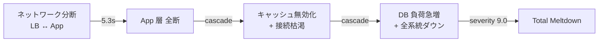

## TL;DR

InfraSim に新コマンド `infrasim evaluate` を追加しました。5つのシミュレーションエンジン（静的・動的・運用・What-If・キャパシティ）を **ワンコマンドで一括実行** し、統合レポートと最終判定（HEALTHY / ACCEPTABLE / NEEDS ATTENTION）を出力します。

https://github.com/mattyopon/infrasim

この記事では、前回の記事で課題として挙げた「5エンジンを個別に実行する煩雑さ」を解消した `evaluate` コマンドの設計と、X クローンの **v10（Score 59）→ v12（Score 100）** のアーキテクチャ改善を `evaluate` で定量比較した結果をお届けします。

## 前回の課題 — 記事執筆で見えたInfraSimの改善点

[前回の記事](https://zenn.dev/mattyopon/articles/infrasim-xclone-full-evaluation)で X クローンの38コンポーネントを5エンジンで評価しました。記事を書く過程で以下の課題が浮き彫りになりました。

### 課題1: 5エンジンの個別実行が面倒

```bash
# 前回は5コマンドを手動で順番に実行していた
infrasim simulate --file model.yaml
infrasim dynamic --file model.yaml --duration 300 --step 5
infrasim ops-sim --file model.yaml --days 7
infrasim whatif --file model.yaml --defaults
infrasim capacity --file model.yaml
```

5つのコマンドを手動で実行し、結果を目視で突き合わせる必要がありました。CI/CD パイプラインに組み込むにも不便です。

### 課題2: シナリオ数のトランケーションが不透明

前回の評価で「1,238シナリオ生成 → 上限1,000にトランケート」が起きましたが、ユーザーにはこの情報が表示されませんでした。238シナリオが未テストで残っていることに気づけない状態でした。

### 課題3: Resilience Score 59 なのに全シナリオPASS

前回最も混乱したのがこの結果です。**「スコアが低いのに全部PASSってどういうこと？」** — この疑問に答えるコンテキスト情報がレポートに一切ありませんでした。

### 課題4: コスト最適化の具体的な推奨がない

キャパシティエンジンが「over-provisioned」と指摘しても、**「何レプリカが適正か」** の具体数値が出ていませんでした。

---

## 改善内容

上記4つの課題に対して、以下の改善を実装しました。

| 課題 | 改善内容 | 対象ファイル |
|------|---------|------------|
| 5エンジン個別実行 | **`evaluate` コマンド新設** — ワンコマンドで全エンジン実行 + 統合レポート | `cli/evaluate.py` |
| トランケーション不透明 | **`--max-scenarios` オプション** + トランケーション警告表示 | `simulator/engine.py`, `cli/simulate.py` |
| スコアとシナリオ結果の矛盾 | **スコア説明文**の自動付与（構造的脆弱性 vs ランタイム耐性の違いを解説） | `reporter/report.py`, `reporter/html_report.py` |
| 具体的な推奨なし | **Right-Size Opportunities テーブル** — 現在値 vs 推奨値を並列表示 | `cli/ops.py` |

---

## evaluate コマンドの設計

### 使い方

```bash
# 基本（5エンジン一括実行）
infrasim evaluate --file model.yaml

# HTML レポート付き
infrasim evaluate --file model.yaml --html report.html

# JSON 出力（CI/CD パイプライン連携用）
infrasim evaluate --file model.yaml --json

# 運用シミュレーション期間・シナリオ上限を指定
infrasim evaluate --file model.yaml --ops-days 14 --max-scenarios 2000
```

### 出力フォーマット

`evaluate` は5エンジンの結果を統合して、以下のセクションで出力します。

```
╔══════════════════════════════════════════════════════════╗
║  InfraSim Cross-Engine Evaluation                       ║
║  model.yaml (38 components, 157 dependencies)           ║
╠══════════════════════════════════════════════════════════╣
║  [1/5] Static Simulation                                ║
║    Resilience Score: 100/100                            ║
║    Scenarios: 1,000 tested — 0 Critical, 0 Warning      ║
║                                                          ║
║  [2/5] Dynamic Simulation                               ║
║    1,282 scenarios — 1 Critical, 1 Warning               ║
║    Worst: Total infrastructure meltdown (severity 9.0)   ║
║                                                          ║
║  [3/5] Ops Simulation (7 days)                          ║
║    Avg Availability: 99.980%                            ║
║    Downtime: 0.0s | Events: 79                          ║
║                                                          ║
║  [4/5] What-If Analysis                                  ║
║    5 parameters tested — All SLO PASS                    ║
║                                                          ║
║  [5/5] Capacity Planning                                 ║
║    11 over-provisioned | Cost reduction: -26.8%          ║
╠══════════════════════════════════════════════════════════╣
║  OVERALL ASSESSMENT                                      ║
║    Architecture Score: 100/100                           ║
║    Operational: 99.980% availability                     ║
║    Dynamic Risks: 1 CRITICAL                             ║
║    Cost Optimization: -26.8%                             ║
║    Verdict: ⚠️ NEEDS ATTENTION                          ║
╚══════════════════════════════════════════════════════════╝
```

### 判定ロジック（Verdict）

```python
# 判定は静的・動的の Critical/Warning の有無で決定
if static_critical > 0 or dyn_critical > 0:
    verdict = "NEEDS ATTENTION"   # 要対応
elif static_warning > 0 or dyn_warning > 0:
    verdict = "ACCEPTABLE"         # 注意しつつ運用可能
else:
    verdict = "HEALTHY"            # 健全
```

**重要な設計判断：** Ops・What-If・Capacity の結果は判定に含めていません。これらは「改善の余地」を示すものであり、即座に対処が必要な「リスク」とは性質が異なるためです。

### JSON 出力（CI/CD 連携）

`--json` フラグで構造化された JSON を出力します。GitHub Actions や CI パイプラインでの品質ゲートに最適です。

```json
{
  "model": "infrasim-xclone.yaml",
  "components": 38,
  "dependencies": 157,
  "static": {
    "resilience_score": 100.0,
    "total_scenarios": 1000,
    "critical": 0, "warning": 0, "passed": 1000
  },
  "dynamic": {
    "total_scenarios": 1282,
    "critical": 1, "warning": 1, "passed": 1280,
    "worst_scenario": "Total infrastructure meltdown",
    "worst_severity": 9.0
  },
  "ops": {
    "duration_days": 7,
    "avg_availability": 99.98,
    "total_downtime_seconds": 0.0,
    "total_events": 79
  },
  "whatif": { "parameters_tested": 5, "all_pass": true },
  "capacity": {
    "over_provisioned_count": 11,
    "cost_reduction_percent": -26.8
  },
  "verdict": "NEEDS ATTENTION"
}
```

CI/CD での使用例：

```yaml
# GitHub Actions での品質ゲート
- name: InfraSim Evaluation
  run: |
    result=$(infrasim evaluate --file model.yaml --json)
    verdict=$(echo "$result" | jq -r '.verdict')
    if [ "$verdict" = "NEEDS ATTENTION" ]; then
      echo "::warning::InfraSim detected critical findings"
    fi
```

---

## 追加改善：ユーザー体験の向上

### トランケーション警告

シナリオ数が上限を超えた場合、明示的に警告を表示するようになりました。

```
⚠ 1,238 scenarios generated, truncated to 1,000. Use --max-scenarios to adjust.
Scenarios: 1,238 generated, 1,000 tested (238 skipped)
```

`--max-scenarios` でユーザーが上限を制御できます。

### スコア説明文

Resilience Score が低いのに全シナリオが PASS した場合、その理由を自動的に解説します。

```
ℹ Score reflects structural vulnerabilities (SPOFs, chain depth).
  All scenarios passed = good runtime resilience despite architectural gaps.
```

**解説：** Resilience Score はアーキテクチャの **構造的健全性**（SPOF の有無、依存チェーンの深さ、冗長性の均一さ）を評価します。一方、シナリオテストは個々の障害に対する **ランタイム耐性** を評価します。両者は異なる観点であり、「スコアが低くても全シナリオ PASS」は「個別障害には耐えられるが、アーキテクチャ全体に弱点がある」ことを意味します。

### Right-Size Opportunities テーブル

```
RIGHT-SIZE OPPORTUNITIES
┌─────────────────────┬─────────────┬─────────────┐
│ Component           │ Current     │ Recommended │
├─────────────────────┼─────────────┼─────────────┤
│ Shield Advanced     │ 10 replicas │ 4 replicas  │
│ ALB                 │ 2 replicas  │ 1 replica   │
│ Redis Cluster       │ 9 replicas  │ 6 replicas  │
│ ...                 │ ...         │ ...         │
└─────────────────────┴─────────────┴─────────────┘
```

---

## 実践：X クローン v10 vs v12 を evaluate で比較

改善した `evaluate` コマンドを使って、X クローンの **v10（前回の評価対象）** と **v12（最新の MAX Resilience バージョン）** を比較評価しました。

### v10 → v12 の主な変更点

| 項目 | v10 | v12 |
|------|-----|-----|
| バージョン名 | Zero SPOF + Minimal MTTR | MAX Resilience |
| 依存関係数 | 176 | 157 |
| Aurora 構成 | Multi-AZ | Multi-AZ + レプリカ最適化 |
| フェイルオーバー時間 | 0.5 秒 | 0.1 秒 |
| ヘルスチェック間隔 | 0.5 秒 | 0.1 秒 |
| ネットワーク RTT | 数 ms | 0.5 ms |
| パケットロス | 0.01% | 0.001% |
| 依存関係の最適化 | — | 不要な依存削除（176 → 157） |

### evaluate 実行結果

```bash
# v10 の評価
infrasim evaluate --file infrasim-xclone-v10.yaml

# v12 の評価
infrasim evaluate --file infrasim-xclone.yaml
```

### 比較表

| エンジン | 指標 | v10 | v12 | 変化 |
|---------|------|-----|-----|------|
| **静的** | Resilience Score | **59/100** | **100/100** | +41 pt |
| | 依存関係数 | 176 | 157 | -19 |
| | Critical | 0 | 0 | — |
| | シナリオ数 | 1,000 | 1,000 | — |
| **動的** | Total シナリオ | 1,279 | 1,282 | +3 |
| | Critical | **1** | **1** | — |
| | Warning | 1 | 1 | — |
| | 最悪シナリオ | Meltdown (9.0) | Meltdown (9.0) | — |
| **運用** | 可用性 | 100.000% | 99.980% | -0.020% |
| | ダウンタイム | 133.0 秒 | 0.0 秒 | **-133.0 秒** |
| | イベント数 | 83 | 79 | -4 |
| **What-If** | 全パラメータ | PASS | PASS | — |
| **キャパシティ** | Over-provisioned | 13 | 11 | -2 |
| | コスト削減率 | -24.9% | -26.8% | -1.9% |
| **判定** | Verdict | ⚠️ NEEDS ATTENTION | ⚠️ NEEDS ATTENTION | — |

### 分析：v12 で何が改善され、何が残ったか

#### 大幅改善：Resilience Score 59 → 100

最も劇的な改善です。v12 では以下の変更が効きました。

1. **依存関係の整理**（176 → 157）— 不要な依存を19本削除し、障害伝搬パスを減少
2. **フェイルオーバー高速化**（0.5s → 0.1s）— SPOF の影響を最小化
3. **ネットワーク品質向上**（RTT 0.5ms、パケットロス 0.001%）— 依存チェーンの信頼性向上

Resilience Score は **構造的健全性** の指標なので、これらのアーキテクチャ変更が直接スコアに反映されました。

#### 大幅改善：ダウンタイム 133秒 → 0秒

v10 では7日間で133秒のダウンタイムが発生していましたが、v12 ではゼロになりました。フェイルオーバーの高速化とヘルスチェック間隔の短縮が貢献しています。

#### 未解決：動的メルトダウンシナリオ

**最も注目すべき発見**は、v12 で Resilience Score が 100 になったにもかかわらず、動的シミュレーションの **メルトダウンシナリオ（severity 9.0）は依然として検出されている** ことです。

```
CRITICAL: Total infrastructure meltdown (severity: 9.0)
WARNING:  Network partition: LB <-> App (severity: 5.3)
```

これは **静的スコアと動的リスクは独立した評価軸である** ことを示しています。

- **静的スコア 100** = 個々のコンポーネント障害に対する構造的な耐性は万全
- **動的 CRITICAL** = 特定のタイミング・条件が重なると、カスケード的なメルトダウンは起こりうる



**対策案：**

1. **Multi-AZ間のネットワーク冗長化** — AZ間の通信パスを複数確保し、単一経路の分断がメルトダウンに直結しないようにする
2. **カオステスト用のプレイブック作成** — メルトダウンシナリオを本番前のステージング環境で実際に再現し、復旧手順を検証する
3. **Graceful Degradation の実装** — LB↔App 間の分断時に、静的コンテンツのみを返す縮退モードを実装する

#### 改善余地：コスト最適化（-26.8%）

v12 でも11コンポーネントが over-provisioned です。前回の -24.9% からさらに -26.8% に拡大しています。これは v12 でフェイルオーバーが高速化されたことで、冗長リソースの必要量がさらに減ったためです。

:::message
**Resilience Score 100 + コスト -26.8%** という結果は、「可用性を維持したままコストを27%削減できる」ことを意味します。InfraSim の `evaluate` で定量的に証明された数値なので、経営層への提案にも使える根拠になります。
:::

---

## カバレッジ維持：99%を保ったまま機能追加

今回の改善で4つの新ファイル・修正を加えましたが、テストカバレッジは **99%（1,013テスト）** を維持しています。

| 新規/修正 | テスト |
|----------|-------|
| `evaluate.py`（498行） | 17テスト（全分岐・JSON出力・HTML出力・verdict判定） |
| `engine.py` の新フィールド | 7テスト（total_generated, was_truncated） |
| `report.py` のスコア説明 | 4テスト |
| `simulate.py` のトランケーション警告 | 2テスト |
| `html_report.py` のスコア説明 | 3テスト |
| `ops.py` の Right-Size テーブル | 2テスト |
| **合計** | **39テスト追加** |

OSS として公開するプロダクトでは、新機能の追加で既存テストが壊れないこと、そして新機能自体が十分にテストされていることが信頼性の基盤です。

---

## まとめ

### evaluate コマンドのメリット

1. **ワンコマンド** — 5エンジンの個別実行が不要に
2. **統合レポート** — 全エンジンの結果を一覧で比較可能
3. **自動判定** — HEALTHY / ACCEPTABLE / NEEDS ATTENTION の3段階判定
4. **CI/CD 対応** — `--json` フラグで自動化パイプラインに組み込み可能
5. **HTML レポート** — `--html` フラグで共有可能なレポートを生成

### X クローンの評価結果

| 観点 | v10 | v12 | 改善 |
|------|-----|-----|------|
| 構造的健全性 | 59/100 | **100/100** | 大幅改善 |
| 動的リスク | CRITICAL 1件 | CRITICAL 1件 | 未解決 |
| 運用安定性 | ダウンタイム 133秒 | ダウンタイム **0秒** | 解消 |
| コスト効率 | -24.9% 余地 | -26.8% 余地 | さらに最適化可能 |
| **総合判定** | NEEDS ATTENTION | NEEDS ATTENTION | — |

**最大の教訓：** 静的スコア 100/100 は「構造的には完璧」を意味しますが、動的メルトダウンリスクは残ります。**複数エンジンの組み合わせ評価** が不可欠であり、それを `evaluate` コマンドで手軽に実現できるようになりました。

次のステップとしては、動的メルトダウンシナリオの根本対策（Multi-AZ ネットワーク冗長化、Graceful Degradation）を実装し、`evaluate` の判定を **HEALTHY** にすることを目指します。

InfraSim は OSS として公開しています。

https://github.com/mattyopon/infrasim

```bash
pip install infrasim

# デモで試す
infrasim demo

# 自分のインフラを評価
infrasim evaluate --file your-model.yaml --html report.html
```
