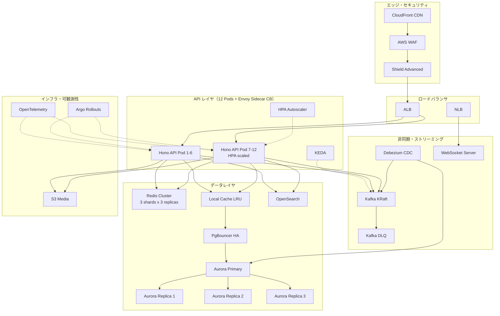
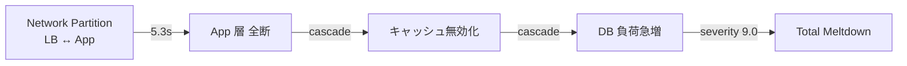
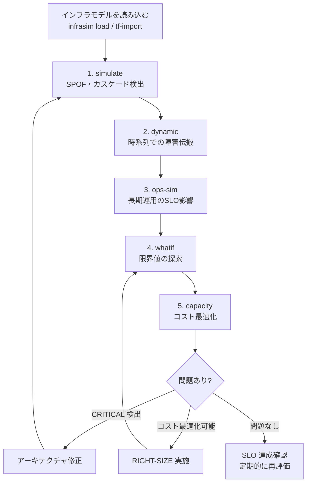

## はじめに

InfraSim は「本番環境に一切触れずに、インフラの可用性限界を数学的にシミュレーションする」カオスエンジニアリングツールです。

https://github.com/mattyopon/infrasim

v5.14 で 5 つのシミュレーションエンジン（静的・動的・運用・What-If・キャパシティ）が揃いました。この記事では、**開発中の X クローン（38 コンポーネント構成）に対して 5 エンジンすべてを適用し、インフラ全体を一気通貫で評価した実践レポート**をお届けします。

過去の xclone-v2 シリーズの記事ではアーキテクチャ進化の過程を追ってきましたが、今回はまったく異なる切り口です。「完成した InfraSim を使って、既存インフラをどう評価し、どんな改善点を見つけられるか」という **実践ガイド** として読んでいただければと思います。

### この記事で分かること

- InfraSim の 5 つのエンジンの使い分けと実行方法
- 38 コンポーネントの X クローンインフラに対する総合評価結果
- 動的シミュレーションで発見されたインフラメルトダウンシナリオ
- キャパシティ分析による **コスト 24.9% 削減** の余地

## 対象インフラの概要 — X クローン v2

今回評価する X クローンのインフラは、AWS 上に構築した SNS プラットフォームです。

### 構成概要

| カテゴリ | コンポーネント | 数 |
|---------|--------------|---|
| エッジ・セキュリティ | CloudFront CDN, WAF, Shield Advanced | 3 |
| ロードバランサ | ALB, NLB | 2 |
| API サーバ | Hono API Pods（Envoy Sidecar CB 付き） | 12 |
| オートスケーラ | HPA, KEDA | 2 |
| リアルタイム通信 | Socket.io WebSocket Server | 1 |
| デプロイ | Argo Rollouts Controller | 1 |
| キャッシュ | Local Cache (LRU), ElastiCache Redis Cluster | 2 |
| データベース | Aurora PostgreSQL (Primary + 3 Replica) | 4 |
| コネクションプール | PgBouncer (HA) | 1 |
| 検索 | OpenSearch Cluster | 1 |
| ストレージ | S3 Media Bucket | 1 |
| メッセージング | Kafka (KRaft), Kafka DLQ | 2 |
| CDC | Debezium Connector | 1 |
| 可観測性 | OpenTelemetry Collector | 1 |
| **合計** | | **38** |

### 構成図



## 5 つのエンジンによる総合評価

InfraSim v5.14 には 5 つのシミュレーションエンジンがあります。それぞれ異なる観点からインフラを評価します。

| エンジン | コマンド | 評価観点 |
|---------|---------|---------|
| 静的シミュレーション | `simulate` | SPOF 検出、カスケード障害、依存関係分析 |
| 動的シミュレーション | `dynamic` | トラフィックパターン、時系列での障害伝搬 |
| 運用シミュレーション | `ops-sim` | デプロイ・障害・劣化の長期間シミュレーション |
| What-If 分析 | `whatif` | パラメータスイープによる限界値探索 |
| キャパシティプランニング | `capacity` | リソース最適化、ボトルネック特定、コスト予測 |

### 事前準備：モデルの読み込み

まず、インフラモデルを InfraSim に読み込みます。

```bash
# YAML ファイルから読み込む場合
infrasim load --file xclone-model.yaml

# JSON ファイルから読み込む場合
infrasim load --file xclone-model.json

# Terraform state から直接インポートする場合
infrasim tf-import --state terraform.tfstate
```

---

### 1. 静的シミュレーション（simulate）

**目的：** 150 以上の障害シナリオを自動生成し、SPOF やカスケード障害を網羅的に検出する。

```bash
infrasim simulate --file xclone-model.json
```

#### 結果

| 指標 | 値 |
|-----|---|
| コンポーネント数 | 38 |
| 依存関係数 | 176 |
| **Resilience Score** | **59 / 100** |
| 生成シナリオ数 | 1,238（上限 1,000 にトランケート） |
| Critical | 0 |
| Warning | 0 |
| Passed | 1,000 |

**ポイント：** 全 1,000 シナリオが Passed という結果は、個々の障害に対する耐性は確保されていることを示しています。しかし **Resilience Score が 59/100** と中程度にとどまっている点は要注意です。これはコンポーネント間の依存関係の密度や冗長性の不均一さが影響しています。

---

### 2. 動的シミュレーション（dynamic）

**目的：** 実際のトラフィックパターンを再現し、時系列での障害発生・伝搬・復旧をシミュレーションする。静的シミュレーションでは見つからない「時間依存の障害」を検出できる。

```bash
infrasim dynamic --file xclone-model.json --duration 300 --step 5
```

#### 結果

| 指標 | 値 |
|-----|---|
| シミュレーション時間 | 300 秒（5 秒ステップ） |
| Total シナリオ | 1,279 |
| Critical | **1** |
| Warning | **1** |
| Passed | 1,277 |

#### 検出された問題

```
🔴 CRITICAL: Total infrastructure meltdown (severity: 9.0)
🟡 WARNING:  Network partition: LB <-> App (severity: 5.3)
```

**Total infrastructure meltdown（severity 9.0）** は、特定のタイミングでロードバランサとアプリケーション層の間でネットワーク分断が発生した場合、その障害がカスケードして全体のメルトダウンに至る可能性があることを示しています。

静的シミュレーションでは全シナリオ Passed だったにもかかわらず、動的シミュレーションでは CRITICAL が 1 件検出されました。**時間軸を加えることで初めて見つかる障害パターンがある**ことを如実に示しています。

---

### 3. 運用シミュレーション（ops-sim）

**目的：** デプロイ、障害発生、リソース劣化を含む長期運用をシミュレーションし、SLO への影響を定量化する。

```bash
infrasim ops-sim --file xclone-model.json --days 7
```

#### 結果

| 指標 | 値 |
|-----|---|
| シミュレーション期間 | 7 日間 |
| 総イベント数 | 83 |
| デプロイ回数 | 42 |
| 障害発生 | 0 |
| 劣化イベント | 3 |
| 加重ダウンタイム | **133.0 秒（2.2 分）** |
| ピーク使用率 | 64.1% |
| **最低可用性** | **99.977%** |

**ポイント：** 7 日間で 42 回のデプロイを行っても、可用性は 99.977% を維持しています。これは月間ダウンタイム約 9.5 分に相当し、99.95% SLO を余裕で達成できる水準です。ピーク使用率が 64.1% なので、キャパシティにも余裕があります。

ただし 3 件の劣化イベントが発生している点は、長期運用でのリソース劣化（メモリリーク、ディスク逼迫等）への対策が必要であることを示唆しています。

---

### 4. What-If 分析（whatif）

**目的：** 「トラフィックが 5 倍になったら？」「レプリカを半分にしたら？」といったパラメータスイープにより、インフラの限界値を探索する。

```bash
infrasim whatif --file xclone-model.json --defaults
```

#### 結果

| パラメータ | 範囲 | 結果 |
|-----------|------|------|
| **Traffic Factor** | 1x 〜 5x | 全て SLO PASS |
| **Replica Factor** | 0.5x 〜 1.5x | 全て SLO PASS |
| **Maint Duration Factor** | 0.5x 〜 5x | 全て SLO PASS |

Traffic 5x 時の詳細：

| 指標 | 値 |
|-----|---|
| Traffic Factor | 5x |
| SLO 判定 | **PASS** |
| Downtime | 4,703.9 秒 |

**ポイント：** トラフィックが現在の **5 倍** になっても SLO は維持できるという結果です。レプリカを半分にしても（0.5x）SLO を維持できるため、過剰プロビジョニングの可能性があります。この点は次のキャパシティプランニングで詳細に分析します。

---

### 5. キャパシティプランニング（capacity）

**目的：** リソースの過剰/不足を検出し、ボトルネックの特定とコスト最適化の提案を行う。

```bash
infrasim capacity --file xclone-model.json
```

#### 結果

| 指標 | 値 |
|-----|---|
| Over-provisioned コンポーネント | **10** |
| ボトルネック | aurora-replica-1, aurora-replica-2, aurora-replica-3 |
| Error Budget 消費率 | **6.5%**（healthy） |
| 3 ヶ月コスト予測（削減率） | **-24.9%** |

#### RIGHT-SIZE 推奨

| コンポーネント | 現在 | 推奨 | 削減率 |
|--------------|------|------|-------|
| Shield Advanced | 10 replicas | 4 replicas | -60% |
| ALB / NLB | 各 2 | 各 1 | -50% |
| Local Cache (LRU) | 12 | 7 | -42% |
| Redis Cluster | 9 (3x3) | 6 | -33% |
| Kafka / Kafka DLQ | 各 3 | 各 2 | -33% |

**ポイント：** 10 コンポーネントが over-provisioned で、推奨通りに最適化すれば **3 ヶ月で約 25% のコスト削減** が可能です。特に Shield Advanced の 10 → 4 replicas は大きなインパクトがあります。

一方で、Aurora のリードレプリカ 3 台がボトルネックとして検出されています。読み取りクエリの負荷が高い場合は、レプリカの追加よりもキャッシュレイヤ（Redis / Local Cache）の最適化を先に検討すべきでしょう。

---

## 発見した問題と改善提案

### 問題 1: 動的シミュレーションで検出されたメルトダウンシナリオ

```
CRITICAL: Total infrastructure meltdown (severity: 9.0)
```

**原因分析：** LB ↔ App 間のネットワーク分断が発生した場合、以下のカスケードが起きる可能性があります。



**改善策：**
1. **サーキットブレーカーの閾値見直し** — Envoy Sidecar CB の設定で、LB 断時にフェイルオーバーするまでの時間を短縮
2. **CloudFront Origin Failover の活用** — LB 障害時に S3 の静的ページへフォールバック
3. **ヘルスチェック間隔の短縮** — ALB のヘルスチェック間隔を 30 秒 → 10 秒に短縮し、障害検知を高速化

### 問題 2: Resilience Score 59/100

静的シミュレーションの Resilience Score が 59 と中程度であることは、アーキテクチャ全体の冗長性に改善の余地があることを示しています。

**改善策：**
1. **Aurora Primary の SPOF 軽減** — Multi-AZ 配置の確認、フェイルオーバー時間の短縮
2. **Kafka のレプリケーション係数確認** — ブローカー障害時のデータ損失リスク評価
3. **PgBouncer の冗長化** — 4 レプリカは確保されているが、接続プール枯渇時の挙動を検証

### 問題 3: コスト最適化の余地（-24.9%）

What-If 分析でレプリカを 0.5x にしても SLO PASS だったことと、キャパシティ分析で 10 コンポーネントが over-provisioned だったことは一致しています。

**改善の優先順位：**

```
1. Shield Advanced: 10 → 4 replicas     ← 最大のコストインパクト
2. ALB/NLB: 2 → 1                       ← ただし可用性への影響を要検証
3. Local Cache: 12 → 7                   ← API Pod 削減に連動
4. Redis Cluster: 9 → 6                  ← シャード構成の見直し
5. Kafka: 3 → 2                          ← パーティション再配置が必要
```

:::message
コスト最適化は段階的に実施してください。一度にすべてを変更するのではなく、1 つずつ変更して `infrasim whatif` で影響を確認しながら進めることを推奨します。
:::

## まとめ：InfraSim 5 エンジンの使い方フローチャート



### 今回の評価サマリー

| エンジン | 結果 | 主な発見 |
|---------|------|---------|
| simulate | Resilience 59/100, 全 1,000 PASS | 個別障害には耐性あり。全体スコアは改善余地あり |
| dynamic | CRITICAL 1, WARNING 1 | LB↔App 分断でメルトダウンリスク |
| ops-sim | 可用性 99.977%, ダウンタイム 2.2 分/7 日 | 運用負荷は許容範囲内 |
| whatif | 全パラメータ SLO PASS | 5x トラフィックまで耐えられる |
| capacity | 10 個 over-provisioned, -24.9% | コスト削減の大きな余地 |

InfraSim の 5 つのエンジンは、それぞれ異なる「レンズ」でインフラを評価します。静的シミュレーションだけでは見つからなかったメルトダウンシナリオが、動的シミュレーションで初めて検出されたように、**複数のエンジンを組み合わせることで初めて見える全体像**があります。

InfraSim は OSS として公開しています。`pip install infrasim` でインストールして、まずは `infrasim demo` でサンプルインフラのシミュレーションを試してみてください。

https://github.com/mattyopon/infrasim
