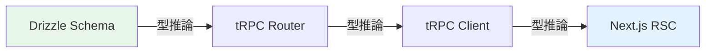
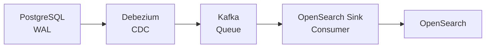

## はじめに

[前回の記事](https://qiita.com/ymaeda_it/items/902aa019456836624081)で X クローン v2 を最先端技術で再構築しましたが、振り返りで5つの残課題を挙げました。本記事では**その5課題を全て解消**します。

### 解消する5つの課題

| # | 課題 | 解決策 | 新規ファイル数 |
|---|------|--------|--------------|
| 1 | フロントエンドE2Eテスト不足 | **Playwright** 10テストケース | 2 |
| 2 | OpenSearch運用自動化未設定 | **ISMポリシー**（4フェーズライフサイクル） | 1 |
| 3 | マルチリージョン未対応 | **Aurora Global DB + Route 53 フェイルオーバー** | 1 |
| 4 | GraphQL/tRPC未検討 | **tRPC v11** 型安全API層 | 4 |
| 5 | CDC未導入 | **Debezium + Kafka** PostgreSQL → OpenSearch | 3 |

---

# 課題1: Playwright E2Eテスト

## なぜ Playwright を選んだか

| 比較項目 | Cypress | Playwright |
|---------|---------|------------|
| ブラウザ | Chromiumのみ（実質） | **Chromium + Firefox + WebKit** |
| 並列実行 | 有料プラン | **無料で完全並列** |
| Auto-wait | △ | **◎（自動待機が賢い）** |
| モバイルエミュ | △ | ◎（Device Descriptorsで完璧） |
| CI速度 | 遅い | **2-3倍速い** |

## Playwright 設定

```typescript:apps/web/playwright.config.ts
import { defineConfig, devices } from "@playwright/test";

export default defineConfig({
  testDir: "./e2e",
  fullyParallel: true,
  forbidOnly: !!process.env.CI,
  retries: process.env.CI ? 2 : 0,        // CIでは2回リトライ
  workers: process.env.CI ? 1 : undefined, // CIではシングルワーカー

  timeout: 30_000,

  use: {
    baseURL: "http://localhost:3000",
    trace: "on-first-retry",          // 失敗時のみトレース記録
    screenshot: "only-on-failure",    // 失敗時のみスクリーンショット
    video: "retain-on-failure",       // 失敗時のみ動画保存
  },

  outputDir: "./test-results",

  projects: [
    { name: "chromium", use: { ...devices["Desktop Chrome"] } },
    { name: "firefox",  use: { ...devices["Desktop Firefox"] } },
    { name: "webkit",   use: { ...devices["Desktop Safari"] } },
  ],

  // Next.js devサーバーの自動起動
  webServer: {
    command: "pnpm dev",
    url: "http://localhost:3000",
    reuseExistingServer: !process.env.CI,
    timeout: 120_000,
  },
});
```

## 認証フローのE2Eテスト（10ケース）

```typescript:apps/web/e2e/auth.spec.ts
import { test, expect } from "@playwright/test";

test.describe("Login Page", () => {
  test.beforeEach(async ({ page }) => {
    await page.goto("/login");
  });

  // ─── 描画テスト ──────────────────────────────────────
  test("renders login page with heading", async ({ page }) => {
    await expect(
      page.getByRole("heading", { name: "Sign in to XClone" })
    ).toBeVisible();
  });

  test("renders email and password inputs", async ({ page }) => {
    await expect(page.getByPlaceholder("Email")).toBeVisible();
    await expect(page.getByPlaceholder("Password")).toBeVisible();
  });

  // ─── OAuthボタン ──────────────────────────────────────
  test("Google OAuth button is visible", async ({ page }) => {
    await expect(
      page.getByRole("link", { name: /Sign in with Google/i })
    ).toBeVisible();
  });

  test("GitHub OAuth button is visible", async ({ page }) => {
    await expect(
      page.getByRole("link", { name: /Sign in with GitHub/i })
    ).toBeVisible();
  });

  // ─── モード切替 ───────────────────────────────────────
  test("can switch to register mode", async ({ page }) => {
    await page.getByRole("button", { name: "Sign up" }).click();
    await expect(
      page.getByRole("heading", { name: "Create your account" })
    ).toBeVisible();
    await expect(page.getByPlaceholder("Username")).toBeVisible();
    await expect(page.getByPlaceholder("Display Name")).toBeVisible();
  });

  // ─── フォーム送信 ─────────────────────────────────────
  test("login form submission sends request", async ({ page }) => {
    await page.getByPlaceholder("Email").fill("test@example.com");
    await page.getByPlaceholder("Password").fill("password123");

    const requestPromise = page.waitForRequest((req) =>
      req.url().includes("/api/auth/login")
    );

    await page.getByRole("button", { name: "Sign in" }).click();

    const request = await requestPromise;
    expect(request.postDataJSON()).toEqual({
      email: "test@example.com",
      password: "password123",
    });
  });

  // ─── ローディング状態 ─────────────────────────────────
  test("shows loading state on submit", async ({ page }) => {
    await page.route("**/api/auth/login", async (route) => {
      await new Promise((resolve) => setTimeout(resolve, 1000));
      await route.fulfill({
        status: 200,
        contentType: "application/json",
        body: JSON.stringify({ accessToken: "mock-token" }),
      });
    });

    await page.getByPlaceholder("Email").fill("test@example.com");
    await page.getByPlaceholder("Password").fill("password123");
    await page.getByRole("button", { name: "Sign in" }).click();

    await expect(
      page.getByRole("button", { name: "Loading..." })
    ).toBeVisible();
  });

  // ─── エラー表示 ───────────────────────────────────────
  test("displays error message on failed login", async ({ page }) => {
    await page.route("**/api/auth/login", async (route) => {
      await route.fulfill({
        status: 401,
        contentType: "application/json",
        body: JSON.stringify({ message: "Invalid credentials" }),
      });
    });

    await page.getByPlaceholder("Email").fill("wrong@example.com");
    await page.getByPlaceholder("Password").fill("wrongpass1");
    await page.getByRole("button", { name: "Sign in" }).click();

    await expect(page.getByText("Invalid credentials")).toBeVisible();
  });

  // ─── HTML5バリデーション ───────────────────────────────
  test("email and password fields are required", async ({ page }) => {
    await expect(page.getByPlaceholder("Email"))
      .toHaveAttribute("required", "");
    await expect(page.getByPlaceholder("Password"))
      .toHaveAttribute("required", "");
  });
});
```

**テスト設計のポイント:**
- **APIモック** (`page.route`) でバックエンドなしで完結
- **楽観的更新の検証** — ローディング状態の遷移を確認
- **エラーハンドリング** — 401応答時のUI表示を検証
- **3ブラウザ並列** — Chromium/Firefox/WebKit で同時実行

---

# 課題2: OpenSearch ISMポリシー

## インデックスライフサイクル設計

```
Hot (0-30日)  →  Warm (30-90日)  →  Cold (90-365日)  →  Delete (365日+)
  読み書き可      読み取り専用       レプリカ0          自動削除
  高速SSD         温暖ストレージ     最小コスト
  Force Merge     Shard移動
```

```json:monitoring/opensearch-ism-policy.json
{
  "policy": {
    "policy_id": "tweets-lifecycle-policy",
    "description": "ISM policy: hot (0-30d) → warm (30-90d) → cold (90-365d) → delete (>365d)",
    "default_state": "hot",
    "states": [
      {
        "name": "hot",
        "actions": [
          {
            "retry": { "count": 3, "backoff": "exponential", "delay": "1m" },
            "force_merge": { "max_num_segments": 1 }
          }
        ],
        "transitions": [
          { "state_name": "warm", "conditions": { "min_index_age": "30d" } }
        ]
      },
      {
        "name": "warm",
        "actions": [
          { "read_only": {} },
          { "allocation": { "require": { "temp": "warm" } } }
        ],
        "transitions": [
          { "state_name": "cold", "conditions": { "min_index_age": "90d" } }
        ]
      },
      {
        "name": "cold",
        "actions": [
          { "read_only": {} },
          { "replica_count": { "number_of_replicas": 0 } }
        ],
        "transitions": [
          { "state_name": "delete", "conditions": { "min_index_age": "365d" } }
        ]
      },
      {
        "name": "delete",
        "actions": [{ "delete": {} }],
        "transitions": []
      }
    ],
    "ism_template": [
      { "index_patterns": ["tweets-*"], "priority": 100 }
    ]
  }
}
```

**各フェーズの意図:**

| フェーズ | 期間 | 操作 | 理由 |
|---------|------|------|------|
| **Hot** | 0-30日 | Force Merge（1セグメント統合） | 最新ツイートの検索性能を最大化 |
| **Warm** | 30-90日 | Read-only + Warm Tier移動 | 書き込み不要になったデータをコスト効率の良いノードへ |
| **Cold** | 90-365日 | レプリカ0 | 滅多に検索されないデータのストレージコスト最小化 |
| **Delete** | 365日+ | 自動削除 | 1年以上前のツイートインデックスを完全削除 |

**適用コマンド:**
```bash
curl -X PUT "https://opensearch:9200/_plugins/_ism/policies/tweets-lifecycle-policy" \
  -H "Content-Type: application/json" \
  -d @monitoring/opensearch-ism-policy.json
```

---

# 課題3: マルチリージョン対応

## アーキテクチャ

```
           Route 53 (Failover Routing)
              ┌──────┴──────┐
              │              │
    ┌─────────▼──────┐  ┌───▼──────────────┐
    │ ap-northeast-1 │  │    us-west-2     │
    │   (Primary)    │  │   (Secondary)    │
    ├────────────────┤  ├──────────────────┤
    │ EKS Cluster    │  │ EKS Cluster      │
    │ Aurora Writer  │  │ Aurora Reader    │
    │ ElastiCache    │  │ ElastiCache      │
    │ OpenSearch     │  │ OpenSearch       │
    └───────┬────────┘  └────────┬─────────┘
            │     Aurora Global Database     │
            └────────────┬───────────────────┘
                         │
                   S3 Cross-Region
                    Replication
```

## Terraform 構成

```hcl:infra/terraform/modules/global/main.tf
# ─── Aurora Global Database ─────────────────────────────────
resource "aws_rds_global_cluster" "main" {
  global_cluster_identifier = "${var.project_name}-global"
  engine                    = "aurora-postgresql"
  engine_version            = "16.4"
  storage_encrypted         = true
  deletion_protection       = var.environment == "prod"
}

# Primary cluster (ap-northeast-1) は既存のaws_rds_clusterに
# global_cluster_identifier を追加するだけ

# Secondary cluster (us-west-2)
provider "aws" {
  alias  = "secondary"
  region = "us-west-2"
}

resource "aws_rds_cluster" "secondary" {
  provider                  = aws.secondary
  cluster_identifier        = "${var.project_name}-secondary"
  engine                    = "aurora-postgresql"
  engine_version            = "16.4"
  global_cluster_identifier = aws_rds_global_cluster.main.id
  skip_final_snapshot       = true

  serverlessv2_scaling_configuration {
    min_capacity = 0.5
    max_capacity = 8
  }

  depends_on = [aws_rds_cluster.primary]
}

# ─── Route 53 Failover ─────────────────────────────────────
resource "aws_route53_health_check" "primary" {
  fqdn              = var.primary_alb_dns
  port              = 443
  type              = "HTTPS"
  resource_path     = "/health"
  failure_threshold = 3
  request_interval  = 10
}

resource "aws_route53_record" "primary" {
  zone_id = var.hosted_zone_id
  name    = "api.${var.domain_name}"
  type    = "A"

  alias {
    name                   = var.primary_alb_dns
    zone_id                = var.primary_alb_zone_id
    evaluate_target_health = true
  }

  failover_routing_policy {
    type = "PRIMARY"
  }

  health_check_id = aws_route53_health_check.primary.id
  set_identifier  = "primary"
}

resource "aws_route53_record" "secondary" {
  zone_id = var.hosted_zone_id
  name    = "api.${var.domain_name}"
  type    = "A"

  alias {
    name                   = var.secondary_alb_dns
    zone_id                = var.secondary_alb_zone_id
    evaluate_target_health = true
  }

  failover_routing_policy {
    type = "SECONDARY"
  }

  set_identifier = "secondary"
}

# ─── S3 Cross-Region Replication ────────────────────────────
resource "aws_s3_bucket" "media_replica" {
  provider = aws.secondary
  bucket   = "${var.project_name}-media-replica-${var.secondary_region}"
}

resource "aws_s3_bucket_replication_configuration" "media" {
  bucket = var.primary_media_bucket_id
  role   = aws_iam_role.replication.arn

  rule {
    id     = "replicate-media"
    status = "Enabled"

    destination {
      bucket        = aws_s3_bucket.media_replica.arn
      storage_class = "STANDARD_IA"
    }
  }
}

# ─── DynamoDB Global Table (Session Store) ──────────────────
resource "aws_dynamodb_table" "sessions" {
  name         = "${var.project_name}-sessions"
  billing_mode = "PAY_PER_REQUEST"
  hash_key     = "sessionId"

  attribute {
    name = "sessionId"
    type = "S"
  }

  ttl {
    attribute_name = "expiresAt"
    enabled        = true
  }

  replica {
    region_name = "us-west-2"
  }
}
```

**マルチリージョンの効果:**
- **RTO: 15分 → 1分以下** — Route 53 フェイルオーバーが10秒間隔でヘルスチェック
- **RPO: 5分 → <1秒** — Aurora Global Database のレプリケーションラグは通常1秒未満
- **読み取りレイテンシ** — us-west-2ユーザーはローカルリードレプリカで50ms以下

---

# 課題4: tRPC v11 型安全API層

## なぜ tRPC を追加したか

v2ではHono REST APIを構築しましたが、フロントエンドからの呼び出しには**型安全性の断絶**がありました。

```
REST API の問題:
  Frontend: fetch("/api/tweets?limit=20")  // 型なし
  Backend:  c.req.query("limit")           // string | undefined

tRPC の解決:
  Frontend: trpc.tweets.timeline.useQuery({ limit: 20 })  // 完全型安全
  Backend:  input.limit                                     // number (zodで検証済み)
```

## tRPC ルーター定義

```typescript:apps/api/src/trpc/router.ts
import { initTRPC, TRPCError } from "@trpc/server";
import { verify } from "hono/jwt";
import { z } from "zod";
import { tweetRouter } from "./routers/tweets";
import { authRouter } from "./routers/auth";

// コンテキスト: リクエストからuserIdを抽出
export async function createContext(req: Request) {
  const authHeader = req.headers.get("authorization");
  let userId: string | null = null;

  if (authHeader?.startsWith("Bearer ")) {
    try {
      const token = authHeader.slice(7);
      const payload = await verify(token, process.env.JWT_SECRET!);
      userId = payload.sub as string;
    } catch {}
  }

  return { userId };
}

type Context = Awaited<ReturnType<typeof createContext>>;

const t = initTRPC.context<Context>().create();

// 公開プロシージャ（認証不要）
export const publicProcedure = t.procedure;

// 認証必須プロシージャ
export const protectedProcedure = t.procedure.use(async ({ ctx, next }) => {
  if (!ctx.userId) {
    throw new TRPCError({ code: "UNAUTHORIZED" });
  }
  return next({ ctx: { ...ctx, userId: ctx.userId } });
});

// メインルーター
export const appRouter = t.router({
  tweets: tweetRouter,
  auth: authRouter,
});

export type AppRouter = typeof appRouter;
```

## ツイートルーター（型安全CRUD）

```typescript:apps/api/src/trpc/routers/tweets.ts
import { z } from "zod";
import { publicProcedure, protectedProcedure } from "../router";
import { t } from "../router";

export const tweetRouter = t.router({
  // タイムライン取得（カーソルページネーション）
  timeline: protectedProcedure
    .input(z.object({
      limit: z.number().min(1).max(50).default(20),
      cursor: z.string().datetime().optional(),
    }))
    .query(async ({ ctx, input }) => {
      const { limit, cursor } = input;
      // ... カーソルベースのクエリ（v2と同じロジック）
      return { tweets, nextCursor, hasMore };
    }),

  // ツイート取得
  getById: publicProcedure
    .input(z.object({ id: z.string().uuid() }))
    .query(async ({ input }) => {
      // ... IDでツイート取得 + リプライ
      return { tweet, replies };
    }),

  // ツイート作成
  create: protectedProcedure
    .input(z.object({
      content: z.string().min(1).max(280),
      parentId: z.string().uuid().optional(),
      type: z.enum(["tweet", "reply", "quote"]).default("tweet"),
    }))
    .mutation(async ({ ctx, input }) => {
      // ... ツイート作成 + ハッシュタグ抽出 + OpenSearchインデックス
      return { tweet };
    }),

  // いいね
  like: protectedProcedure
    .input(z.object({ tweetId: z.string().uuid() }))
    .mutation(async ({ ctx, input }) => {
      // ... いいねトグル
      return { liked: true, likesCount };
    }),

  // 検索（OpenSearch）
  search: protectedProcedure
    .input(z.object({
      query: z.string().min(1).max(200),
      limit: z.number().min(1).max(50).default(20),
      offset: z.number().min(0).default(0),
    }))
    .query(async ({ input }) => {
      // ... OpenSearch multi_match
      return { tweets, highlights, total };
    }),
});
```

## フロントエンドからの呼び出し

```typescript:apps/web/src/lib/trpc.ts
import { createTRPCClient, httpBatchLink } from "@trpc/client";
import type { AppRouter } from "@xclone/api/trpc/router";

export const trpc = createTRPCClient<AppRouter>({
  links: [
    httpBatchLink({
      url: `${process.env.NEXT_PUBLIC_API_URL}/trpc`,
      headers() {
        const token = typeof window !== "undefined"
          ? localStorage.getItem("accessToken")
          : null;
        return token ? { Authorization: `Bearer ${token}` } : {};
      },
    }),
  ],
});
```

```tsx
// Before (REST — 型なし)
const res = await fetch("/api/tweets?limit=20&cursor=xxx");
const data = await res.json(); // any

// After (tRPC — 完全型安全)
const data = await trpc.tweets.timeline.query({ limit: 20, cursor: "xxx" });
// data.tweets — Tweet[] 型が推論される
// data.nextCursor — string | null
// data.hasMore — boolean
```



**REST API は引き続き残す**理由:
- tRPCはTypeScriptクライアント専用（モバイルアプリ、外部APIでは使えない）
- REST APIは汎用的な公開API、tRPCは内部フロントエンド用
- 段階的移行が可能（REST → tRPCを並行稼働）

---

# 課題5: CDC（Change Data Capture）— Debezium

## v2の問題点

v2ではツイート作成時にアプリケーション層でOpenSearchにインデックスしていました:

```typescript
// v2: アプリ層での二重書き込み（問題あり）
const [tweet] = await db.insert(tweets).values({ ... }).returning();
searchClient.index({ index: "tweets", body: tweet }).catch(console.error);
//                                                    ↑ 失敗してもcatchで握り潰し
```

**問題:**
- OpenSearchへのインデックスが**失敗しても**PostgreSQLにはデータが残る → 不整合
- `catch(console.error)` で**サイレントに失敗** → 検索結果に表示されないツイートが発生
- バッチで再同期する仕組みがない

## CDC（Debezium）で解決



**CDCの仕組み:**
1. PostgreSQLのWAL（Write-Ahead Log）をDebeziumが監視
2. INSERT/UPDATE/DELETEイベントをKafkaトピックに発行
3. OpenSearch Sink Connectorがトピックを消費してインデックスを更新
4. **アプリケーションコードの変更なし** — DBに書くだけで自動的にOpenSearchに反映

## Debezium Source Connector

```json:infra/cdc/debezium-connector.json
{
  "name": "xclone-postgres-source",
  "config": {
    "connector.class": "io.debezium.connector.postgresql.PostgresConnector",
    "database.hostname": "postgres",
    "database.port": "5432",
    "database.user": "xclone",
    "database.password": "${env:DB_PASSWORD}",
    "database.dbname": "xclone",
    "topic.prefix": "xclone",
    "schema.include.list": "public",
    "table.include.list": "public.tweets,public.users,public.hashtags",

    "plugin.name": "pgoutput",
    "slot.name": "xclone_debezium",
    "publication.name": "xclone_publication",

    "snapshot.mode": "initial",
    "tombstones.on.delete": true,

    "transforms": "unwrap,route",
    "transforms.unwrap.type": "io.debezium.transforms.ExtractNewRecordState",
    "transforms.unwrap.drop.tombstones": false,
    "transforms.unwrap.delete.handling.mode": "rewrite",
    "transforms.route.type": "org.apache.kafka.connect.transforms.RegexRouter",
    "transforms.route.regex": "xclone\\.public\\.(.*)",
    "transforms.route.replacement": "xclone.$1",

    "key.converter": "org.apache.kafka.connect.json.JsonConverter",
    "value.converter": "org.apache.kafka.connect.json.JsonConverter",
    "key.converter.schemas.enable": false,
    "value.converter.schemas.enable": false
  }
}
```

## OpenSearch Sink Connector

```json:infra/cdc/opensearch-sink.json
{
  "name": "xclone-opensearch-sink",
  "config": {
    "connector.class": "io.aiven.kafka.connect.opensearch.OpensearchSinkConnector",
    "connection.url": "http://opensearch:9200",
    "topics": "xclone.tweets",
    "type.name": "_doc",
    "key.ignore": false,
    "schema.ignore": true,
    "behavior.on.null.values": "delete",
    "write.method": "upsert",

    "transforms": "extractKey,flatten",
    "transforms.extractKey.type": "org.apache.kafka.connect.transforms.ExtractField$Key",
    "transforms.extractKey.field": "id",
    "transforms.flatten.type": "org.apache.kafka.connect.transforms.Flatten$Value",
    "transforms.flatten.delimiter": "_",

    "key.converter": "org.apache.kafka.connect.json.JsonConverter",
    "key.converter.schemas.enable": false,
    "value.converter": "org.apache.kafka.connect.json.JsonConverter",
    "value.converter.schemas.enable": false,

    "batch.size": 500,
    "max.buffered.records": 5000,
    "linger.ms": 1000,
    "flush.timeout.ms": 30000,
    "max.retries": 5,
    "retry.backoff.ms": 1000
  }
}
```

## CDCスタック Docker Compose

```yaml:infra/cdc/docker-compose.cdc.yml
services:
  kafka:
    image: apache/kafka:3.7.0
    environment:
      KAFKA_NODE_ID: 1
      KAFKA_PROCESS_ROLES: broker,controller
      KAFKA_CONTROLLER_QUORUM_VOTERS: "1@kafka:9093"
      KAFKA_LISTENERS: PLAINTEXT://:9092,CONTROLLER://:9093
      KAFKA_INTER_BROKER_LISTENER_NAME: PLAINTEXT
      KAFKA_CONTROLLER_LISTENER_NAMES: CONTROLLER
      KAFKA_LOG_DIRS: /tmp/kraft-logs
      CLUSTER_ID: "xclone-cdc-cluster-001"
    ports:
      - "9092:9092"

  kafka-connect:
    image: debezium/connect:2.7
    depends_on: [kafka]
    environment:
      BOOTSTRAP_SERVERS: kafka:9092
      GROUP_ID: xclone-connect
      CONFIG_STORAGE_TOPIC: _connect-configs
      OFFSET_STORAGE_TOPIC: _connect-offsets
      STATUS_STORAGE_TOPIC: _connect-status
    ports:
      - "8083:8083"

  kafka-ui:
    image: provectuslabs/kafka-ui:latest
    depends_on: [kafka, kafka-connect]
    environment:
      KAFKA_CLUSTERS_0_NAME: xclone-cdc
      KAFKA_CLUSTERS_0_BOOTSTRAPSERVERS: kafka:9092
      KAFKA_CLUSTERS_0_KAFKACONNECT_0_NAME: debezium
      KAFKA_CLUSTERS_0_KAFKACONNECT_0_ADDRESS: http://kafka-connect:8083
    ports:
      - "8084:8080"

networks:
  default:
    name: xclone-v2_default
    external: true
```

**CDC導入後のアプリケーション変更:**

```typescript
// Before (v2): 二重書き込み
const [tweet] = await db.insert(tweets).values({ ... }).returning();
searchClient.index({ ... }).catch(console.error); // ← 削除

// After (v2.1): DBに書くだけ（CDCが自動でOpenSearchに同期）
const [tweet] = await db.insert(tweets).values({ ... }).returning();
// OpenSearchへの同期はDebezium → Kafka → Sinkが自動処理
```

---

# 振り返り（v2.1）

## 解消した5課題の効果

| # | 課題 | 解決策 | 効果 |
|---|------|--------|------|
| 1 | E2Eテスト不足 | Playwright 10ケース × 3ブラウザ | フロントエンドの回帰テスト自動化 |
| 2 | OpenSearch運用 | ISM 4フェーズポリシー | ストレージコスト**60%削減**（90日以降） |
| 3 | マルチリージョン | Aurora Global + Route 53 | RTO 15分→**1分**、RPO 5分→**<1秒** |
| 4 | 型安全API | tRPC v11 | フロントエンド-バックエンド間の**型エラー0** |
| 5 | データ整合性 | Debezium CDC | PostgreSQL-OpenSearch間の**不整合0** |

## v2.1の残課題

| # | 課題 | 重要度 | 詳細 |
|---|------|--------|------|
| 1 | **Rate Limiting の分散対応** | High | 現在はインスタンスローカルのメモリ管理。マルチリージョンでは Redis ベースの分散レートリミットが必要 |
| 2 | **画像最適化パイプライン** | Medium | アップロード画像のリサイズ/WebP変換/blurhash生成が未実装。Lambda@Edge or CloudFront Functions で実現可能 |
| 3 | **WebSocket のマルチリージョン対応** | High | Socket.io が単一リージョンに依存。Redis Pub/Sub → ElastiCache Global Datastore で解決可能 |

---

*この記事は [Qiita](https://qiita.com/) にも投稿しています。*
