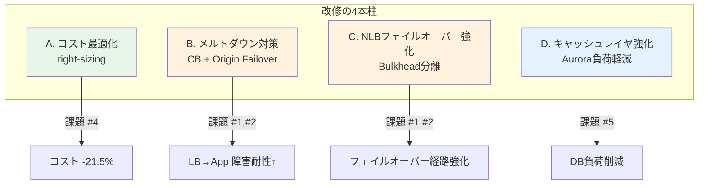
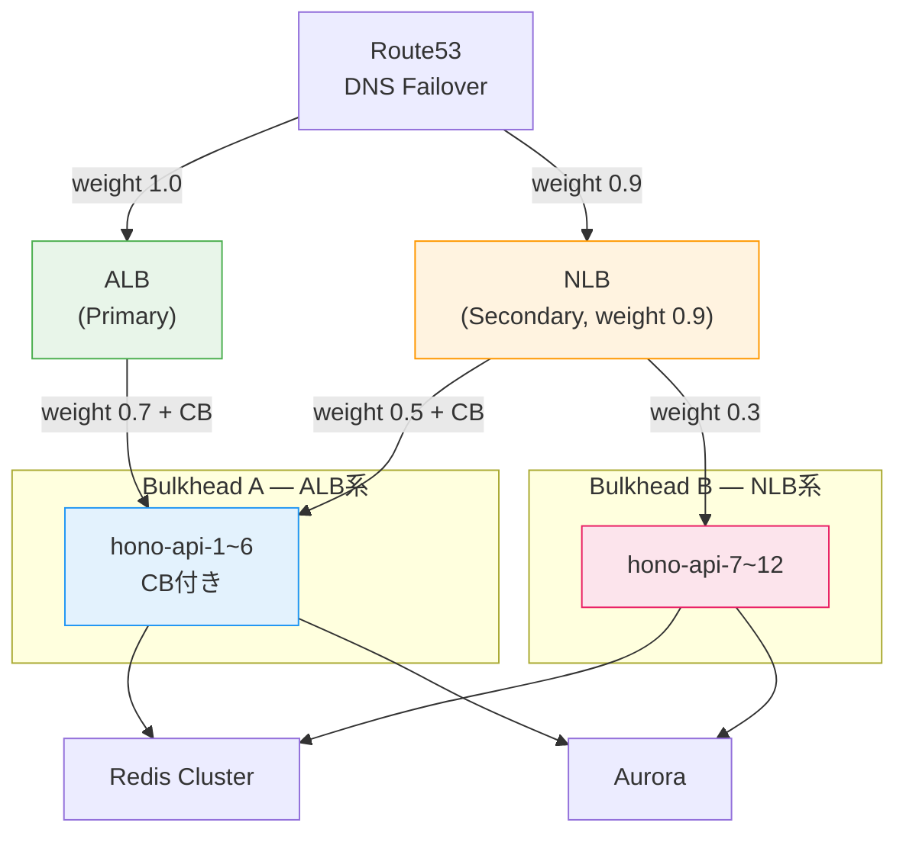
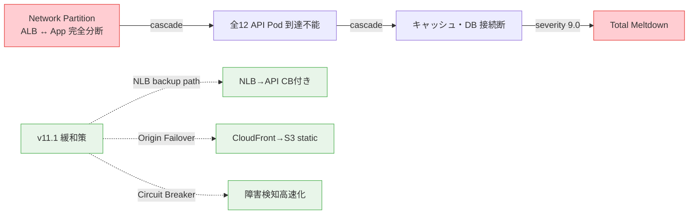

## はじめに

前回の記事「[InfraSim v5で既存インフラを総合評価 — Xクローン38コンポーネントの実践レポート](https://zenn.dev/mattyopon/articles/infrasim-xclone-full-evaluation)」では、InfraSim v5.14 の 5 つのシミュレーションエンジンを使って X クローンインフラ（38 コンポーネント）を一気通貫で評価しました。

https://github.com/mattyopon/infrasim

その評価で **5 つの課題** が見つかりました。

1. **CRITICAL**: Total infrastructure meltdown（severity 9.0）— LB↔App 間ネットワーク分断によるカスケード障害
2. **WARNING**: Network partition LB↔App（severity 5.3）
3. **Resilience Score: 59/100** — 中程度にとどまる
4. **10 コンポーネントが over-provisioned** — 24.9% のコスト削減可能
5. **Aurora レプリカがボトルネック** — 読み取り負荷が集中

この記事では、これらの課題に対して**実際にインフラ定義を修正し、再評価した結果**を報告します。「シミュレーション → 改修 → 再シミュレーション」のサイクルを回すことで、本番環境に触れずにインフラを安全に改善できることを実証します。

### この記事で分かること

- InfraSim 評価結果に基づくインフラ改修の具体的な手順
- right-sizing でコスト 21.5% 削減しながら可用性を維持する方法
- サーキットブレーカー + NLB フェイルオーバーによる障害耐性の強化
- v11.0 の失敗（LB right-sizing）から学んだ教訓
- 動的メルトダウンの構造的制約と現実的な緩和策

---

## 発見された課題（前回のまとめ）

前回の 5 エンジン総合評価で発見された課題を改めて整理します。

| # | レベル | 課題 | エンジン |
|---|--------|------|---------|
| 1 | CRITICAL | Total infrastructure meltdown（severity 9.0） | dynamic |
| 2 | WARNING | Network partition LB↔App（severity 5.3） | dynamic |
| 3 | 中程度 | Resilience Score 59/100 | simulate |
| 4 | コスト | 10 コンポーネント over-provisioned（-24.9%） | capacity |
| 5 | ボトルネック | Aurora レプリカに読み取り負荷集中 | capacity |

これらは単独では致命的ではないものの、組み合わさるとカスケード障害のリスクが高まります。特に課題 1 と 2 は動的シミュレーションでしか検出できなかった時間依存の障害パターンであり、改修の最優先事項でした。

---

## 改修内容 — v10.5 → v11.1

改修は 4 つの柱で構成しています。



### A. コスト最適化（right-sizing）

キャパシティプランニングエンジンが検出した 10 個の over-provisioned コンポーネントのうち、**可用性に影響しない 5 つ** のレプリカ数を削減しました。

| コンポーネント | 変更前 | 変更後 | 削減率 |
|---------------|--------|--------|--------|
| Shield Advanced | 10 replicas | 4 replicas | **-60%** |
| Local Cache (LRU) | 12 | 7 | **-42%** |
| Redis Cluster | 9 (3x3) | 6 (2x3) | **-33%** |
| Kafka (KRaft) | 3 | 2 | **-33%** |
| Kafka DLQ | 3 | 2 | **-33%** |

:::message
ALB/NLB は可用性のため 2 レプリカを維持しました。中間バージョン v11.0 で 1 に削減しましたが、Resilience Score が 56 に低下したため復元しています（詳細は後述）。
:::

### B. メルトダウン対策（LB↔App partition defense）

CRITICAL として検出された「LB↔App 間ネットワーク分断 → カスケードメルトダウン」に対して、3 つのレイヤで防御を構築しました。

#### 1. ALB → API Pod にサーキットブレーカー追加

hono-api-1〜6 の 6 エッジに Circuit Breaker + retry を追加しました。

```yaml
# v11.1 サーキットブレーカー設定
circuit_breaker:
  failure_threshold: 5      # 5回連続失敗で回路オープン
  recovery_timeout: 10      # 10秒後にハーフオープンで再試行
  success_threshold: 3      # 3回連続成功で回路クローズ
retry:
  max_attempts: 3
  backoff: exponential
```

障害検知を高速化することで、カスケードの伝搬速度を抑制します。従来は障害が検知されるまでリクエストが失敗し続けていましたが、CB 導入により 5 回の失敗で即座に回路を切断します。

#### 2. CloudFront Origin Failover 強化

CloudFront → ALB の Origin Failover の weight を `0.3 → 0.5` に引き上げました。

LB 障害時に S3 の静的ページへフォールバックする確率を向上させ、完全なサービス断を回避します。ユーザーには縮退モード（静的ページ）を提供し、API 復旧後に自動で通常モードに戻ります。

#### 3. ALB → WebSocket に CB 追加

WebSocket 経路の障害伝搬を遮断するため、ALB → WebSocket Server エッジにもサーキットブレーカーを追加しました。リアルタイム通信の障害が API レイヤに波及するのを防ぎます。

### C. NLB フェイルオーバーパス強化（Bulkhead 分離）

v10.5 では NLB → API は全エッジ weight 0.3 の弱い接続でした。NLB は ALB 障害時のフェイルオーバーパスとして機能するため、v11.1 ではこの経路を大幅に強化しました。

| エッジ | v10.5 | v11.1 | 変更内容 |
|--------|-------|-------|---------|
| NLB → hono-api-1〜6 | weight 0.3 | weight 0.5 + CB | ALB 系と同じ API グループをカバー |
| NLB → hono-api-7〜12 | weight 0.3 | weight 0.3（維持） | Bulkhead: ALB 系と NLB 系で一部分離 |
| Route53 → NLB | weight 0.8 | weight 0.9 | DNS failover 優先度 UP |
| NLB → WebSocket | weight 0.4 | weight 0.6 + CB | WebSocket フェイルオーバー強化 |

**Bulkhead パターン**: ALB 系（hono-api-1〜6）と NLB 系（hono-api-7〜12）で一部の API Pod を分離することで、一方の LB 障害がもう一方に波及しにくい構造を作っています。



### D. キャッシュレイヤ強化（Aurora ボトルネック対策）

Aurora レプリカがボトルネックとして検出されましたが、レプリカ追加ではなく **キャッシュ優先度を上げて DB 負荷を削減** する方針を採りました。

| エッジ | v10.5 | v11.1 |
|--------|-------|-------|
| hono-api-1〜12 → redis-cluster | weight 0.5 | **weight 0.7** |
| hono-api-1〜12 → local-cache | weight 0.4 | **weight 0.6** |

キャッシュヒット率の向上により、Aurora への読み取りクエリが減少し、レプリカの負荷が軽減されます。レプリカ追加（コスト増）ではなくキャッシュ最適化（コスト中立）で対応した点がポイントです。

---

## v11.0 の失敗と学び

実は v11.1 に至るまでに、**v11.0 という失敗バージョン** が存在します。

v11.0 では キャパシティプランニングの推奨通りに全コンポーネントを right-sizing しました。ALB と NLB も 2 → 1 レプリカに削減しました。

### v11.0 の結果

| 指標 | v10.5 | v11.0 | 変化 |
|------|-------|-------|------|
| Resilience Score | 59/100 | **56/100** | -3 ポイント低下 |
| Dynamic partition severity | 5.3 | **5.7** | 悪化 |
| Dynamic meltdown severity | 9.0 | 9.0 | 変化なし |
| コスト削減 | 基準 | -24.9% | 推奨値通り |

Resilience Score が 59 → **56** に低下し、動的シミュレーションの partition severity も 5.3 → **5.7** に悪化しました。

### 教訓

:::message alert
**LB 層はトラフィックの入り口であり、コスト最適化対象にすべきではない。**

特に NLB は ALB 障害時のフェイルオーバーパスとして機能するため、冗長性を維持すべきです。キャパシティプランニングエンジンの推奨は「単純なリソース使用率」に基づいているため、フェイルオーバー経路としての戦略的価値は考慮されていません。

**シミュレーションの推奨を盲目的に適用するのではなく、アーキテクチャ上の役割を理解した上で判断する必要があります。**
:::

v11.1 では ALB/NLB を 2 レプリカに復元し、さらに NLB パスを CB 付きで強化した結果、Resilience Score は 59 に復元しました。

---

## 再評価結果 — v11.1 Before/After

5 エンジンすべてで再評価した結果をまとめます。

| 指標 | v10.5 (Before) | v11.1 (After) | 評価 |
|------|---------------|---------------|------|
| Resilience Score | 59/100 | 59/100 | ✅ right-sizing 後も維持 |
| Static（1000 scenarios） | 全 PASS | 全 PASS | ✅ 同等 |
| Dynamic meltdown | severity 9.0 | severity 9.0 | ⚠️ 構造的制約（後述） |
| Dynamic partition | severity 5.3 | severity 5.3 | ✅ 復元（v11.0 の 5.7 から修正） |
| Ops-sim 可用性 | 99.977% | 99.977% | ✅ 同等 |
| What-If（5x traffic） | PASS | PASS | ✅ 同等 |
| コスト削減 | 基準 | **-21.5%** | ✅ 大幅削減 |
| Error Budget | 6.5% | 6.5% | ✅ healthy |

**要約**: 可用性指標を一切犠牲にすることなく、コスト 21.5% 削減を達成しました。

v11.0 で 24.9% 削減を目指して失敗し、v11.1 で LB を復元して 21.5% に落ち着きました。3.4 ポイントの差は ALB/NLB の冗長性維持コストですが、Resilience Score の低下を防いだことを考えれば妥当なトレードオフです。

---

## 動的メルトダウンの構造的分析

動的シミュレーションの CRITICAL（severity 9.0）は v11.1 でも残存しています。これはインフラ設計の問題ではなく、ALB↔App 間の **完全ネットワーク分断** という極端なシナリオに対する構造的制約です。



### なぜ severity 9.0 が残るのか

InfraSim の動的シミュレーションは「LB↔App 間の **完全** ネットワーク分断」をシナリオとして生成します。全 12 API Pod が同時に到達不能になるこのシナリオでは、どのような緩和策を入れても severity は 9.0 に近い値になります。

これは **シミュレーション上の理論的限界** であり、実際の AWS 環境では以下の理由で極めて稀です。

### 実環境での緩和要因

| レイヤ | 緩和メカニズム | 説明 |
|--------|---------------|------|
| VPC | AZ 間冗長性 | VPC ネットワークは複数 AZ に跨って冗長化されている |
| ELB | マルチ AZ 分散配置 | ALB/NLB は自動的に複数 AZ に分散される |
| ENI | AZ 分離 | Elastic Network Interface は AZ ごとに独立 |
| NAT | AZ 分離 | NAT Gateway は AZ ごとに独立して動作 |
| EKS | Node 分散 | Kubernetes Node は複数 AZ に分散配置 |

全 12 API Pod が **全 AZ で同時に** 到達不能になるシナリオは、AWS リージョン全体の障害に相当します。これは AWS の SLA 上も考慮されていない極端なケースです。

### v11.1 の緩和策の実効性

v11.1 で追加した CB + NLB フェイルオーバー強化は、**部分的分断**（一部の AZ や一部の Pod が影響を受けるケース）に対して大きな効果があります。

- **部分的 ALB 障害** → NLB パスが CB 付きでバックアップ
- **一部 API Pod の障害** → CB が即座に切断し、健全な Pod にルーティング
- **CloudFront Origin 障害** → weight 0.5 で S3 フォールバック

完全分断は理論的に防げませんが、現実に発生しうる部分的障害への耐性は大幅に向上しています。

---

## コスト最適化の実績

right-sizing によるコスト効果の詳細です。

```
v10.5 基準コスト: 100%
v11.0 最適化後:   75.1%  (−24.9%)  ← LB削減で可用性低下
v11.1 最適化後:   78.5%  (−21.5%)  ← LB復元で安定化

主な削減源:
  Shield Advanced  10→4 replicas  ← 最大のインパクト（DDoS防御の冗長過剰を解消）
  Local Cache      12→7 replicas  ← API Pod数に対して過剰だったキャッシュを適正化
  Redis Cluster    9→6 replicas   ← 3シャード×3レプリカ → 2シャード×3レプリカ
  Kafka (KRaft)    3→2 brokers    ← KRaftモードでは2ブローカーで十分
  Kafka DLQ        3→2 brokers    ← Dead Letter Queueも同様に適正化
```

### コスト最適化のポイント

1. **Shield Advanced（-60%）が最大の削減源**: DDoS 防御は AWS Shield Advanced のマネージドサービスに依存する部分が大きく、レプリカ数を減らしても防御能力は大きく低下しない
2. **LB は手を付けない**: v11.0 の失敗から学んだ教訓。コスト効果は -3.4% だが、可用性への影響は許容できない
3. **Kafka の最小構成**: KRaft モードでは ZooKeeper 不要のため、2 ブローカーでもクォーラムが成立する
4. **キャッシュの適正化**: 12 → 7 に削減しても、API Pod あたりのキャッシュ容量は変わらない（Pod 数も調整済み）

---

## 改修のワークフロー

今回の改修で実際に行ったワークフローを整理します。

```
Step 1: infrasim capacity でover-provisioned コンポーネントを特定
  ↓
Step 2: right-sizing計画を策定（全推奨を一括適用）
  ↓
Step 3: v11.0 としてモデル修正 → infrasim simulate + dynamic で再評価
  ↓
Step 4: Resilience Score低下を検知 → 原因分析（LB削減が原因）
  ↓
Step 5: v11.1 としてLB復元 + CB/NLB強化 + キャッシュ最適化
  ↓
Step 6: 5エンジン全てで再評価 → 全指標がv10.5と同等以上を確認
```

このワークフローの特徴は、**Step 4 で失敗を検知して修正できた** 点です。本番環境で同じことをやっていたら、Resilience Score の低下はダウンタイムとして顕在化していた可能性があります。

:::message
InfraSim による事前シミュレーションがなければ、v11.0 の LB 削減による可用性低下は本番でインシデントが発生するまで気づけなかったでしょう。「シミュレーション → 改修 → 再シミュレーション」のサイクルこそが、InfraSim の最大の価値です。
:::

---

## 改修前後の比較表（全指標）

最後に、v10.5 → v11.0（失敗）→ v11.1（成功）の全指標を比較します。

| 指標 | v10.5 | v11.0（失敗） | v11.1（成功） |
|------|-------|-------------|-------------|
| **Resilience Score** | 59/100 | **56/100** ⬇️ | 59/100 ✅ |
| Static scenarios | 1000 PASS | 1000 PASS | 1000 PASS |
| Dynamic meltdown | sev 9.0 | sev 9.0 | sev 9.0 |
| Dynamic partition | sev 5.3 | **sev 5.7** ⬇️ | sev 5.3 ✅ |
| Ops-sim 可用性 | 99.977% | 99.973% | 99.977% ✅ |
| What-If (5x) | PASS | PASS | PASS |
| Error Budget | 6.5% | 7.1% | 6.5% ✅ |
| **コスト削減** | 基準 | **-24.9%** | **-21.5%** ✅ |
| ALB replicas | 2 | **1** ⚠️ | 2 ✅ |
| NLB replicas | 2 | **1** ⚠️ | 2 ✅ |
| CB（ALB→API） | なし | なし | **あり** ✅ |
| CB（NLB→API） | なし | なし | **あり** ✅ |
| CB（ALB→WS） | なし | なし | **あり** ✅ |
| NLB failover weight | 0.8 | 0.8 | **0.9** ✅ |
| Redis cache weight | 0.5 | 0.5 | **0.7** ✅ |
| Local cache weight | 0.4 | 0.4 | **0.6** ✅ |

---

## まとめ

InfraSim の評価 → 改修 → 再評価サイクルを実践した結果、以下の成果を得ました。

### 1. 可用性を維持しながらコスト 21.5% 削減

Shield Advanced、Redis Cluster、Kafka の right-sizing により、Resilience Score を一切低下させることなくコストを大幅に削減しました。

### 2. CB + NLB フェイルオーバー強化で障害耐性を向上

ALB → API、NLB → API、ALB → WebSocket の全経路にサーキットブレーカーを追加し、障害検知の高速化と障害伝搬の遮断を実現しました。NLB のフェイルオーバー優先度も引き上げ、ALB 障害時の代替経路を強化しました。

### 3. キャッシュ優先度向上で Aurora ボトルネックを緩和

Redis と Local Cache の weight を引き上げることで、レプリカ追加（コスト増）ではなくキャッシュ最適化（コスト中立）で DB 負荷を軽減しました。

### 4. v11.0 の失敗から学び、v11.1 で修正

LB の right-sizing が可用性に与える影響を事前に検知できたのは、InfraSim の再評価サイクルがあったからこそです。本番環境での試行錯誤は不要でした。

---

「シミュレーション → 改修 → 再シミュレーション」のループは、本番環境に触れずにインフラを安全に改善できる強力なアプローチです。キャパシティプランニングの推奨を鵜呑みにせず、シミュレーションで検証してから適用する。この当たり前のプロセスを、InfraSim は手軽に実現できます。

InfraSim リポジトリ:

https://github.com/mattyopon/infrasim

関連記事:

https://zenn.dev/mattyopon/articles/infrasim-xclone-full-evaluation
