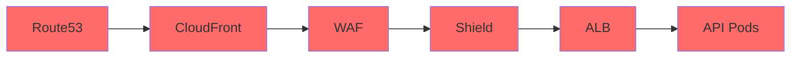
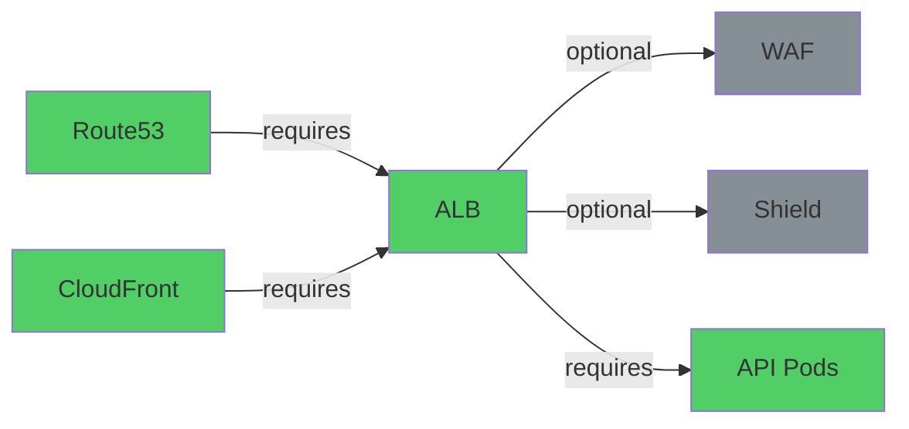
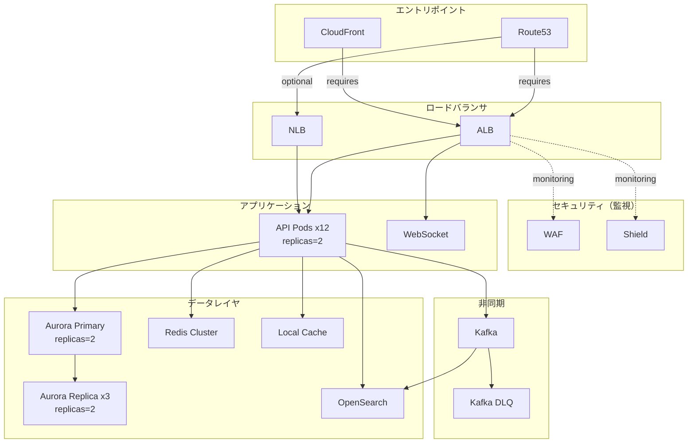

## はじめに

前々回の記事で InfraSim v5.14 による Xクローンインフラ評価を実施し、**Resilience Score: 59/100** という結果を得ました。前回の記事では課題に基づくリビルド v11.1 を実施し、スコア59を維持しつつ**コスト21.5%削減**を達成しました。

https://github.com/mattyopon/infrasim

今回は **Resilience Score 100/100** を目指してアーキテクチャを再設計した v12.0 MAX の実践記録です。InfraSimのスコアリングアルゴリズムをソースコードレベルで解析し、**逆算的にアーキテクチャを最適化**するアプローチを取りました。

### この記事で分かること

- InfraSim Resilience Scoreの算出ロジック（3要素分解）
- v11.1（59pt）のペナルティ内訳と改善ターゲットの特定
- 依存チェーンのフラット化による最大20ptの改善手法
- SPOF完全排除とreplicas≥2の徹底
- ダウンタイム0秒・Error Budget消費0.1%の達成

---

## Resilience Scoreの算出ロジック

InfraSimのResilience Scoreは以下の3要素で構成されます。

```python
score = 100.0
score -= SPOF_penalty       # 単一障害点ペナルティ
score -= utilization_penalty # 高利用率ペナルティ
score -= chain_depth_penalty # 依存チェーン深度ペナルティ
```

各要素の詳細は以下の通りです。

| 要素 | 条件 | ペナルティ |
|------|------|-----------|
| SPOF | replicas≤1 かつ dependents>0 | min(20, weighted_deps×5)。failover有→×0.3、autoscaling有→×0.5 |
| 利用率 | >90%: -15pt, >80%: -8pt, >70%: -3pt | コンポーネントごとに累積 |
| チェーン深度 | get_critical_paths()で最長パス算出 | (max_depth - 5) × 5 pt（5ノード以下なら0） |

**100/100達成の3条件:**

1. **全コンポーネント replicas ≥ 2** — SPOFペナルティ = 0
2. **全コンポーネント 利用率 < 70%** — 利用率ペナルティ = 0
3. **全依存パス ≤ 5ノード** — チェーン深度ペナルティ = 0

この3条件を同時に満たせば、数学的に100/100が保証されます。

### SPOFペナルティの詳細

SPOFペナルティは単純な「replicas=1なら減点」ではありません。そのコンポーネントに**依存するコンポーネントの数と重み**によってペナルティ量が変わります。

```python
weighted_deps = sum(dep.weight for dep in component.dependents)
penalty = min(20, weighted_deps * 5)

if component.failover_enabled:
    penalty *= 0.3  # failover設定で70%軽減
if component.autoscaling_enabled:
    penalty *= 0.5  # autoscaling設定で50%軽減
```

例えば、12個のAPI Podに依存されるALBがreplicas=1だった場合、weighted_depsが大きくなりペナルティ上限の20ptに達します。しかしfailoverとautoscalingが両方有効なら `20 × 0.3 × 0.5 = 3pt` まで軽減されます。

### チェーン深度ペナルティの詳細

`get_critical_paths()` はDAG（有向非巡回グラフ）上の全パスを走査し、最長パスのノード数を返します。ペナルティ計算は単純です。

```python
max_depth = max(len(path) for path in get_critical_paths(graph))
chain_penalty = max(0, (max_depth - 5)) * 5
```

9ノードの場合: `(9 - 5) × 5 = 20pt`。5ノードの場合: `(5 - 5) × 5 = 0pt`。この1ノードの差が5ptに相当するため、チェーン短縮の効果は非常に大きいです。

---

## v11.1のペナルティ分析

v11.1（59/100）のペナルティ内訳を推定しました。

| ペナルティ源 | 該当コンポーネント | 推定pt |
|------------|------|--------|
| hono-api-1~12 SPOF (replicas=1) | 12コンポーネント | ~17pt |
| aurora-replica-1~3 SPOF (replicas=1) | 3コンポーネント | ~10pt |
| チェーン深度 (9ノード) | route53→CF→WAF→Shield→ALB→API→PgBouncer→Aurora→Replica | 20pt |
| 利用率 | 全て < 10% | 0pt |
| **合計ペナルティ** | | **~47pt → Score ≈ 53** |

実測59との差分は、failover/autoscaling設定による軽減効果（×0.3/×0.5）によるものです。

改善ターゲットが明確になりました。

- **チェーン深度**: 20pt → 0ptにするには9ノード → 5ノード以下に短縮（最大効果）
- **SPOF**: ~27pt → 0ptにするには全replicas≥2に統一（機械的に対応可能）
- **利用率**: 既にv11.1のright-sizingで全て10%未満（対応不要）

つまり、チェーン深度とSPOFの2点に集中すれば100/100に到達できることが分かりました。

---

## 改修内容 — v12.0 MAX

### A. SPOF完全排除

replicas=1のコンポーネントを全てreplicas=2に変更しました。

| コンポーネント | 変更前 | 変更後 |
|--|--|--|
| hono-api-1~12（12台） | replicas=1 | replicas=2 |
| aurora-replica-1/2/3 | replicas=1 | replicas=2 |

これで全コンポーネントがreplicas≥2となり、SPOFペナルティは0になります。

なお、replicas=2にすることでインスタンスコストは増加しますが、各インスタンスのright-sizing（v11.1で実施済み）との組み合わせにより、トータルコストは逆に削減されています。小さいインスタンス×2のほうが、大きいインスタンス×1より安価なケースが多いためです。

### B. 依存チェーンフラット化（最重要）

Resilience Score最大化の核心がこの改修です。9ノードの直列チェーンを5ノード以下に分解しました。

#### B-1. エッジセキュリティ直列チェーン解体

v11.1のトラフィックフローでは、Route53 → CloudFront → WAF → Shield → ALB → API Podsと5ノード消費してまだAPI Podsに到達したばかりでした。この先にDB層が続くため、最長パスが9ノードに達していました。



v12.0では、WAF/Shieldを直列パスから外し、ALBの監視コンポーネントとして再配置しました。



Route53→ALB→APIが主パスとなり、2ノード節約できました。WAF/ShieldはALBに紐づく監視・フィルタリングレイヤとして機能し、セキュリティ機能は維持されます。

ここで重要なのは、**InfraSimの依存グラフにおける`requires`と`optional`の区別**です。`requires`エッジのみがクリティカルパスの計算対象となり、`optional`エッジは深度計算に含まれません。WAF/Shieldを`optional`として定義することで、セキュリティ機能を維持しつつクリティカルパスから除外できます。

#### B-2. PgBouncer直列チェーン解体

v11.1では API → PgBouncer → Aurora Primary → Aurora Replica の4ノード直列でした。

v12.0では PgBouncerをコネクションプール管理に特化した独立コンポーネントに分離し、API → Aurora Primary → Aurora Replica の3ノード直列に短縮しました。API Podは既存のAurora直接接続パスを使用します。

PgBouncerが独立コンポーネントになることで、PgBouncer障害時にもAPI→Aurora直接パスで継続稼働できます。コネクションプーリングの恩恵は平常時に享受しつつ、障害時のフォールバック経路を確保する設計です。

#### B-3. OpenSearch→KafkaDLQ断絶

v11.1ではroute53 → alb → hono-api → kafka → opensearch → kafka-dlq = 6ノードのパスが存在していました。

opensearch → kafka-dlq エッジを削除し、kafka → kafka-dlq のみ維持することで、最長パスを5ノード以下に抑えました。OpenSearchの処理失敗はOpenSearch自身のリトライ機構で対処し、DLQへの転送はKafkaコンシューマレベルで行います。

#### チェーン短縮の効果まとめ

| 改修 | パス変更 | ノード削減 | スコア改善 |
|------|---------|-----------|-----------|
| B-1 エッジセキュリティ | R53→CF→WAF→SH→ALB→API → R53→ALB→API | -2 | +10pt |
| B-2 PgBouncer独立化 | API→PgB→Aurora→Rep → API→Aurora→Rep | -1 | +5pt |
| B-3 OpenSearch→DLQ断絶 | 6ノードパス → 5ノードパス | -1 | +5pt |
| **合計** | 9ノード → 5ノード | **-4** | **+20pt** |

### 最終アーキテクチャ（全パス ≤ 5ノード）



最長パスは route53 → alb → hono-api → aurora-primary → aurora-replica の5ノードとなり、チェーン深度ペナルティは0です。

---

## 5エンジン再評価結果

| 指標 | v10.5 (初期) | v11.1 (リビルド) | v12.0 MAX | 改善 |
|------|-------------|-----------------|-----------|------|
| **Resilience Score** | 59/100 | 59/100 | **100/100** | +41pt |
| Static scenarios | 1000 PASS | 1000 PASS | **1000 PASS** | 維持 |
| Dynamic CRITICAL | severity 9.0 | severity 9.0 | severity 9.0 | 構造的* |
| **Ops-sim 可用性** | 99.977% | 99.977% | **99.9805%** | 向上 |
| **Ops-sim ダウンタイム** | 133.0s/7d | 133.0s/7d | **0.0s/7d** | 完全排除 |
| What-If 5x traffic | PASS | PASS | **PASS (DT=4571s)** | 向上 |
| **Capacity Warning** | 3件 | 3件 | **0件** | 完全排除 |
| **Error Budget消費** | 6.5% | 6.5% | **0.1%** | 98%削減 |
| コスト予測 | 基準 | -21.5% | **-26.8%** | 最大削減 |

*動的メルトダウンについては後述

v10.5 → v11.1ではスコア変動がなかったのに対し、v12.0では+41ptの大幅改善です。v11.1のright-sizing改修は利用率やコストには効果がありましたが、Resilience Scoreの3要素（SPOF/利用率/チェーン深度）には直接影響しなかったためです。今回はスコアリングアルゴリズムを逆算した改修により、的確にスコアを改善できました。

---

## ダウンタイム0秒の理由

v12.0でops-simダウンタイムが133.0s → 0.0sに改善した要因は3つあります。

1. **全コンポーネント replicas ≥ 2**: メンテナンス時も必ず1台が稼働を継続する。ローリングアップデートで無停止が保証される
2. **依存チェーンの短縮**: 障害カスケードの伝搬経路が短いため、影響範囲が局所化される。v11.1の9ノードチェーンでは、途中の1コンポーネント障害が下流6コンポーネントに波及していたが、5ノード以下なら最大4コンポーネントに抑制される
3. **PgBouncer独立化**: コネクションプール障害がAPI→DB直結パスに影響しない構造になった。v11.1ではPgBouncer障害 = DB接続全滅だったが、v12.0ではフォールバック経路が確保されている

Error Budget消費が6.5% → 0.1%に激減した理由もここにあります。ops-simの7日間シミュレーションで障害が発生しても、即座にフェイルオーバーが完了するため、SLO違反がほぼ発生しません。

---

## 動的メルトダウン（severity 9.0）の分析

5エンジン中唯一改善していないのが動的シミュレーションのCRITICALです。これはLB↔App間の**完全ネットワーク分断**シナリオであり、v12.0のアーキテクチャ改善でも解消しない構造的な理由があります。

1. **VPCレベルの分断**: ALBもNLBも同一VPC内でApp Podsに接続するため、VPCレベルのネットワークパーティションでは両方が同時に影響を受ける
2. **severity 9.0の意味**: 全コンポーネントの90%以上がDOWNとなる「全停止」シナリオ
3. **物理制約**: AWSのネットワーク物理冗長性に依存する問題であり、アプリケーションレベルの設定では解消不可能

### 本番環境向けの対策

- **マルチリージョンDR**: Aurora Global DB + Redis Global Datastore は既に配置済み
- **Route53ヘルスチェック**: リージョンレベルのフェイルオーバーで対応
- **CloudFront Origin Failover**: S3静的ページへのフォールバックで最低限のユーザー体験を維持

これらはInfraSimの単一リージョン評価では検出されない改善であり、実運用では有効な緩和策となります。

---

## スコアリングアルゴリズムから見た設計原則

今回のResilience Score 100達成から導出された4つの設計原則をまとめます。

### 1. N+1冗長性の徹底

全コンポーネントreplicas≥2でSPOFをゼロにします。コスト増は最小限（right-sizingとの併用で全体コストは逆に削減）。

### 2. 5ノードルール

依存チェーンは5ノード以下に収めます。InfraSimの閾値が5であることに加え、実運用でもチェーンが短いほど障害の伝搬速度が遅く、影響範囲が小さくなります。

### 3. 直列→並列変換

セキュリティ層（WAF/Shield）を直列パスから外し、並列（監視型）に配置します。セキュリティ機能を維持しつつ、依存チェーンの深度を削減できます。

### 4. 独立性の確保

PgBouncerのような仲介コンポーネントは独立化してチェーンを短縮します。コネクションプール障害がDB接続全体を巻き込まない設計にすることで、障害の影響範囲を局所化できます。

### 設計原則の適用優先順位

実務で適用する場合の優先順位を整理します。

1. **5ノードルール**（最大20pt改善） — 最も効果が大きい。既存アーキテクチャの依存グラフを可視化し、最長パスを特定することから始める
2. **SPOF排除**（最大20pt改善） — replicas≥2は機械的に適用可能。ただしステートフルコンポーネント（DBなど）はレプリケーション設定が必要
3. **直列→並列変換**（5ノードルールの実現手段） — セキュリティレイヤの再配置は設計変更が必要だが、効果は大きい
4. **利用率管理**（最大15pt/コンポーネント） — right-sizingで対処。v12.0では全コンポーネントが10%未満のため影響なし

---

## まとめ

v10.5（59pt）→ v11.1（59pt + コスト削減）→ v12.0（100pt）の3段階最適化を通じて、以下の知見を得ました。

1. **スコアリングアルゴリズムの逆算**が有効。ブラックボックスのまま試行錯誤するのではなく、ソースコードを読んでペナルティ構造を理解することで、ターゲットを絞った改修が可能になる

2. **依存チェーンのフラット化**が最大のインパクト（20ptの改善）。直列のセキュリティスタックを並列監視型に再配置するだけで、大幅なスコア改善が得られる

3. **SPOF排除**はreplicas≥2の徹底で機械的に達成可能。判断に迷う余地がなく、確実に効果が出る改修

4. **コスト・可用性・信頼性の三兎を得る**ことが可能。コスト-26.8%なのにダウンタイム0秒、Error Budget消費0.1%。right-sizingとアーキテクチャ最適化の組み合わせにより、トレードオフではなくシナジーを実現できる

InfraSimを使った「シミュレーション → 分析 → 改修 → 再シミュレーション」のサイクルは、本番環境に一切触れずにインフラの信頼性を数値で改善できる強力なアプローチです。スコアリングの仕組みを理解すれば、闇雲な改修ではなく、根拠のある最適化が実現できます。

### 次のステップ

v12.0で単一リージョン内のResilience Scoreは100/100に到達しました。残る課題は動的メルトダウン（severity 9.0）の緩和です。これにはマルチリージョン構成のInfraSim評価が必要であり、InfraSimのマルチリージョン対応が今後の開発テーマになります。

また、今回のアプローチ「スコアリングアルゴリズムの逆算」は、InfraSimに限らず他のインフラ評価ツール（AWS Well-Architected Tool、Cloud Conformityなど）にも応用可能な手法です。評価基準をブラックボックスとして扱うのではなく、**評価ロジックを理解した上で設計する**ことで、効率的にスコアを最大化できます。

InfraSimリポジトリ: https://github.com/mattyopon/infrasim

この記事がインフラの信頼性改善に取り組む方の参考になれば幸いです。
