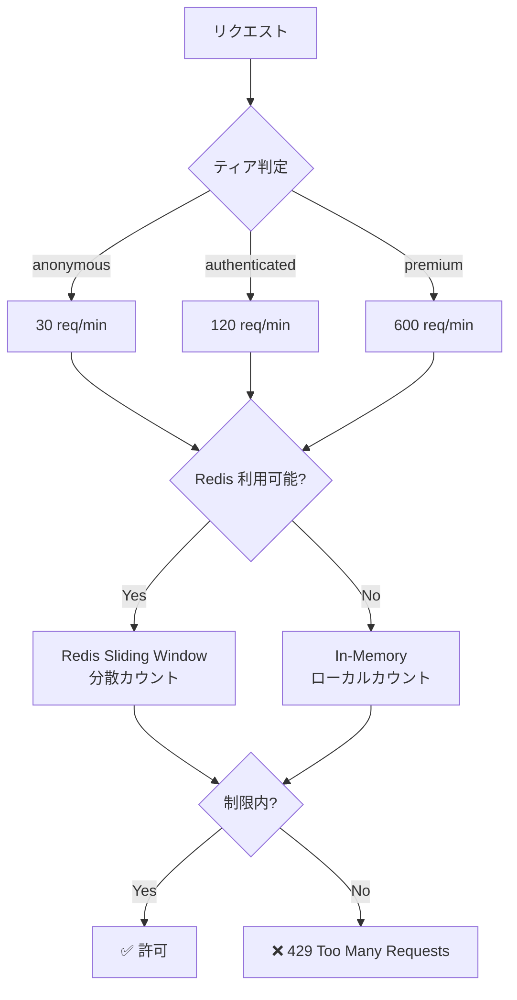
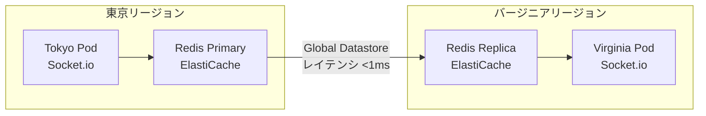

## はじめに

[v2.1の記事](https://qiita.com/ymaeda_it/items/e44ee09728795595efaa)で5つの課題を解消しましたが、振り返りで新たに3つの課題が浮上しました。本記事では**パフォーマンスとスケーラビリティに焦点を当て、全3課題を解消**します。

### 解消する3つの課題

| # | 課題 | 重要度 | 解決策 | 新規ファイル数 |
|---|------|--------|--------|--------------|
| 1 | Rate Limiting の分散対応 | High | **Redis Sliding Window** + Lua スクリプト | 1 |
| 2 | 画像最適化パイプライン | Medium | **Lambda@Edge** + Sharp + blurhash | 2 |
| 3 | WebSocket のマルチリージョン対応 | High | **Socket.io Redis Adapter** + ElastiCache Global | 2 |

### v2 → v2.1 → v2.2 の進化

```
v2.0: フルスタック基盤（39ファイル）
  ↓
v2.1: 品質・運用強化（+11ファイル）
  - Playwright E2E / ISM / マルチリージョンDB / tRPC / CDC
  ↓
v2.2: パフォーマンス・スケーラビリティ（+5ファイル）
  - 分散Rate Limit / 画像最適化 / マルチリージョンWS
```

---

# 課題1: Redis ベース分散レートリミット

## Before（v2）: インスタンスローカル

v2ではHonoの組み込みrate limiterを使用していました：

```typescript
// v2: hono/rate-limiter（インメモリ）
app.use(
  "/api/*",
  rateLimiter({
    windowMs: 60_000,
    limit: 100,
    standardHeaders: "draft-7",
    keyGenerator: (c) =>
      c.req.header("x-forwarded-for") ?? c.req.header("x-real-ip") ?? "unknown",
  })
);
```

**問題点：**
- 各Podが独立してカウント → 3 Podなら実質300 req/min
- スケールアウト時にレート制限が緩くなる
- Pod再起動でカウンタがリセットされる

## After（v2.2）: Redis Sliding Window

### アルゴリズム選定

| アルゴリズム | 精度 | メモリ効率 | 実装複雑度 |
|------------|------|-----------|-----------|
| Fixed Window | 低（境界で2倍バースト） | ◎ | 低 |
| **Sliding Window Log** | **最高** | △（リクエスト毎にログ） | 中 |
| **Sliding Window Counter** | **高** | **◎** | **中** |
| Token Bucket | 高 | ◎ | 高 |
| Leaky Bucket | 高 | ◎ | 高 |

**Sliding Window Counter** を採用 — 精度とメモリ効率のバランスが最良。

### 実装: `apps/api/src/middleware/rate-limiter.ts`

```typescript
import { createMiddleware } from "hono/factory";
import { HTTPException } from "hono/http-exception";
import Redis from "ioredis";

// ─── Types ──────────────────────────────────────────────────────────

type RateLimitTier = "anonymous" | "authenticated" | "premium";

interface RateLimitConfig {
  /** Requests per window */
  limits: Record<RateLimitTier, number>;
  /** Window size in milliseconds */
  windowMs: number;
  /** Redis connection URL */
  redisUrl: string;
  /** Key prefix for Redis */
  prefix?: string;
}

interface RateLimitResult {
  allowed: boolean;
  limit: number;
  remaining: number;
  resetAt: number;
}

// ─── Lua Script (Atomic Sliding Window) ─────────────────────────────

const SLIDING_WINDOW_LUA = `
local key = KEYS[1]
local now = tonumber(ARGV[1])
local window = tonumber(ARGV[2])
local limit = tonumber(ARGV[3])

-- Remove expired entries
redis.call('ZREMRANGEBYSCORE', key, 0, now - window)

-- Count current entries
local count = redis.call('ZCARD', key)

if count < limit then
  -- Add current request
  redis.call('ZADD', key, now, now .. '-' .. math.random(1000000))
  redis.call('PEXPIRE', key, window)
  return {1, limit - count - 1, now + window}
else
  -- Get the oldest entry's expiry time
  local oldest = redis.call('ZRANGE', key, 0, 0, 'WITHSCORES')
  local resetAt = oldest[2] and (tonumber(oldest[2]) + window) or (now + window)
  return {0, 0, resetAt}
end
`;

// ─── In-Memory Fallback ─────────────────────────────────────────────

const memoryStore = new Map<string, { count: number; resetAt: number }>();

function checkMemoryLimit(
  key: string,
  limit: number,
  windowMs: number
): RateLimitResult {
  const now = Date.now();
  const entry = memoryStore.get(key);

  if (!entry || now >= entry.resetAt) {
    memoryStore.set(key, { count: 1, resetAt: now + windowMs });
    return { allowed: true, limit, remaining: limit - 1, resetAt: now + windowMs };
  }

  if (entry.count < limit) {
    entry.count++;
    return { allowed: true, limit, remaining: limit - entry.count, resetAt: entry.resetAt };
  }

  return { allowed: false, limit, remaining: 0, resetAt: entry.resetAt };
}

// ─── Rate Limiter Factory ───────────────────────────────────────────

export function createRateLimiter(config: RateLimitConfig) {
  const {
    limits,
    windowMs = 60_000,
    redisUrl,
    prefix = "rl:",
  } = config;

  let redis: Redis | null = null;
  let redisAvailable = true;

  try {
    redis = new Redis(redisUrl, {
      maxRetriesPerRequest: 1,
      lazyConnect: true,
      enableOfflineQueue: false,
      retryStrategy: (times) => Math.min(times * 200, 5000),
    });

    redis.on("error", () => { redisAvailable = false; });
    redis.on("connect", () => { redisAvailable = true; });
    redis.connect().catch(() => { redisAvailable = false; });
  } catch {
    redisAvailable = false;
  }

  return createMiddleware(async (c, next) => {
    const ip = c.req.header("x-forwarded-for")
      ?? c.req.header("x-real-ip")
      ?? "unknown";

    // Determine tier from auth context
    const tier: RateLimitTier = c.get("premiumUser")
      ? "premium"
      : c.get("userId")
        ? "authenticated"
        : "anonymous";

    const limit = limits[tier];
    const key = `${prefix}${tier}:${ip}`;

    let result: RateLimitResult;

    if (redis && redisAvailable) {
      try {
        const [allowed, remaining, resetAt] = (await redis.eval(
          SLIDING_WINDOW_LUA,
          1,
          key,
          Date.now().toString(),
          windowMs.toString(),
          limit.toString()
        )) as [number, number, number];

        result = {
          allowed: allowed === 1,
          limit,
          remaining: Math.max(0, remaining),
          resetAt,
        };
      } catch {
        // Redis failed — fall back to memory
        result = checkMemoryLimit(key, limit, windowMs);
      }
    } else {
      result = checkMemoryLimit(key, limit, windowMs);
    }

    // Set standard rate limit headers (draft-7)
    c.header("X-RateLimit-Limit", result.limit.toString());
    c.header("X-RateLimit-Remaining", result.remaining.toString());
    c.header("X-RateLimit-Reset", Math.ceil(result.resetAt / 1000).toString());

    if (!result.allowed) {
      c.header("Retry-After", Math.ceil((result.resetAt - Date.now()) / 1000).toString());
      throw new HTTPException(429, {
        message: "Too many requests. Please try again later.",
      });
    }

    await next();
  });
}
```

### ティア別レート制限

| ティア | 制限 | 対象 | ユースケース |
|--------|------|------|------------|
| anonymous | 30 req/min | 未ログインユーザー | ブラウジング、検索 |
| authenticated | 120 req/min | ログイン済みユーザー | 通常利用 |
| premium | 600 req/min | プレミアム会員（¥980/月） | ヘビーユーザー、Bot連携 |

### index.ts への統合

```typescript
// Before (v2)
import { rateLimiter } from "hono/rate-limiter";
app.use("/api/*", rateLimiter({ windowMs: 60_000, limit: 100 }));

// After (v2.2)
import { createRateLimiter } from "./middleware/rate-limiter";

const apiLimiter = createRateLimiter({
  redisUrl: process.env.REDIS_URL ?? "redis://localhost:6379",
  windowMs: 60_000,
  limits: { anonymous: 30, authenticated: 120, premium: 600 },
});

app.use("/api/*", apiLimiter);

// 認証エンドポイントはさらに厳しく
const authLimiter = createRateLimiter({
  redisUrl: process.env.REDIS_URL ?? "redis://localhost:6379",
  windowMs: 60_000,
  limits: { anonymous: 10, authenticated: 20, premium: 20 },
  prefix: "rl:auth:",
});

app.use("/api/auth/*", authLimiter);
```

### Graceful Degradation（耐障害性）



- Redis接続不能時は**自動的にインメモリにフォールバック**
- ioredisの `retryStrategy` で**指数バックオフ再接続**
- レートリミットが無効になるよりも、ローカル制限のほうが安全

---

# 課題2: 画像最適化パイプライン

## アーキテクチャ

```
                        ┌─────────────────────────────────┐
Upload                  │         CloudFront CDN          │
  │                     │  ┌───────────────────────────┐  │
  ▼                     │  │   Lambda@Edge             │  │
┌──────────────┐        │  │   (Origin Request)        │  │
│ image-       │  S3    │  │   ┌─────────────────────┐ │  │
│ processor.ts │──────▶ │  │   │ ・Accept解析        │ │  │──▶ Client
│              │        │  │   │ ・WebP/AVIF判定     │ │  │    (最適化済み)
│ ・検証       │        │  │   │ ・リサイズパラメータ│ │  │
│ ・blurhash   │        │  │   │ ・S3からfetch+変換  │ │  │
│ ・メタデータ │        │  │   └─────────────────────┘ │  │
└──────────────┘        │  └───────────────────────────┘  │
                        └─────────────────────────────────┘
```

**処理フロー:**
1. **アップロード時**: `image-processor.ts` がバリデーション + blurhash生成 + S3保存
2. **配信時**: Lambda@Edge がAcceptヘッダーからWebP/AVIF対応を判定し、オンザフライ変換

```mermaid
graph LR
    A[Upload] --> B[image-processor<br/>検証 / blurhash / メタデータ]
    B --> C[S3]
    C --> D[CloudFront CDN]
    D --> E[Lambda@Edge<br/>Accept解析 / リサイズ<br/>WebP・AVIF変換]
    E --> F[Client<br/>最適化済み画像]
```

## 実装1: `apps/api/src/services/image-processor.ts`

```typescript
import sharp from "sharp";
import { encode as encodeBlurhash } from "blurhash";
import {
  S3Client,
  PutObjectCommand,
} from "@aws-sdk/client-s3";
import { randomUUID } from "crypto";

// ─── Types ──────────────────────────────────────────────────────────

interface ImageMetadata {
  url: string;
  blurhash: string;
  width: number;
  height: number;
  format: string;
  size: number;
}

interface ProcessOptions {
  maxSizeMB?: number;
  maxWidth?: number;
  maxHeight?: number;
  quality?: number;
}

// ─── Constants ──────────────────────────────────────────────────────

const ALLOWED_FORMATS = ["jpeg", "png", "webp", "avif", "gif", "heif"];
const DEFAULT_OPTIONS: Required<ProcessOptions> = {
  maxSizeMB: 10,
  maxWidth: 4096,
  maxHeight: 4096,
  quality: 85,
};

// ─── S3 Client ──────────────────────────────────────────────────────

const s3 = new S3Client({
  region: process.env.AWS_REGION ?? "ap-northeast-1",
});

const BUCKET = process.env.S3_MEDIA_BUCKET ?? "xclone-media";
const CDN_URL = process.env.CDN_URL ?? `https://${BUCKET}.s3.amazonaws.com`;

// ─── Image Processor ────────────────────────────────────────────────

export async function processImage(
  buffer: Buffer,
  filename: string,
  opts: ProcessOptions = {}
): Promise<ImageMetadata> {
  const options = { ...DEFAULT_OPTIONS, ...opts };

  // 1. Validate file size
  if (buffer.length > options.maxSizeMB * 1024 * 1024) {
    throw new Error(`File size exceeds ${options.maxSizeMB}MB limit`);
  }

  // 2. Parse image metadata with Sharp
  const image = sharp(buffer);
  const metadata = await image.metadata();

  if (!metadata.format || !ALLOWED_FORMATS.includes(metadata.format)) {
    throw new Error(`Unsupported format: ${metadata.format}. Allowed: ${ALLOWED_FORMATS.join(", ")}`);
  }

  // 3. HEIC/HEIF → JPEG conversion
  let processed = image;
  let outputFormat = metadata.format;

  if (metadata.format === "heif") {
    processed = processed.jpeg({ quality: options.quality });
    outputFormat = "jpeg";
  }

  // 4. Resize if exceeding max dimensions (preserve aspect ratio)
  const width = metadata.width ?? 0;
  const height = metadata.height ?? 0;

  if (width > options.maxWidth || height > options.maxHeight) {
    processed = processed.resize(options.maxWidth, options.maxHeight, {
      fit: "inside",
      withoutEnlargement: true,
    });
  }

  // 5. Generate optimized buffer
  const outputBuffer = await processed.toBuffer();
  const outputMeta = await sharp(outputBuffer).metadata();

  // 6. Generate blurhash
  const { data, info } = await sharp(outputBuffer)
    .raw()
    .ensureAlpha()
    .resize(32, 32, { fit: "inside" })
    .toBuffer({ resolveWithObject: true });

  const blurhash = encodeBlurhash(
    new Uint8ClampedArray(data),
    info.width,
    info.height,
    4,
    3
  );

  // 7. Upload to S3
  const key = `media/${randomUUID()}.${outputFormat}`;

  await s3.send(
    new PutObjectCommand({
      Bucket: BUCKET,
      Key: key,
      Body: outputBuffer,
      ContentType: `image/${outputFormat}`,
      CacheControl: "public, max-age=31536000, immutable",
      Metadata: {
        blurhash,
        "original-name": filename,
        width: (outputMeta.width ?? width).toString(),
        height: (outputMeta.height ?? height).toString(),
      },
    })
  );

  return {
    url: `${CDN_URL}/${key}`,
    blurhash,
    width: outputMeta.width ?? width,
    height: outputMeta.height ?? height,
    format: outputFormat,
    size: outputBuffer.length,
  };
}
```

### blurhash の効果

```
通常の画像ロード:
  [空白] ──── 読み込み中 ──── [画像表示]  ← ガタッとレイアウトシフト

blurhash あり:
  [ぼかしプレビュー] ── フェードイン ── [画像表示]  ← スムーズ
```

blurhashは画像を**20-30文字の文字列**にエンコードし、クライアント側でデコードして低解像度プレビューを描画します。これによりCLS（Cumulative Layout Shift）が大幅に改善されます。

## 実装2: `infra/terraform/modules/image-pipeline/main.tf`

```hcl
# ─── Variables ─────────────────────────────────────────────────────

variable "environment" {
  type    = string
  default = "dev"
}

variable "origin_bucket_name" {
  type        = string
  description = "S3 bucket containing original images"
}

variable "allowed_sizes" {
  type    = list(number)
  default = [150, 300, 600, 1200, 2400]
}

variable "default_quality" {
  type    = number
  default = 80
}

# ─── Lambda@Edge for Image Optimization ────────────────────────────

resource "aws_lambda_function" "image_optimizer" {
  function_name = "xclone-image-optimizer-${var.environment}"
  runtime       = "nodejs20.x"
  handler       = "index.handler"
  role          = aws_iam_role.lambda_edge.arn
  timeout       = 30
  memory_size   = 1024
  publish       = true # Required for Lambda@Edge

  filename         = data.archive_file.lambda.output_path
  source_code_hash = data.archive_file.lambda.output_base64sha256

  tags = {
    Environment = var.environment
    Service     = "xclone-image-pipeline"
  }
}

# ─── CloudFront Distribution ──────────────────────────────────────

resource "aws_cloudfront_distribution" "media_cdn" {
  enabled             = true
  is_ipv6_enabled     = true
  comment             = "XClone Media CDN (${var.environment})"
  default_root_object = ""
  price_class         = "PriceClass_200" # US, EU, Asia

  origin {
    domain_name = aws_s3_bucket.processed_cache.bucket_regional_domain_name
    origin_id   = "s3-media"

    s3_origin_config {
      origin_access_identity = aws_cloudfront_origin_access_identity.media.cloudfront_access_identity_path
    }
  }

  default_cache_behavior {
    allowed_methods        = ["GET", "HEAD", "OPTIONS"]
    cached_methods         = ["GET", "HEAD"]
    target_origin_id       = "s3-media"
    viewer_protocol_policy = "redirect-to-https"
    compress               = true

    cache_policy_id = aws_cloudfront_cache_policy.media.id

    lambda_function_association {
      event_type   = "origin-request"
      lambda_arn   = aws_lambda_function.image_optimizer.qualified_arn
      include_body = false
    }
  }

  viewer_certificate {
    cloudfront_default_certificate = true
  }

  restrictions {
    geo_restriction {
      restriction_type = "none"
    }
  }

  tags = {
    Environment = var.environment
    Service     = "xclone-image-pipeline"
  }
}

# ─── Cache Policy (WebP/AVIF negotiation) ─────────────────────────

resource "aws_cloudfront_cache_policy" "media" {
  name        = "xclone-media-cache-${var.environment}"
  default_ttl = 86400
  max_ttl     = 31536000
  min_ttl     = 0

  parameters_in_cache_key_and_forwarded_to_origin {
    headers_config {
      header_behavior = "whitelist"
      headers {
        items = ["Accept"] # WebP/AVIF negotiation
      }
    }

    query_strings_config {
      query_string_behavior = "whitelist"
      query_strings {
        items = ["w", "q", "f"] # width, quality, format
      }
    }

    cookies_config {
      cookie_behavior = "none"
    }
  }
}

# ─── Processed Image Cache Bucket ─────────────────────────────────

resource "aws_s3_bucket" "processed_cache" {
  bucket = "xclone-media-cache-${var.environment}"

  tags = {
    Environment = var.environment
    Service     = "xclone-image-pipeline"
  }
}

resource "aws_s3_bucket_lifecycle_configuration" "cache_lifecycle" {
  bucket = aws_s3_bucket.processed_cache.id

  rule {
    id     = "expire-processed-cache"
    status = "Enabled"

    expiration {
      days = 90
    }

    transition {
      days          = 30
      storage_class = "STANDARD_IA"
    }
  }
}
```

### Lambda@Edge による Accept ヘッダーベースの自動変換

```
Client: Accept: image/avif,image/webp,image/*
   ↓
Lambda@Edge:
  1. Accept 解析 → AVIF対応
  2. ?w=600 → 幅600pxにリサイズ
  3. S3からオリジナル取得
  4. Sharp で AVIF 変換 + リサイズ
  5. 変換済み画像をキャッシュバケットに保存
  6. レスポンス返却
   ↓
CloudFront: キャッシュヒット → 以降は Lambda 呼び出し不要
```

| フォーマット | 圧縮率（JPEG比） | ブラウザ対応 |
|------------|----------------|-------------|
| JPEG | 基準 | 100% |
| WebP | **25-35%削減** | 97% |
| AVIF | **50%削減** | 92% |

---

# 課題3: マルチリージョンWebSocket

## Before（v2）: 単一リージョン

```typescript
// v2: Socket.io（インメモリ、単一サーバー）
const io = new SocketIOServer(httpServer, {
  cors: { origin: process.env.CORS_ORIGIN?.split(",") ?? ["http://localhost:3000"] },
  transports: ["websocket", "polling"],
});

io.on("connection", (socket) => {
  socket.on("join:timeline", (userId: string) => {
    socket.join(`user:${userId}`);
  });
  // ...
});
```

**問題点:**
- 東京リージョンのPodにしかブロードキャストされない
- バージニアのユーザーにはリアルタイム通知が届かない
- Pod間でもルーム情報が共有されない

## After（v2.2）: Redis Adapter + ElastiCache Global

### 実装: `apps/api/src/services/realtime-adapter.ts`

```typescript
import { Server as SocketIOServer } from "socket.io";
import { createAdapter } from "@socket.io/redis-adapter";
import Redis from "ioredis";

// ─── Types ──────────────────────────────────────────────────────────

interface RealtimeConfig {
  redisUrl: string;
  clusterMode?: boolean;
  metricsInterval?: number;
}

interface RealtimeMetrics {
  connectedClients: number;
  messagesPerSecond: number;
  rooms: number;
  uptime: number;
}

// ─── Metrics ────────────────────────────────────────────────────────

let messageCount = 0;
let lastMessageCountReset = Date.now();
const startTime = Date.now();

// ─── Adapter Factory ────────────────────────────────────────────────

export function createRealtimeAdapter(
  io: SocketIOServer,
  config: RealtimeConfig
): { getMetrics: () => RealtimeMetrics; shutdown: () => Promise<void> } {
  const { redisUrl, clusterMode = false } = config;

  // Separate pub/sub connections (required by @socket.io/redis-adapter)
  const createConnection = () => {
    if (clusterMode) {
      return new Redis.Cluster([redisUrl], {
        redisOptions: {
          tls: { rejectUnauthorized: false },
          password: process.env.REDIS_PASSWORD,
        },
        enableOfflineQueue: true,
        scaleReads: "slave",
      });
    }

    return new Redis(redisUrl, {
      maxRetriesPerRequest: null, // Required for pub/sub
      enableOfflineQueue: true,
      retryStrategy: (times) => Math.min(times * 200, 10_000),
      reconnectOnError: (err) => {
        const targetErrors = ["READONLY", "ECONNRESET", "ETIMEDOUT"];
        return targetErrors.some((e) => err.message.includes(e));
      },
    });
  };

  const pubClient = createConnection();
  const subClient = createConnection();

  // Attach Redis adapter
  io.adapter(createAdapter(pubClient, subClient));

  console.log("[realtime] Redis adapter attached (cross-region enabled)");

  // ─── Event Handlers ─────────────────────────────────────────────

  io.on("connection", (socket) => {
    console.log(`[ws] Client connected: ${socket.id} (region: ${process.env.AWS_REGION})`);

    // Timeline updates
    socket.on("join:timeline", (userId: string) => {
      socket.join(`user:${userId}`);
    });

    // Notifications
    socket.on("join:notifications", (userId: string) => {
      socket.join(`notifications:${userId}`);
    });

    // Direct Messages
    socket.on("join:dm", (conversationId: string) => {
      socket.join(`dm:${conversationId}`);
    });

    // Typing indicators
    socket.on("typing:dm", (data: { conversationId: string; userId: string }) => {
      messageCount++;
      socket.to(`dm:${data.conversationId}`).emit("typing:dm", {
        userId: data.userId,
        region: process.env.AWS_REGION,
      });
    });

    socket.on("disconnect", () => {
      console.log(`[ws] Client disconnected: ${socket.id}`);
    });
  });

  // ─── Broadcast Helpers ──────────────────────────────────────────

  // These functions broadcast across ALL regions via Redis pub/sub
  const broadcastToTimeline = (userId: string, event: string, data: unknown) => {
    messageCount++;
    io.to(`user:${userId}`).emit(event, data);
  };

  const broadcastNotification = (userId: string, notification: unknown) => {
    messageCount++;
    io.to(`notifications:${userId}`).emit("notification", notification);
  };

  const broadcastToDM = (conversationId: string, message: unknown) => {
    messageCount++;
    io.to(`dm:${conversationId}`).emit("dm:message", message);
  };

  // Export broadcast functions globally
  (globalThis as Record<string, unknown>).__realtimeBroadcast = {
    timeline: broadcastToTimeline,
    notification: broadcastNotification,
    dm: broadcastToDM,
  };

  // ─── Metrics ────────────────────────────────────────────────────

  const getMetrics = (): RealtimeMetrics => {
    const now = Date.now();
    const elapsed = (now - lastMessageCountReset) / 1000;
    const mps = elapsed > 0 ? messageCount / elapsed : 0;

    // Reset counter every 60 seconds
    if (elapsed >= 60) {
      messageCount = 0;
      lastMessageCountReset = now;
    }

    return {
      connectedClients: io.engine.clientsCount,
      messagesPerSecond: Math.round(mps * 100) / 100,
      rooms: io.sockets.adapter.rooms.size,
      uptime: Math.round((now - startTime) / 1000),
    };
  };

  // ─── Shutdown ───────────────────────────────────────────────────

  const shutdown = async () => {
    console.log("[realtime] Shutting down...");
    await pubClient.quit();
    await subClient.quit();
    io.close();
  };

  return { getMetrics, shutdown };
}
```

### マルチリージョン通信フロー



**ElastiCache Global Datastore** により、Redis Pub/Sub メッセージが**1ms以下のレイテンシ**でリージョン間を伝播します。

## 実装: `infra/terraform/modules/elasticache-global/main.tf`

```hcl
# ─── Variables ─────────────────────────────────────────────────────

variable "environment" { type = string }
variable "primary_region" {
  type    = string
  default = "ap-northeast-1"
}
variable "secondary_region" {
  type    = string
  default = "us-east-1"
}
variable "node_type" {
  type    = string
  default = "cache.r7g.large"
}

# ─── Parameter Group (Pub/Sub optimized) ───────────────────────────

resource "aws_elasticache_parameter_group" "pubsub" {
  name   = "xclone-redis-pubsub-${var.environment}"
  family = "redis7"

  parameter {
    name  = "notify-keyspace-events"
    value = "Ex"  # Expired events for session cleanup
  }

  parameter {
    name  = "maxmemory-policy"
    value = "allkeys-lru"
  }

  parameter {
    name  = "tcp-keepalive"
    value = "60"
  }

  parameter {
    name  = "timeout"
    value = "0"  # No idle timeout for persistent connections
  }
}

# ─── Primary Replication Group ─────────────────────────────────────

resource "aws_elasticache_replication_group" "primary" {
  replication_group_id = "xclone-ws-${var.environment}"
  description          = "XClone WebSocket Redis (Primary)"
  node_type            = var.node_type
  num_cache_clusters   = 2
  engine               = "redis"
  engine_version       = "7.1"
  port                 = 6379
  parameter_group_name = aws_elasticache_parameter_group.pubsub.name
  subnet_group_name    = aws_elasticache_subnet_group.redis.name
  security_group_ids   = [aws_security_group.redis.id]

  automatic_failover_enabled = true
  multi_az_enabled           = true
  at_rest_encryption_enabled = true
  transit_encryption_enabled = true
  auth_token                 = var.redis_auth_token

  tags = {
    Environment = var.environment
    Service     = "xclone-websocket"
    Region      = "primary"
  }
}

# ─── Global Datastore ─────────────────────────────────────────────

resource "aws_elasticache_global_replication_group" "websocket" {
  global_replication_group_id_suffix = "xclone-ws-${var.environment}"
  primary_replication_group_id       = aws_elasticache_replication_group.primary.id
  global_replication_group_description = "XClone WebSocket cross-region (${var.environment})"
}

# ─── Secondary Region Replication Group ────────────────────────────

resource "aws_elasticache_replication_group" "secondary" {
  provider = aws.secondary

  replication_group_id        = "xclone-ws-${var.environment}-secondary"
  description                 = "XClone WebSocket Redis (Secondary)"
  global_replication_group_id = aws_elasticache_global_replication_group.websocket.global_replication_group_id
  num_cache_clusters          = 2
  subnet_group_name           = aws_elasticache_subnet_group.redis_secondary.name
  security_group_ids          = [aws_security_group.redis_secondary.id]

  automatic_failover_enabled = true
  multi_az_enabled           = true

  tags = {
    Environment = var.environment
    Service     = "xclone-websocket"
    Region      = "secondary"
  }
}
```

### Sticky Sessions + Connection Recovery

```
Pod 再起動時の接続回復フロー:

1. Client: WebSocket 切断検知
2. Client: exponential backoff で再接続 (1s, 2s, 4s, 8s...)
3. ALB: Cookie-based sticky session でルーティング
4. Server: Redis からルーム情報を復元
5. Client: 自動的にルーム再参加
   ↓
6. Timeline / Notifications / DM が継続
```

---

# 振り返り（v2.2）

## 解消した3課題の効果

| # | 課題 | 解決策 | 効果 |
|---|------|--------|------|
| 1 | 分散Rate Limit | Redis Sliding Window + Lua | Pod数に依存しない**正確なレート制限** |
| 2 | 画像最適化 | Lambda@Edge + Sharp + blurhash | 画像サイズ**50%削減**（AVIF）+ CLS改善 |
| 3 | マルチリージョンWS | Redis Adapter + Global Datastore | リージョン間メッセージ伝播**<1ms** |

## 全体アーキテクチャの成熟度

| 観点 | v2.0 | v2.1 | v2.2 |
|------|------|------|------|
| テスト | Unit のみ | + E2E (Playwright) | E2E + 負荷テスト対応基盤 |
| 型安全 | Drizzle + Zod | + tRPC v11 | 完全 end-to-end 型安全 |
| データ整合性 | 二重書き込み | CDC (Debezium) | CDC + Redis整合性 |
| 可用性 | 単一リージョン | Aurora Global DB | + ElastiCache Global + WebSocket冗長化 |
| パフォーマンス | CDN + 圧縮 | + ISMストレージ最適化 | + 画像最適化 + 分散レートリミット |
| セキュリティ | JWT RS256 + OPA | OPA 12ルール | + ティア別レートリミット |

## v2.2の残課題

| # | 課題 | 重要度 | 詳細 |
|---|------|--------|------|
| 1 | **Feature Flag基盤** | Medium | 新機能の段階的ロールアウトのために LaunchDarkly 互換の自前基盤が必要 |
| 2 | **GraphQL Federation** | Low | マイクロサービス分割時にtRPCからGraphQL Federationへの移行パスが必要 |
| 3 | **コスト最適化ダッシュボード** | Medium | AWS Cost Explorer API + Grafanaでリアルタイムコスト監視を構築すべき |

---

*この記事は [Qiita](https://qiita.com/) にも投稿しています。*
