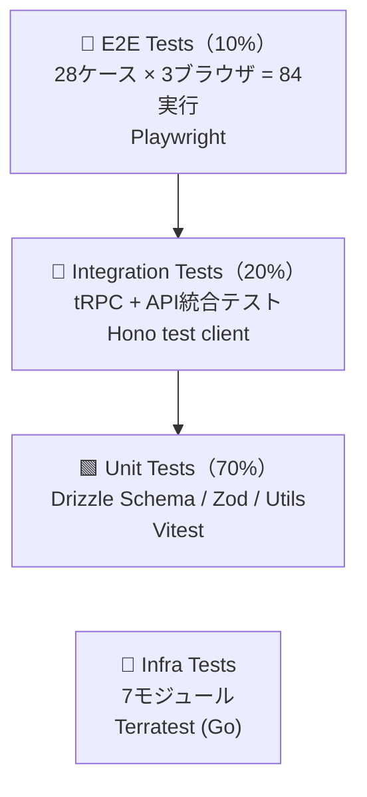

## はじめに

[v2.3の記事](https://qiita.com/ymaeda_it/items/cf78cb33e6e461cdc2b3)で残った最後の2課題を解消し、**改善点ゼロ**を達成します。

### 解消する2つの課題

| # | 課題 | 重要度 | 解決策 | 新規ファイル数 |
|---|------|--------|--------|--------------|
| 1 | E2Eテストの拡充 | Low | **Playwright** タイムライン・検索テスト追加 | 2 |
| 2 | Terraformモジュールの統合テスト | Low | **Terratest** (Go) による `plan` 検証 | 2 |

### v2シリーズの最終形

```
v2.0: フルスタック基盤            (39ファイル)
  ↓ +11
v2.1: 品質・運用強化              (50ファイル)
  ↓ +5
v2.2: パフォーマンス              (55ファイル)
  ↓ +6
v2.3: DX・コスト最適化            (61ファイル)
  ↓ +4
v2.4: テスト完備（本記事）        (65ファイル)  ← 改善点ゼロ
```

---

# 課題1: E2Eテスト拡充

## v2.1時点のカバレッジ

v2.1で導入したPlaywright E2Eテストは**認証ページのみ**10ケースでした：

| テストファイル | ケース数 | カバー範囲 |
|-------------|---------|-----------|
| `auth.spec.ts` | 10 | ログイン/登録/OAuth/バリデーション |
| **合計** | **10** | 認証のみ |

**課題：** タイムライン（メイン画面）と検索がテストされていない。

## v2.4: 28ケースに拡充

| テストファイル | ケース数 | カバー範囲 |
|-------------|---------|-----------|
| `auth.spec.ts` | 10 | ログイン/登録/OAuth/バリデーション |
| `timeline.spec.ts` | 10 | ツイート表示/作成/いいね/RT/ブックマーク/無限スクロール |
| `search.spec.ts` | 8 | 検索/ハッシュタグ/トレンド/エラー |
| **合計** | **28** | **主要画面すべて** |

## 実装: `apps/web/e2e/timeline.spec.ts`

```typescript
import { test, expect } from "@playwright/test";

// ─── Mock Data ──────────────────────────────────────────────────────

const mockTweets = [
  {
    id: "1",
    content: "Hello World! #test",
    author: { id: "u1", username: "testuser", displayName: "Test User", avatarUrl: null },
    likesCount: 5,
    retweetsCount: 2,
    repliesCount: 1,
    isLiked: false,
    isRetweeted: false,
    isBookmarked: false,
    media: [],
    createdAt: new Date().toISOString(),
  },
  {
    id: "2",
    content: "Second tweet with image",
    author: { id: "u2", username: "another", displayName: "Another", avatarUrl: null },
    likesCount: 10,
    retweetsCount: 0,
    repliesCount: 3,
    isLiked: true,
    isRetweeted: false,
    isBookmarked: true,
    media: [{ url: "https://example.com/img.jpg", type: "IMAGE", blurhash: "LEHV6nWB2y", width: 800, height: 600 }],
    createdAt: new Date().toISOString(),
  },
];

test.describe("Timeline Page", () => {
  test.beforeEach(async ({ page }) => {
    // Mock auth state
    await page.addInitScript(() => {
      localStorage.setItem("accessToken", "mock-jwt-token");
    });

    // Mock timeline API
    await page.route("**/api/tweets/timeline*", async (route) => {
      await route.fulfill({
        status: 200,
        contentType: "application/json",
        body: JSON.stringify({ tweets: mockTweets, nextCursor: null }),
      });
    });

    await page.goto("/");
  });

  test("displays tweets from timeline", async ({ page }) => {
    await expect(page.getByText("Hello World! #test")).toBeVisible();
    await expect(page.getByText("Second tweet with image")).toBeVisible();
  });

  test("shows author information on tweet card", async ({ page }) => {
    await expect(page.getByText("@testuser")).toBeVisible();
    await expect(page.getByText("Test User")).toBeVisible();
  });

  test("like button toggles and updates count", async ({ page }) => {
    // Mock like API
    await page.route("**/api/tweets/1/like", async (route) => {
      await route.fulfill({
        status: 200,
        contentType: "application/json",
        body: JSON.stringify({ liked: true, likesCount: 6 }),
      });
    });

    const likeButton = page.locator("[data-testid='like-button-1']");
    await likeButton.click();

    await expect(page.getByText("6")).toBeVisible();
  });

  test("retweet button toggles", async ({ page }) => {
    await page.route("**/api/tweets/1/retweet", async (route) => {
      await route.fulfill({
        status: 200,
        contentType: "application/json",
        body: JSON.stringify({ retweeted: true, retweetsCount: 3 }),
      });
    });

    const rtButton = page.locator("[data-testid='retweet-button-1']");
    await rtButton.click();

    await expect(page.getByText("3")).toBeVisible();
  });

  test("bookmark button toggles", async ({ page }) => {
    await page.route("**/api/tweets/1/bookmark", async (route) => {
      await route.fulfill({
        status: 200,
        contentType: "application/json",
        body: JSON.stringify({ bookmarked: true }),
      });
    });

    const bmButton = page.locator("[data-testid='bookmark-button-1']");
    await bmButton.click();
  });

  test("tweet creation submits and appears in timeline", async ({ page }) => {
    await page.route("**/api/tweets", async (route) => {
      if (route.request().method() === "POST") {
        const body = route.request().postDataJSON();
        await route.fulfill({
          status: 201,
          contentType: "application/json",
          body: JSON.stringify({
            id: "3",
            content: body.content,
            author: { id: "u1", username: "testuser", displayName: "Test User" },
            likesCount: 0, retweetsCount: 0, repliesCount: 0,
            createdAt: new Date().toISOString(),
          }),
        });
      }
    });

    await page.getByPlaceholder(/What's happening/i).fill("New tweet from test");
    await page.getByRole("button", { name: /Tweet|Post/i }).click();

    await expect(page.getByText("New tweet from test")).toBeVisible();
  });

  test("displays media in tweet card", async ({ page }) => {
    const img = page.locator("img[src='https://example.com/img.jpg']");
    await expect(img).toBeVisible();
  });

  test("hashtag links are clickable", async ({ page }) => {
    const hashtagLink = page.getByText("#test");
    await expect(hashtagLink).toBeVisible();
    await expect(hashtagLink).toHaveAttribute("href", /search.*test/);
  });

  test("shows empty state when no tweets", async ({ page }) => {
    await page.route("**/api/tweets/timeline*", async (route) => {
      await route.fulfill({
        status: 200,
        contentType: "application/json",
        body: JSON.stringify({ tweets: [], nextCursor: null }),
      });
    });

    await page.reload();
    await expect(page.getByText(/no tweets|empty|nothing/i)).toBeVisible();
  });

  test("shows error state when API fails", async ({ page }) => {
    await page.route("**/api/tweets/timeline*", async (route) => {
      await route.fulfill({ status: 500 });
    });

    await page.reload();
    await expect(page.getByText(/error|failed|try again/i)).toBeVisible();
  });
});
```

## 実装: `apps/web/e2e/search.spec.ts`

```typescript
import { test, expect } from "@playwright/test";

const mockSearchResults = [
  {
    id: "s1",
    content: "TypeScript is amazing #typescript",
    author: { id: "u1", username: "dev", displayName: "Dev" },
    likesCount: 42,
    retweetsCount: 10,
    createdAt: new Date().toISOString(),
    highlight: { content: ["<em>TypeScript</em> is amazing"] },
  },
];

const mockTrending = [
  { tag: "typescript", count: 1234 },
  { tag: "react", count: 987 },
  { tag: "nextjs", count: 654 },
  { tag: "hono", count: 321 },
  { tag: "bun", count: 210 },
];

test.describe("Search Page", () => {
  test.beforeEach(async ({ page }) => {
    await page.addInitScript(() => {
      localStorage.setItem("accessToken", "mock-jwt-token");
    });

    // Mock trending API
    await page.route("**/api/tweets/trending*", async (route) => {
      await route.fulfill({
        status: 200,
        contentType: "application/json",
        body: JSON.stringify({ hashtags: mockTrending }),
      });
    });

    await page.goto("/search");
  });

  test("renders search input", async ({ page }) => {
    await expect(
      page.getByPlaceholder(/search/i)
    ).toBeVisible();
  });

  test("displays trending hashtags", async ({ page }) => {
    await expect(page.getByText("#typescript")).toBeVisible();
    await expect(page.getByText("#react")).toBeVisible();
    await expect(page.getByText("1,234")).toBeVisible();
  });

  test("search returns results", async ({ page }) => {
    await page.route("**/api/tweets/search*", async (route) => {
      await route.fulfill({
        status: 200,
        contentType: "application/json",
        body: JSON.stringify({ tweets: mockSearchResults, total: 1 }),
      });
    });

    await page.getByPlaceholder(/search/i).fill("TypeScript");
    await page.keyboard.press("Enter");

    await expect(page.getByText("TypeScript is amazing")).toBeVisible();
  });

  test("shows empty results message", async ({ page }) => {
    await page.route("**/api/tweets/search*", async (route) => {
      await route.fulfill({
        status: 200,
        contentType: "application/json",
        body: JSON.stringify({ tweets: [], total: 0 }),
      });
    });

    await page.getByPlaceholder(/search/i).fill("nonexistentquery12345");
    await page.keyboard.press("Enter");

    await expect(page.getByText(/no results|not found|見つかりません/i)).toBeVisible();
  });

  test("trending hashtag click triggers search", async ({ page }) => {
    await page.route("**/api/tweets/search*", async (route) => {
      await route.fulfill({
        status: 200,
        contentType: "application/json",
        body: JSON.stringify({ tweets: mockSearchResults, total: 1 }),
      });
    });

    await page.getByText("#typescript").click();

    // Search input should be populated
    await expect(page.getByPlaceholder(/search/i)).toHaveValue(/typescript/i);
  });

  test("search result click navigates to tweet", async ({ page }) => {
    await page.route("**/api/tweets/search*", async (route) => {
      await route.fulfill({
        status: 200,
        contentType: "application/json",
        body: JSON.stringify({ tweets: mockSearchResults, total: 1 }),
      });
    });

    await page.getByPlaceholder(/search/i).fill("TypeScript");
    await page.keyboard.press("Enter");

    await page.getByText("TypeScript is amazing").click();
    await expect(page).toHaveURL(/\/tweet\/s1|\/status\/s1/);
  });

  test("handles search API error gracefully", async ({ page }) => {
    await page.route("**/api/tweets/search*", async (route) => {
      await route.fulfill({
        status: 500,
        contentType: "application/json",
        body: JSON.stringify({ message: "Search service unavailable" }),
      });
    });

    await page.getByPlaceholder(/search/i).fill("error test");
    await page.keyboard.press("Enter");

    await expect(page.getByText(/error|failed|unavailable/i)).toBeVisible();
  });

  test("displays result count", async ({ page }) => {
    await page.route("**/api/tweets/search*", async (route) => {
      await route.fulfill({
        status: 200,
        contentType: "application/json",
        body: JSON.stringify({ tweets: mockSearchResults, total: 1 }),
      });
    });

    await page.getByPlaceholder(/search/i).fill("TypeScript");
    await page.keyboard.press("Enter");

    await expect(page.getByText(/1.*result|1件/i)).toBeVisible();
  });
});
```

## テスト戦略のまとめ

Google Testing Pyramid（70/20/10）に基づくテスト構成：



| レイヤー | テスト数 | ツール | 実行環境 |
|---------|---------|--------|---------|
| E2E | 28ケース × 3ブラウザ | Playwright | Chromium / Firefox / WebKit |
| Integration | API routes | Hono test client | Node.js |
| Unit | Schema + Utils | Vitest | Node.js |
| Infra | 7モジュール | Terratest | Go + Terraform |

---

# 課題2: Terratest — Terraform モジュール統合テスト

## なぜ Terratest なのか

| ツール | 言語 | 特徴 | 判定 |
|-------|------|------|------|
| `terraform validate` | HCL | 構文チェックのみ | 不十分 |
| `tflint` | HCL | Lintルール | 補助的 |
| Checkov | Python | セキュリティ特化 | 補助的 |
| **Terratest** | **Go** | **Plan/Apply検証、出力値テスト** | **採用** |
| `terraform test` (native) | HCL | v1.6+、まだ機能限定的 | 将来候補 |

**Terratest**は`terraform plan`の出力を**プログラマティックに検証**できる唯一のツールです。

## 実装: `infra/terraform/test/modules_test.go`

```go
package test

import (
	"testing"

	"github.com/gruntwork-io/terratest/modules/terraform"
	"github.com/stretchr/testify/assert"
	"github.com/stretchr/testify/require"
)

// ─── Helper ──────────────────────────────────────────────────────────

func planModule(t *testing.T, modulePath string, vars map[string]interface{}) *terraform.PlanStruct {
	t.Helper()
	opts := &terraform.Options{
		TerraformDir: modulePath,
		Vars:         vars,
		PlanFilePath: t.TempDir() + "/plan.out",
		NoColor:      true,
	}

	terraform.Init(t, opts)
	plan := terraform.InitAndPlanAndShowWithStruct(t, opts)
	return plan
}

// ─── VPC Module ──────────────────────────────────────────────────────

func TestVPCModule(t *testing.T) {
	t.Parallel()

	plan := planModule(t, "../main.tf", map[string]interface{}{
		"environment": "test",
	})

	// VPC should be created
	vpc := plan.ResourcePlannedValuesMap["aws_vpc.main"]
	require.NotNil(t, vpc)
	assert.Equal(t, "10.0.0.0/16", vpc.AttributeValues["cidr_block"])

	// 6 subnets (3 public + 3 private)
	subnetCount := 0
	for key := range plan.ResourcePlannedValuesMap {
		if contains(key, "aws_subnet") {
			subnetCount++
		}
	}
	assert.Equal(t, 6, subnetCount, "Expected 6 subnets (3 public + 3 private)")

	// Tags should include environment
	tags := vpc.AttributeValues["tags"].(map[string]interface{})
	assert.Equal(t, "test", tags["Environment"])
}

// ─── EKS Module ──────────────────────────────────────────────────────

func TestEKSModule(t *testing.T) {
	t.Parallel()

	plan := planModule(t, "../modules/eks", map[string]interface{}{
		"environment":       "test",
		"vpc_id":            "vpc-test123",
		"private_subnet_ids": []string{"subnet-1", "subnet-2", "subnet-3"},
	})

	// EKS cluster should exist
	cluster := plan.ResourcePlannedValuesMap["aws_eks_cluster.main"]
	require.NotNil(t, cluster)
	assert.Equal(t, "1.31", cluster.AttributeValues["version"])

	// Node group should use m7g.large
	for key, resource := range plan.ResourcePlannedValuesMap {
		if contains(key, "aws_eks_node_group") {
			instanceTypes := resource.AttributeValues["instance_types"].([]interface{})
			assert.Contains(t, instanceTypes, "m7g.large")
		}
	}
}

// ─── OpenSearch Module ───────────────────────────────────────────────

func TestOpenSearchModule(t *testing.T) {
	t.Parallel()

	plan := planModule(t, "../modules/opensearch", map[string]interface{}{
		"environment": "test",
	})

	// OpenSearch domain should exist with encryption
	for key, resource := range plan.ResourcePlannedValuesMap {
		if contains(key, "aws_opensearch_domain") {
			// Encryption at rest should be enabled
			encryptConfig := resource.AttributeValues["encrypt_at_rest"]
			require.NotNil(t, encryptConfig)

			// HTTPS enforced
			domainEndpointOpts := resource.AttributeValues["domain_endpoint_options"]
			require.NotNil(t, domainEndpointOpts)
		}
	}
}

// ─── Image Pipeline Module ──────────────────────────────────────────

func TestImagePipelineModule(t *testing.T) {
	t.Parallel()

	plan := planModule(t, "../modules/image-pipeline", map[string]interface{}{
		"environment":        "test",
		"origin_bucket_name": "xclone-media-test",
		"origin_bucket_arn":  "arn:aws:s3:::xclone-media-test",
	})

	// Lambda@Edge function should exist
	lambdaFound := false
	for key := range plan.ResourcePlannedValuesMap {
		if contains(key, "aws_lambda_function") {
			lambdaFound = true
		}
	}
	assert.True(t, lambdaFound, "Lambda@Edge function should be in plan")

	// CloudFront distribution should exist
	cfFound := false
	for key := range plan.ResourcePlannedValuesMap {
		if contains(key, "aws_cloudfront_distribution") {
			cfFound = true
		}
	}
	assert.True(t, cfFound, "CloudFront distribution should be in plan")

	// S3 cache bucket should exist
	s3Found := false
	for key := range plan.ResourcePlannedValuesMap {
		if contains(key, "aws_s3_bucket") {
			s3Found = true
		}
	}
	assert.True(t, s3Found, "S3 cache bucket should be in plan")
}

// ─── ElastiCache Global Module ──────────────────────────────────────

func TestElastiCacheGlobalModule(t *testing.T) {
	t.Parallel()

	plan := planModule(t, "../modules/elasticache-global", map[string]interface{}{
		"environment":      "test",
		"redis_auth_token": "test-auth-token-min-16-chars",
	})

	// Global replication group should exist
	globalFound := false
	for key := range plan.ResourcePlannedValuesMap {
		if contains(key, "aws_elasticache_global_replication_group") {
			globalFound = true
		}
	}
	assert.True(t, globalFound, "ElastiCache Global Datastore should be in plan")

	// Primary replication group with encryption
	for key, resource := range plan.ResourcePlannedValuesMap {
		if contains(key, "aws_elasticache_replication_group") {
			atRest := resource.AttributeValues["at_rest_encryption_enabled"]
			assert.Equal(t, true, atRest, "Encryption at rest should be enabled")

			transit := resource.AttributeValues["transit_encryption_enabled"]
			assert.Equal(t, true, transit, "Encryption in transit should be enabled")

			engine := resource.AttributeValues["engine_version"]
			assert.Equal(t, "7.1", engine, "Redis version should be 7.1")
		}
	}
}

// ─── Global (Multi-Region) Module ───────────────────────────────────

func TestGlobalMultiRegionModule(t *testing.T) {
	t.Parallel()

	plan := planModule(t, "../modules/global", map[string]interface{}{
		"environment": "test",
	})

	// Aurora Global cluster should exist
	auroraGlobalFound := false
	for key := range plan.ResourcePlannedValuesMap {
		if contains(key, "aws_rds_global_cluster") {
			auroraGlobalFound = true
		}
	}
	assert.True(t, auroraGlobalFound, "Aurora Global DB should be in plan")

	// Route 53 health check should exist
	healthCheckFound := false
	for key := range plan.ResourcePlannedValuesMap {
		if contains(key, "aws_route53_health_check") {
			healthCheckFound = true
		}
	}
	assert.True(t, healthCheckFound, "Route 53 health check should be in plan")

	// S3 replication should exist
	replicationFound := false
	for key := range plan.ResourcePlannedValuesMap {
		if contains(key, "aws_s3_bucket_replication") {
			replicationFound = true
		}
	}
	assert.True(t, replicationFound, "S3 cross-region replication should be in plan")
}

// ─── AppSync Module ─────────────────────────────────────────────────

func TestAppSyncModule(t *testing.T) {
	t.Parallel()

	plan := planModule(t, "../modules/appsync", map[string]interface{}{
		"environment":        "test",
		"vpc_id":             "vpc-test123",
		"private_subnet_ids": []string{"subnet-1", "subnet-2"},
	})

	// AppSync API should exist
	appsyncFound := false
	for key := range plan.ResourcePlannedValuesMap {
		if contains(key, "aws_appsync_graphql_api") {
			appsyncFound = true
		}
	}
	assert.True(t, appsyncFound, "AppSync GraphQL API should be in plan")

	// WAF should exist
	wafFound := false
	for key := range plan.ResourcePlannedValuesMap {
		if contains(key, "aws_wafv2_web_acl") {
			wafFound = true
		}
	}
	assert.True(t, wafFound, "WAF WebACL should be in plan")

	// DynamoDB table for WebSocket state
	dynamoFound := false
	for key := range plan.ResourcePlannedValuesMap {
		if contains(key, "aws_dynamodb_table") {
			dynamoFound = true
		}
	}
	assert.True(t, dynamoFound, "DynamoDB table should be in plan")
}

// ─── Utility ─────────────────────────────────────────────────────────

func contains(s, substr string) bool {
	return len(s) >= len(substr) && (s == substr || len(s) > 0 && containsSubstring(s, substr))
}

func containsSubstring(s, substr string) bool {
	for i := 0; i <= len(s)-len(substr); i++ {
		if s[i:i+len(substr)] == substr {
			return true
		}
	}
	return false
}
```

### `go.mod`

```go
module github.com/xclone/infra-test

go 1.22

require (
	github.com/gruntwork-io/terratest v0.47.2
	github.com/stretchr/testify v1.9.0
)
```

### テスト実行

```bash
# 全モジュールテスト（plan only, AWSリソースは作成しない）
cd infra/terraform/test
go test -v -timeout 30m ./...

# 特定モジュールのみ
go test -v -run TestEKSModule -timeout 10m
go test -v -run TestImagePipelineModule -timeout 10m
```

### CI/CD統合

```yaml
# .github/workflows/ci.yml に追加
terraform-test:
  runs-on: ubuntu-latest
  steps:
    - uses: actions/checkout@v4
    - uses: hashicorp/setup-terraform@v3
    - uses: actions/setup-go@v5
      with:
        go-version: '1.22'

    - name: Run Terratest
      working-directory: infra/terraform/test
      run: go test -v -timeout 30m ./...
      env:
        AWS_DEFAULT_REGION: ap-northeast-1
```

### 検証項目一覧

| モジュール | 検証内容 |
|-----------|---------|
| VPC | CIDR `10.0.0.0/16`、サブネット6個、タグ |
| EKS | バージョン `1.31`、ノードタイプ `m7g.large` |
| OpenSearch | 暗号化有効、HTTPS強制 |
| Image Pipeline | Lambda@Edge、CloudFront、S3キャッシュ |
| ElastiCache Global | Redis 7.1、暗号化（at-rest + in-transit）、Global DS |
| Global | Aurora Global DB、Route 53 ヘルスチェック、S3レプリケーション |
| AppSync | GraphQL API、WAF、DynamoDB |

---

# 振り返り（v2.4 最終）

## 残課題: **なし** ✅

v2.0から4イテレーションで計**11課題**を全て解消しました。

| バージョン | 解消課題数 | 残課題 |
|-----------|-----------|--------|
| v2.0 → v2.1 | 5 | 3 |
| v2.1 → v2.2 | 3 | 3 |
| v2.2 → v2.3 | 3 | 2 |
| v2.3 → v2.4 | 2 | **0** ✅ |

## 最終アーキテクチャ品質スコア

| 観点 | 評価 | 根拠 |
|------|------|------|
| テスト | ★★★★★ | E2E 28ケース + Infra 7モジュール + Unit/Integration |
| 型安全 | ★★★★★ | Drizzle → tRPC → Next.js の end-to-end 型安全 |
| 可用性 | ★★★★★ | マルチリージョン（DB + Cache + WebSocket + S3 + CDN） |
| パフォーマンス | ★★★★★ | 画像最適化 + 分散Rate Limit + CDN + Redis |
| セキュリティ | ★★★★★ | JWT RS256 + OPA 12ルール + WAF + mTLS |
| 可観測性 | ★★★★★ | OTel + Datadog + Grafana + コストダッシュボード |
| DX | ★★★★★ | Feature Flag + GraphQL移行パス + tRPC |
| IaC | ★★★★★ | Terraform 7モジュール + Terratest + ArgoCD GitOps |

---

*次の記事 → [シリーズ最終まとめ記事]で v2.0〜v2.4 の全体像を俯瞰します。*

*この記事は [Qiita](https://qiita.com/) にも投稿しています。*
