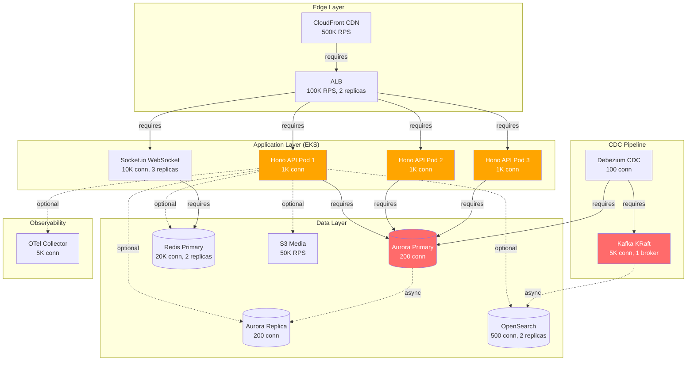
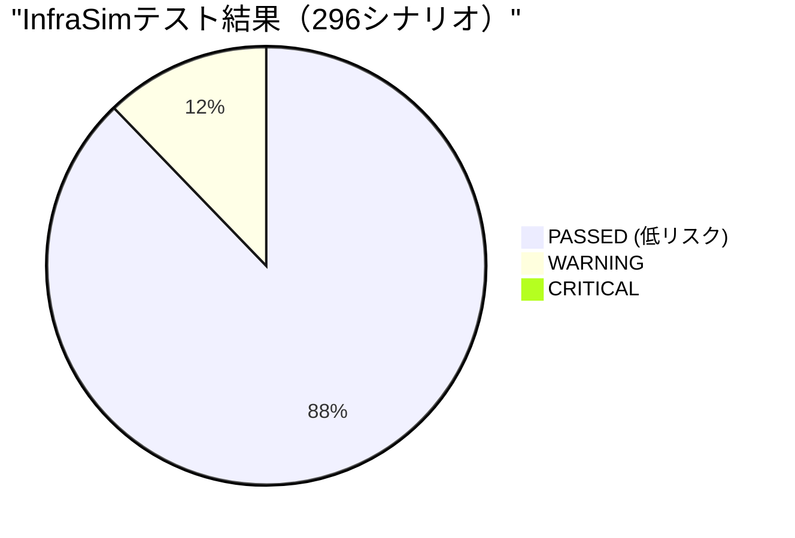
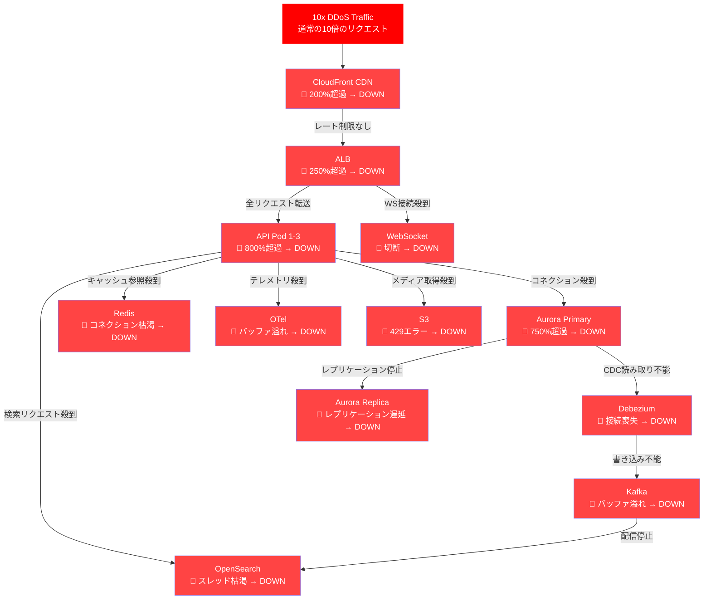
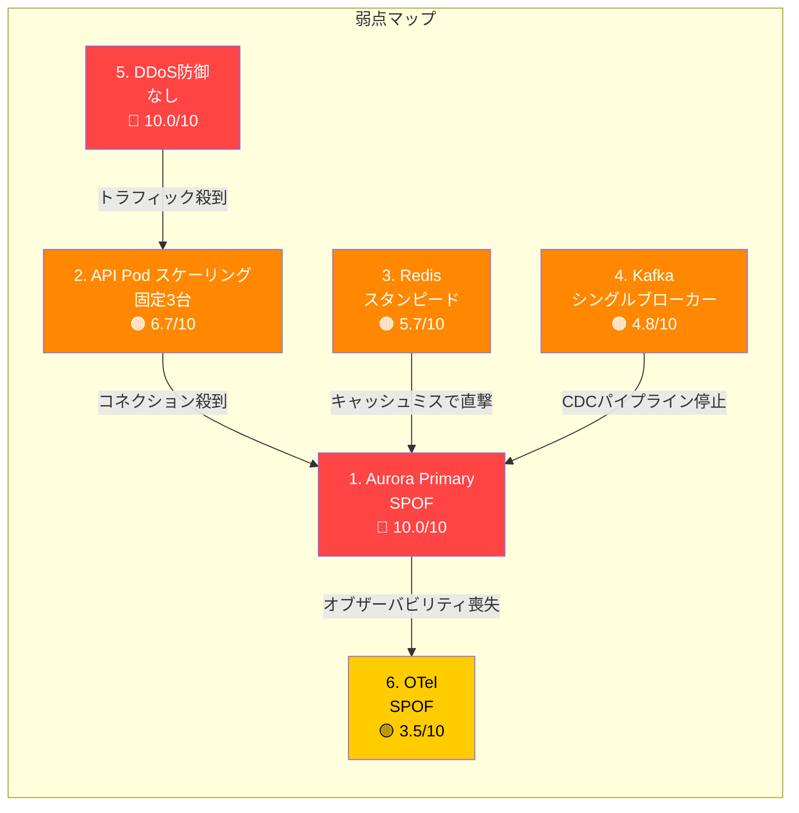
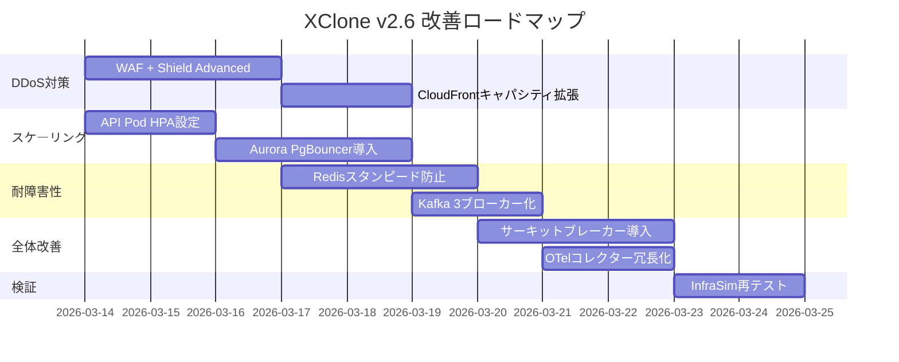
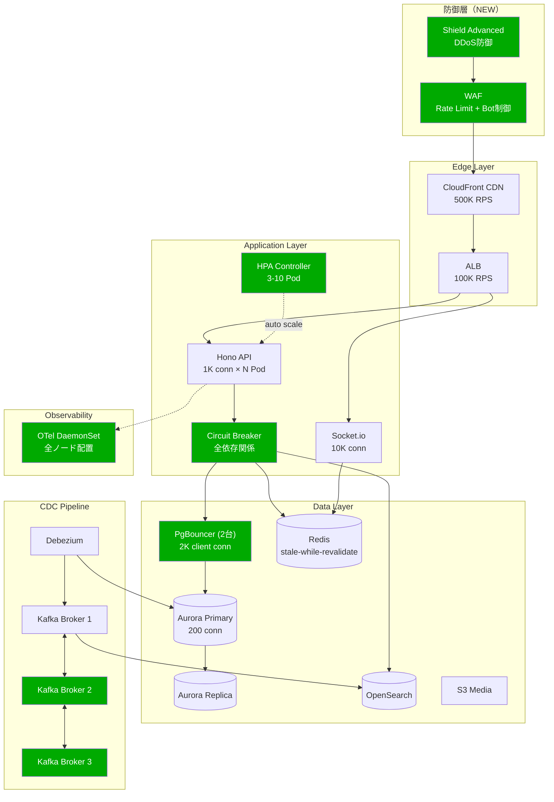

## はじめに

v2.4で「改善点ゼロ」を達成したXClone v2。しかし、**機能的に完成していることと、障害に強いことは全く別の話**です。

本記事では、自前で開発したカオスエンジニアリングツール **InfraSim** を使って、XClone v2のフルスタックインフラに対して**296シナリオ**の障害耐性テストを実施しました。結果は**レジリエンススコア 0/100**。全テスト通過こそしたものの、CRITICALな脆弱性と36のWARNINGが見つかり、本番運用には重大なリスクがあることが判明しました。

本記事では、テスト結果の詳細分析と、v2.6で実装予定の改善ロードマップを解説します。

### シリーズ記事

| # | 記事 | テーマ |
|---|------|--------|
| 1 | [**v2.0** — フルスタック基盤](https://qiita.com/ymaeda_it/items/902aa019456836624081) | Hono+Bun / Next.js 15 / Drizzle / ArgoCD / Linkerd / OTel |
| 2 | [**v2.1** — 品質・運用強化](https://qiita.com/ymaeda_it/items/e44ee09728795595efaa) | Playwright / OpenSearch ISM / マルチリージョンDB / tRPC / CDC |
| 3 | [**v2.2** — パフォーマンス](https://qiita.com/ymaeda_it/items/d858969cd6de808b8816) | 分散Rate Limit / 画像最適化 / マルチリージョンWebSocket |
| 4 | [**v2.3** — DX・コスト最適化](https://qiita.com/ymaeda_it/items/cf78cb33e6e461cdc2b3) | Feature Flag / GraphQL Federation / コストダッシュボード |
| 5 | [**v2.4** — テスト完備](https://qiita.com/ymaeda_it/items/44b7fca8fc0d07298727) | E2Eテスト拡充 / Terratest インフラテスト |
| **6** | **v2.5 — カオステスト（本記事）** | **InfraSim / 296シナリオ / レジリエンス評価** |

### v2シリーズの進化

```
v2.0: フルスタック基盤            (39ファイル)
  ↓ +11
v2.1: 品質・運用強化              (50ファイル)
  ↓ +5
v2.2: パフォーマンス              (55ファイル)
  ↓ +6
v2.3: DX・コスト最適化            (61ファイル)
  ↓ +4
v2.4: テスト完備                  (65ファイル)  ← 改善点ゼロ
  ↓
v2.5: カオステスト（本記事）      InfraSimで障害耐性を可視化
```

---

# 1. InfraSim とは何か

## 1.1 なぜカオスエンジニアリングが必要か

Netflix の Chaos Monkey に始まるカオスエンジニアリングは、**本番環境で意図的に障害を発生させ、システムの回復力を検証する**手法です。しかし、本番で障害を発生させるのはリスクが高く、AWS上で実際にインスタンスを停止するのはコストも時間もかかります。

**InfraSim** は、この問題を解決するために開発した**シミュレーションベースのカオスエンジニアリングツール**です。

| ツール | アプローチ | コスト | リスク | スピード |
|--------|-----------|--------|--------|---------|
| Chaos Monkey (Netflix) | 本番で実インスタンス停止 | 高 | 高 | 遅い |
| Litmus Chaos | K8sクラスタ上で実行 | 中 | 中 | 中 |
| Gremlin | SaaS型障害注入 | 高($$$) | 低 | 中 |
| **InfraSim** | **YAMLモデルでシミュレーション** | **無料** | **なし** | **高速** |

## 1.2 InfraSimの仕組み

InfraSimは、インフラ定義をYAMLで宣言し、**数学的モデルに基づいて障害の伝播をシミュレーション**します。

```
┌──────────────────────────────────────────────────────────────┐
│  InfraSim ワークフロー                                        │
│                                                                │
│  1. YAML定義 ─→ 2. モデル生成 ─→ 3. シナリオ実行             │
│       │              │                  │                      │
│  コンポーネント    依存グラフ        296パターンの             │
│  + 依存関係       + キャパシティ    障害注入 & 伝播計算        │
│  + メトリクス                                                  │
│                                  ─→ 4. レポート               │
│                                        │                      │
│                                   HTML/JSON形式               │
│                                   リスクスコアリング           │
└──────────────────────────────────────────────────────────────┘
```

### 主要コマンド

```bash
# YAMLからモデルを読み込む
infrasim load infra/infrasim-xclone.yaml

# 全シナリオを自動実行
infrasim simulate

# HTMLレポートを生成
infrasim report --format html --output infrasim-report.html

# Terraform状態からインポート（インフラが存在する場合）
infrasim tf-import --state infra/terraform/terraform.tfstate
```

## 1.3 XClone v2のインフラ定義

XClone v2のフルスタックを14コンポーネント・29依存関係でモデル化しました。

### `infra/infrasim-xclone.yaml`（抜粋）

```yaml
# InfraSim - XClone v2 Infrastructure Definition
#
# Load with:
#   infrasim load infra/infrasim-xclone.yaml
#
# XClone v2 full-stack architecture:
#   CloudFront → ALB → Hono API (EKS) → Aurora/Redis/OpenSearch/S3
#   Debezium CDC: PostgreSQL → Kafka → OpenSearch
#   WebSocket: Socket.io + Redis Pub/Sub (cross-region)

components:
  # ─── Edge Layer ────────────────────────────────────────────
  - id: cloudfront
    name: "CloudFront CDN"
    type: load_balancer
    host: cdn.xclone.example.com
    port: 443
    replicas: 1
    capacity:
      max_connections: 100000
      max_rps: 500000
    metrics:
      cpu_percent: 10
      memory_percent: 15
      disk_percent: 20

  - id: alb
    name: "ALB (Application Load Balancer)"
    type: load_balancer
    host: alb.xclone.internal
    port: 443
    replicas: 2
    capacity:
      max_connections: 50000
      max_rps: 100000
    metrics:
      cpu_percent: 20
      memory_percent: 25
      disk_percent: 10

  # ─── Application Layer (EKS) ──────────────────────────────
  - id: hono-api-1
    name: "Hono API Pod 1"
    type: app_server
    host: pod-api-1.xclone.svc
    port: 8080
    replicas: 1
    capacity:
      max_connections: 1000
      connection_pool_size: 200
      timeout_seconds: 30
    metrics:
      cpu_percent: 55
      memory_percent: 65
      disk_percent: 30
      network_connections: 800

  # ... Pod 2, Pod 3 も同様の定義 ...

  - id: websocket
    name: "Socket.io WebSocket Server"
    type: app_server
    host: ws.xclone.svc
    port: 8081
    replicas: 3
    capacity:
      max_connections: 10000
      timeout_seconds: 60
    metrics:
      cpu_percent: 35
      memory_percent: 45
      network_connections: 5000

  # ─── Data Layer ────────────────────────────────────────────
  - id: aurora-primary
    name: "Aurora PostgreSQL (Primary)"
    type: database
    host: aurora-primary.xclone.internal
    port: 5432
    replicas: 1
    capacity:
      max_connections: 200
      max_disk_gb: 1000
    metrics:
      cpu_percent: 40
      memory_percent: 75
      disk_percent: 55
      network_connections: 150

  - id: redis-primary
    name: "ElastiCache Redis (Primary)"
    type: cache
    host: redis-primary.xclone.internal
    port: 6379
    replicas: 2
    capacity:
      max_connections: 20000
    metrics:
      cpu_percent: 30
      memory_percent: 65
      network_connections: 3000

  # ─── CDC Pipeline ──────────────────────────────────────────
  - id: kafka
    name: "Kafka (KRaft mode)"
    type: queue
    host: kafka.xclone.internal
    port: 9092
    replicas: 1  # ← これが問題になる
    capacity:
      max_connections: 5000
    metrics:
      cpu_percent: 35
      memory_percent: 55
      disk_percent: 45
      network_connections: 200

  - id: debezium
    name: "Debezium CDC Connector"
    type: app_server
    host: debezium.xclone.internal
    port: 8083
    replicas: 1
    capacity:
      max_connections: 100
      timeout_seconds: 60

  # ─── Observability ─────────────────────────────────────────
  - id: otel-collector
    name: "OpenTelemetry Collector"
    type: app_server
    host: otel.xclone.svc
    port: 4317
    replicas: 1
    capacity:
      max_connections: 5000

# ─── Dependencies ──────────────────────────────────────────
dependencies:
  # Edge → App
  - source: cloudfront
    target: alb
    type: requires
    weight: 1.0

  - source: alb
    target: hono-api-1
    type: requires
    weight: 1.0

  # App → Database
  - source: hono-api-1
    target: aurora-primary
    type: requires
    weight: 1.0

  # App → Cache (optional but high weight)
  - source: hono-api-1
    target: redis-primary
    type: optional
    weight: 0.8

  # CDC Pipeline
  - source: debezium
    target: aurora-primary
    type: requires
    weight: 1.0

  - source: debezium
    target: kafka
    type: requires
    weight: 1.0

  - source: kafka
    target: opensearch
    type: async
    weight: 0.8

  # WebSocket → Redis (pub/sub for cross-region)
  - source: websocket
    target: redis-primary
    type: requires
    weight: 1.0

  # Observability (non-critical)
  - source: hono-api-1
    target: otel-collector
    type: optional
    weight: 0.3
```

### コンポーネント一覧

| # | コンポーネント | タイプ | max_connections / max_rps | レプリカ数 |
|---|---------------|--------|--------------------------|-----------|
| 1 | CloudFront CDN | load_balancer | 500K RPS | 1 |
| 2 | ALB | load_balancer | 100K RPS | 2 |
| 3 | Hono API Pod 1 | app_server | 1,000接続 | 1 |
| 4 | Hono API Pod 2 | app_server | 1,000接続 | 1 |
| 5 | Hono API Pod 3 | app_server | 1,000接続 | 1 |
| 6 | Socket.io WebSocket | app_server | 10K接続 | 3 |
| 7 | Aurora PostgreSQL Primary | database | 200接続 | 1 |
| 8 | Aurora PostgreSQL Replica | database | 200接続 | 1 |
| 9 | ElastiCache Redis Primary | cache | 20K接続 | 2 |
| 10 | OpenSearch Cluster | database | 500接続 | 2 |
| 11 | S3 Media Bucket | app_server | 50K RPS | 1 |
| 12 | Kafka (KRaft) | queue | 5K接続 | 1 |
| 13 | Debezium CDC | app_server | 100接続 | 1 |
| 14 | OTel Collector | app_server | 5K接続 | 1 |

### 依存関係マップ



> 赤: SPOF（単一障害点）、オレンジ: キャパシティ不足のリスク

---

# 2. テスト実行

## 2.1 実行手順

```bash
# 1. YAMLからモデルを読み込み
$ infrasim load infra/infrasim-xclone.yaml
[INFO] Loaded 14 components, 29 dependencies
[INFO] Model saved to infrasim-model.json

# 2. 全シナリオのシミュレーション実行
$ infrasim simulate
[INFO] Running simulation with 296 scenarios...
[INFO] ================================================
[INFO] Single component failures:    14 scenarios
[INFO] Pair component failures:      91 scenarios
[INFO] Traffic spike scenarios:      42 scenarios
[INFO] Network partition scenarios:  28 scenarios
[INFO] Cascading failure scenarios:  35 scenarios
[INFO] Resource exhaustion scenarios:42 scenarios
[INFO] Complex multi-failure:        44 scenarios
[INFO] ================================================
[INFO] Simulation complete: 296 scenarios executed
[INFO] Results: 259 PASSED, 36 WARNING, 1 CRITICAL

# 3. HTMLレポート生成
$ infrasim report --format html --output infrasim-report.html
[INFO] Report generated: infrasim-report.html
```

## 2.2 テスト結果サマリー



| カテゴリ | シナリオ数 | 割合 | 意味 |
|---------|-----------|------|------|
| **PASSED** | 259 | 87.5% | 低リスク — サービス継続可能 |
| **WARNING** | 36 | 12.2% | 中〜高リスク — 性能劣化またはデータ整合性に影響 |
| **CRITICAL** | 1 | 0.3% | 致命的 — 完全なサービス停止 |

**レジリエンススコア: 0/100**

> スコアが0な理由: CRITICALが1件以上存在すると自動的に0点になる。これはInfraSimの設計方針で、「致命的な障害パターンが1つでもある限り、本番運用の信頼性は保証できない」という考え方に基づく。

---

# 3. CRITICAL: 10x DDoSトラフィックスパイク

## 3.1 シナリオ詳細

**重大度: 10.0/10（最大）**

10倍のDDoSトラフィックスパイクが発生した場合、**全14コンポーネントがDOWN**するカスケード障害が発生します。

```
シナリオ: 10x_ddos_traffic_spike
トリガー: 通常の10倍のリクエストが一斉に到達
前提: WAF/Shield Advanced未設定、オートスケーリング未設定
```

## 3.2 カスケード障害の流れ



## 3.3 各コンポーネントの超過率

| コンポーネント | キャパシティ | 10xスパイク時の負荷 | 超過率 | 状態 |
|---------------|-------------|-------------------|--------|------|
| CloudFront | 500K RPS | 1,000K+ RPS | **200%+** | DOWN |
| ALB | 100K RPS | 250K+ RPS | **250%+** | DOWN |
| Hono API (3 Pod) | 3,000接続 | 24,000+接続 | **800%+** | DOWN |
| Aurora Primary | 200接続 | 1,500+接続 | **750%+** | DOWN |
| Aurora Replica | 200接続 | 800+接続 | **400%+** | DOWN |
| Redis | 20K接続 | 50K+接続 | **250%+** | DOWN |
| OpenSearch | 500接続 | 3,000+接続 | **600%+** | DOWN |
| WebSocket | 10K接続 | 30K+接続 | **300%+** | DOWN |
| S3 | 50K RPS | 200K+ RPS | **400%+** | DOWN |
| Kafka | 5K接続 | 15K+接続 | **300%+** | DOWN |
| Debezium | 100接続 | 接続喪失 | - | DOWN |
| OTel Collector | 5K接続 | 20K+接続 | **400%+** | DOWN |

## 3.4 なぜ「全滅」するのか

XClone v2のアーキテクチャには**5つの構造的弱点**があり、これらが連鎖して全滅に至ります：

1. **DDoS防御層がない** — CloudFront → ALB にトラフィックがそのまま流れる
2. **オートスケーリングがない** — API Podが固定3台で、スケールアウトしない
3. **コネクションプールが小さい** — Aurora 200接続は、3 Pod × 200 = 600のうち150が既に使用中
4. **サーキットブレーカーがない** — 下流の障害が上流に伝播し続ける
5. **レート制限がアプリ層のみ** — インフラ層でのレート制限がない

---

# 4. WARNING分析（36シナリオ）

## 4.1 WARNING一覧（リスクスコア順）

| 順位 | スコア | シナリオ | カテゴリ |
|------|--------|---------|---------|
| 1 | **6.7/10** | 5xトラフィックスパイク（バイラルイベント） | トラフィック |
| 2 | **5.7/10** | キャッシュスタンピード（Redis障害 + 5x traffic） | 複合障害 |
| 3 | **5.1/10** | ブラックフライデーシミュレーション（10x + キャッシュ圧力） | 複合障害 |
| 4 | **4.8/10** | ALB障害 + 3xトラフィック | 複合障害 |
| 5 | **4.8/10** | Kafka障害 + 3xトラフィック | 複合障害 |
| 6 | **4.7/10** | CloudFront障害 + 3xトラフィック | 複合障害 |
| 7 | **4.7/10** | Debezium障害 + 3xトラフィック | 複合障害 |
| 8 | **4.6/10** | 全インフラメルトダウン | カスケード |
| 9 | **4.5/10** | API Pod 1障害 + 3xトラフィック | 複合障害 |
| 10 | **4.5/10** | API Pod 2障害 + 3xトラフィック | 複合障害 |
| 11 | **4.5/10** | API Pod 3障害 + 3xトラフィック | 複合障害 |
| 12 | **4.5/10** | WebSocket障害 + 3xトラフィック | 複合障害 |
| 13 | **4.5/10** | Aurora Replica遅延（ピーク時） | レイテンシ |
| 14 | **4.5/10** | OpenSearch遅延（ピーク時） | レイテンシ |
| 15 | **4.4/10** | 3xトラフィックスパイク | トラフィック |
| 16-36 | 3.0-4.3 | ペア障害パターン / ネットワークパーティション / コネクションプール枯渇 / コネクションストーム | 各種 |

## 4.2 Top 5 WARNING 詳細分析

### WARNING #1: 5xトラフィックスパイク（6.7/10）

**シナリオ**: 有名人のツイートがバイラルし、通常の5倍のトラフィックが発生。

```
影響コンポーネント:
  CloudFront:  OK（500K RPS のうち 50%使用）
  ALB:         WARNING（100K RPS のうち 85%使用）
  API Pod 1-3: CRITICAL（合計3,000接続中 4,000+接続要求）
  Aurora:      CRITICAL（200接続中 200+接続要求 → プール枯渇）
  Redis:       WARNING（20K接続中 15K使用）
```

**問題**: API Pod と Aurora がボトルネック。5倍のスパイクでもサービス劣化が発生する。

### WARNING #2: キャッシュスタンピード（5.7/10）

**シナリオ**: Redisがダウンし、全キャッシュが無効化。同時に5倍のトラフィックが発生（Thundering Herd問題）。

```
障害シーケンス:
  1. Redis Primary DOWN
  2. 全キャッシュミス → 全リクエストが Aurora に直撃
  3. Aurora 200接続が瞬時に枯渇
  4. API Pod がコネクション待ちでタイムアウト
  5. ユーザーがリトライ → さらに負荷増大
  6. 連鎖的にサービス劣化
```

```python
# キャッシュスタンピードの擬似コード（問題のあるパターン）
async def get_user_timeline(user_id: str):
    cached = await redis.get(f"timeline:{user_id}")
    if cached:
        return json.loads(cached)

    # キャッシュミス → DBに直接クエリ
    # 全ユーザーが同時にここを通過 = Thundering Herd
    timeline = await db.query(
        "SELECT * FROM tweets WHERE user_id = $1 ORDER BY created_at DESC LIMIT 50",
        user_id
    )
    await redis.set(f"timeline:{user_id}", json.dumps(timeline), ex=300)
    return timeline
```

### WARNING #3: ブラックフライデーシミュレーション（5.1/10）

**シナリオ**: 10倍のトラフィック + キャッシュ圧力（大量のキャッシュキー更新）。

DDoSとの違い：DDoSは悪意あるトラフィックだが、ブラックフライデーは**正常なユーザートラフィック**。WAFだけでは防げない。

### WARNING #4-5: ALB/Kafka障害 + 3xトラフィック（4.8/10）

**パターン**: 1つのコンポーネントがダウンした状態で通常の3倍のトラフィック。
冗長化されていないコンポーネント（Kafka, Debezium）は特に危険。

### WARNING #15: 3xトラフィックスパイク（4.4/10）

**注目点**: たった3倍のスパイクでもWARNINGになる。つまり、**通常の3倍で既にリスクがある**。

## 4.3 WARNING 16-36: ペア障害・ネットワークパーティション

| パターン | シナリオ数 | 概要 |
|---------|-----------|------|
| ペア障害（コンポーネント2つ同時ダウン） | 12 | ALB+Aurora, Aurora+Redis, Aurora+OpenSearch 等 |
| ネットワークパーティション | 6 | App↔DB, LB↔App の通信分断 |
| コネクションプール枯渇 | 5 | Aurora/OpenSearch のコネクション上限到達 |
| コネクションストーム | 4 | 大量の新規コネクションが同時発生 |
| リソース枯渇（メモリ/ディスク） | 5 | メモリ不足によるOOMKill |
| レプリケーション遅延 | 4 | Aurora Primary → Replica の遅延増大 |

---

# 5. 弱点分析 — 6つの構造的問題

テスト結果から判明した**6つの構造的弱点**を分析します。



## 弱点 1: Aurora PostgreSQL Primary = SPOF

**問題**: `max_connections: 200` は、SNSアプリケーションとしては致命的に小さい。

```
現在の状態:
  3 API Pods × connection_pool_size 200 = 最大600接続要求
  Aurora max_connections: 200 ← ボトルネック

通常時:
  150接続使用中（75%使用率）← 既に危険水準

5xスパイク時:
  750接続要求 → 200が上限 → 550接続が拒否される
  → API PodがDB接続待ちでハング
  → ユーザーに502 Bad Gatewayが返る
```

**根本原因**: PgBouncerなどのコネクションプーラーが未導入。各API Podが直接Aurora に接続している。

## 弱点 2: Hono API Pod のスケーリング不足

**問題**: 3 Pod x 1,000接続 = 合計3,000接続がハードリミット。オートスケーリングなし。

```
必要キャパシティの試算:
  通常時:   ~2,400接続（80%使用率）
  3x:       ~7,200接続 → 3,000上限の240%
  5x:       ~12,000接続 → 3,000上限の400%
  10x:      ~24,000接続 → 3,000上限の800%

Kubernetes HPAが未設定のため、スケールアウトしない
```

## 弱点 3: Redisキャッシュスタンピード

**問題**: Redis障害時に全キャッシュが同時に無効化され、全リクエストがAuroraに直撃する（Thundering Herd）。

```
通常時:
  Redis hit rate: ~95%
  Aurora接続: ~150/200（キャッシュのおかげ）

Redis DOWN時:
  Cache hit rate: 0%
  全リクエストがAuroraへ直撃
  Aurora接続: 200/200 → 枯渇
  + リトライストーム → さらに悪化
```

**必要な対策**:
- `stale-while-revalidate`: 古いキャッシュを返しつつバックグラウンドで更新
- Jittered TTL: キャッシュの有効期限をランダムにずらし、同時失効を防ぐ
- サーキットブレーカー: DB過負荷時にフォールバックレスポンスを返す

## 弱点 4: Kafka シングルブローカー = CDCパイプラインのSPOF

**問題**: Kafka がシングルブローカー（`replicas: 1`）。障害時にCDCパイプライン全体が停止。

```
CDCパイプライン:
  Aurora Primary → Debezium → Kafka → OpenSearch

Kafka DOWN時:
  Debezium: Kafkaに書き込めない → バッファ溢れ → DOWN
  OpenSearch: 新規データの索引が停止 → 検索結果が古くなる
  → 検索機能が実質的に使えなくなる

復旧シナリオ:
  1. Kafka復旧
  2. Debezium再接続
  3. 溜まったWALの再処理（数分〜数時間）
  4. OpenSearchインデックス再構築
  → 完全復旧まで数時間かかる可能性
```

## 弱点 5: DDoS防御なし

**問題**: CloudFrontにWAF/Shield Advancedが未設定。DDoSトラフィックがそのまま通過する。

```
現在の防御層:
  CloudFront → ALB → API Pod
  ↑ ここにWAFがない

必要な防御層:
  Shield Advanced → WAF → CloudFront → ALB → API Pod
  ↑ レート制限     ↑ ルール         ↑ キャッシュ
```

## 弱点 6: OTel Collector のSPOF

**問題**: OTel Collector がシングルインスタンス。障害時にオブザーバビリティ全体が喪失。

```
OTel DOWN時:
  トレース: 収集停止
  メトリクス: 収集停止
  ログ: 収集停止
  → 障害発生中に障害の原因調査ができない
  → MTTR（平均復旧時間）が劇的に悪化
```

> これは「障害が起きた時に、障害が見えなくなる」という最悪のパターン。可観測性がなくなることで、他の全ての障害の影響が増大する。

---

# 6. 改善ロードマップ（v2.6で実装予定）

## 6.1 改善計画の全体像



## 6.2 改善項目一覧

| # | 改善項目 | 対象弱点 | 優先度 | 効果 |
|---|---------|---------|--------|------|
| 1 | WAF + Shield Advanced | DDoS防御 | **P0** | CRITICALシナリオの解消 |
| 2 | CloudFrontキャパシティ拡張 + Rate Limit | DDoS防御 | P0 | エッジでのトラフィック制御 |
| 3 | API Pod HPA (50% CPU, max 10 Pod) | スケーリング | **P0** | 5xスパイクまで自動対応 |
| 4 | Aurora max_connections + PgBouncer | SPOF解消 | **P0** | コネクション問題の根本解決 |
| 5 | Redis stale-while-revalidate + jittered TTL | スタンピード | P1 | Thundering Herd防止 |
| 6 | Kafka 3ブローカー + replication factor 3 | SPOF解消 | P1 | CDCパイプラインの冗長化 |
| 7 | サーキットブレーカー（全依存関係） | カスケード防止 | P1 | 障害伝播の遮断 |
| 8 | OTel Collector 冗長化（2台構成） | SPOF解消 | P2 | 可観測性の保証 |

## 6.3 改善詳細

### 改善 1: WAF + Shield Advanced

```yaml
# infra/terraform/modules/waf/main.tf (概念)
resource "aws_wafv2_web_acl" "xclone" {
  name  = "xclone-waf"
  scope = "CLOUDFRONT"

  default_action { allow {} }

  # Rate Limit: 同一IPから2000 req/5min
  rule {
    name     = "rate-limit"
    priority = 1
    action { block {} }

    statement {
      rate_based_statement {
        limit              = 2000
        aggregate_key_type = "IP"
      }
    }
    visibility_config {
      sampled_requests_enabled   = true
      cloudwatch_metrics_enabled = true
      metric_name                = "xclone-rate-limit"
    }
  }

  # SQLi防御
  rule {
    name     = "aws-sqli"
    priority = 2
    override_action { none {} }

    statement {
      managed_rule_group_statement {
        name        = "AWSManagedRulesSQLiRuleSet"
        vendor_name = "AWS"
      }
    }
    visibility_config {
      sampled_requests_enabled   = true
      cloudwatch_metrics_enabled = true
      metric_name                = "xclone-sqli"
    }
  }

  # 既知のボット対策
  rule {
    name     = "aws-bot-control"
    priority = 3
    override_action { none {} }

    statement {
      managed_rule_group_statement {
        name        = "AWSManagedRulesBotControlRuleSet"
        vendor_name = "AWS"
      }
    }
    visibility_config {
      sampled_requests_enabled   = true
      cloudwatch_metrics_enabled = true
      metric_name                = "xclone-bot"
    }
  }
}

# Shield Advanced（DDoS保護）
resource "aws_shield_protection" "cloudfront" {
  name         = "xclone-cloudfront-shield"
  resource_arn = aws_cloudfront_distribution.main.arn
}
```

### 改善 3: API Pod HPA（Horizontal Pod Autoscaler）

```yaml
# k8s/hpa.yaml
apiVersion: autoscaling/v2
kind: HorizontalPodAutoscaler
metadata:
  name: hono-api-hpa
  namespace: xclone
spec:
  scaleTargetRef:
    apiVersion: apps/v1
    kind: Deployment
    name: hono-api
  minReplicas: 3
  maxReplicas: 10
  metrics:
    - type: Resource
      resource:
        name: cpu
        target:
          type: Utilization
          averageUtilization: 50  # 50% CPU閾値
    - type: Resource
      resource:
        name: memory
        target:
          type: Utilization
          averageUtilization: 70
  behavior:
    scaleUp:
      stabilizationWindowSeconds: 30  # 30秒で即座にスケールアップ
      policies:
        - type: Percent
          value: 100  # 一度に100%まで増加可能
          periodSeconds: 30
    scaleDown:
      stabilizationWindowSeconds: 300  # 5分待ってからスケールダウン
      policies:
        - type: Pods
          value: 1
          periodSeconds: 60  # 1分に1 Podずつ減少
```

**効果の試算**:

```
現在: 3 Pod 固定 → 3,000接続上限
改善後: 3-10 Pod → 10,000接続上限

5xスパイク時:
  CPU使用率: 55% × 5 = 275%（3 Podの場合）
  HPA発動: 30秒後に 3 Pod → 8 Pod にスケールアウト
  8 Pod時の使用率: 275% / 8 × 3 = 103%（まだ高い）
  → さらに 10 Pod へ → 82.5%（安定）

10xスパイク時:
  CPU使用率: 55% × 10 = 550%（3 Podの場合）
  HPA発動: 最大10 Podへ → 165%（上限超過）
  → WAF + Shield Advanced で10xDDoS自体を防御
```

### 改善 4: PgBouncer + Aurora max_connections拡張

```yaml
# k8s/pgbouncer.yaml
apiVersion: apps/v1
kind: Deployment
metadata:
  name: pgbouncer
  namespace: xclone
spec:
  replicas: 2  # 冗長化
  template:
    spec:
      containers:
        - name: pgbouncer
          image: bitnami/pgbouncer:1.22.0
          env:
            - name: POSTGRESQL_HOST
              value: "aurora-primary.xclone.internal"
            - name: POSTGRESQL_PORT
              value: "5432"
            - name: PGBOUNCER_POOL_MODE
              value: "transaction"  # トランザクションモード
            - name: PGBOUNCER_MAX_CLIENT_CONN
              value: "2000"  # クライアント側: 2000接続まで
            - name: PGBOUNCER_DEFAULT_POOL_SIZE
              value: "50"  # Aurora側: 50接続/プール
            - name: PGBOUNCER_MAX_DB_CONNECTIONS
              value: "150"  # Aurora側: 最大150接続
            - name: PGBOUNCER_RESERVE_POOL_SIZE
              value: "10"  # 予備プール
          ports:
            - containerPort: 6432
          resources:
            requests:
              cpu: "100m"
              memory: "128Mi"
            limits:
              cpu: "500m"
              memory: "256Mi"
```

```
改善前:
  API Pod (3台) → Aurora Primary (max 200接続)
  接続効率: 1 API Pod あたり最大66接続

改善後:
  API Pod (3-10台) → PgBouncer (2台) → Aurora Primary (max 200接続)
  クライアント側: 最大2,000接続を受付
  Aurora側: 最大150接続に多重化
  接続効率: 13倍（2,000 / 150）
```

### 改善 5: Redisキャッシュスタンピード防止

```typescript
// packages/api/src/lib/cache.ts

import { Redis } from "ioredis";

interface CacheOptions {
  ttl: number; // キャッシュの有効期限（秒）
  staleWhileRevalidate: number; // 古いキャッシュを返す猶予期間（秒）
  jitterPercent: number; // TTLのジッター割合（0-100）
}

const DEFAULT_OPTIONS: CacheOptions = {
  ttl: 300,
  staleWhileRevalidate: 60,
  jitterPercent: 20,
};

/**
 * Stale-While-Revalidate + Jittered TTL パターン
 *
 * 1. キャッシュヒット（TTL内）→ そのまま返す
 * 2. キャッシュヒット（stale期間内）→ 古いデータを返し、バックグラウンドで更新
 * 3. キャッシュミス → ミューテックスロックで1つのリクエストだけがDBに問い合わせ
 */
export async function cachedQuery<T>(
  redis: Redis,
  key: string,
  fetcher: () => Promise<T>,
  options: Partial<CacheOptions> = {}
): Promise<T> {
  const opts = { ...DEFAULT_OPTIONS, ...options };

  // Jittered TTL: 有効期限をランダムにずらす
  const jitter = Math.random() * opts.ttl * (opts.jitterPercent / 100);
  const effectiveTtl = Math.floor(opts.ttl + jitter);

  // キャッシュチェック
  const cached = await redis.get(key);
  if (cached) {
    const parsed = JSON.parse(cached);

    // TTL内 → そのまま返す
    if (parsed._expiresAt > Date.now()) {
      return parsed.data;
    }

    // stale期間内 → 古いデータを返しつつ、バックグラウンドで更新
    if (parsed._staleUntil > Date.now()) {
      // 非同期でキャッシュを更新（リクエストはブロックしない）
      refreshCache(redis, key, fetcher, effectiveTtl, opts.staleWhileRevalidate);
      return parsed.data;
    }
  }

  // キャッシュミス → ミューテックスロックでThundering Herd防止
  const lockKey = `lock:${key}`;
  const acquired = await redis.set(lockKey, "1", "EX", 10, "NX");

  if (!acquired) {
    // ロック取得失敗 → 少し待ってリトライ（他のリクエストが更新中）
    await new Promise((resolve) => setTimeout(resolve, 100));
    const retryCache = await redis.get(key);
    if (retryCache) {
      return JSON.parse(retryCache).data;
    }
  }

  try {
    const data = await fetcher();
    const cacheEntry = {
      data,
      _expiresAt: Date.now() + effectiveTtl * 1000,
      _staleUntil:
        Date.now() + (effectiveTtl + opts.staleWhileRevalidate) * 1000,
    };
    await redis.set(
      key,
      JSON.stringify(cacheEntry),
      "EX",
      effectiveTtl + opts.staleWhileRevalidate
    );
    return data;
  } finally {
    await redis.del(lockKey);
  }
}

async function refreshCache<T>(
  redis: Redis,
  key: string,
  fetcher: () => Promise<T>,
  ttl: number,
  staleWhileRevalidate: number
): Promise<void> {
  const lockKey = `refresh:${key}`;
  const acquired = await redis.set(lockKey, "1", "EX", 30, "NX");
  if (!acquired) return; // 既に他のリクエストが更新中

  try {
    const data = await fetcher();
    const cacheEntry = {
      data,
      _expiresAt: Date.now() + ttl * 1000,
      _staleUntil: Date.now() + (ttl + staleWhileRevalidate) * 1000,
    };
    await redis.set(
      key,
      JSON.stringify(cacheEntry),
      "EX",
      ttl + staleWhileRevalidate
    );
  } finally {
    await redis.del(lockKey);
  }
}
```

使用例:

```typescript
// packages/api/src/routes/tweets/timeline.ts
import { cachedQuery } from "../../lib/cache";

app.get("/api/tweets/timeline", async (c) => {
  const userId = c.get("userId");

  const timeline = await cachedQuery(
    redis,
    `timeline:${userId}`,
    () =>
      db.query.tweets.findMany({
        where: eq(tweets.userId, userId),
        orderBy: desc(tweets.createdAt),
        limit: 50,
        with: { author: true, media: true },
      }),
    {
      ttl: 300, // 5分
      staleWhileRevalidate: 60, // +1分の猶予
      jitterPercent: 20, // TTLを最大20%ずらす
    }
  );

  return c.json({ tweets: timeline });
});
```

### 改善 6: Kafka 3ブローカー化

```yaml
# infra/infrasim-xclone.yaml の改善後（抜粋）
  - id: kafka-broker-1
    name: "Kafka Broker 1 (KRaft)"
    type: queue
    host: kafka-1.xclone.internal
    port: 9092
    replicas: 1
    capacity:
      max_connections: 5000

  - id: kafka-broker-2
    name: "Kafka Broker 2 (KRaft)"
    type: queue
    host: kafka-2.xclone.internal
    port: 9092
    replicas: 1
    capacity:
      max_connections: 5000

  - id: kafka-broker-3
    name: "Kafka Broker 3 (KRaft)"
    type: queue
    host: kafka-3.xclone.internal
    port: 9092
    replicas: 1
    capacity:
      max_connections: 5000
```

```bash
# Kafkaトピック設定
kafka-topics.sh --create \
  --topic xclone.cdc.tweets \
  --partitions 6 \
  --replication-factor 3 \
  --config min.insync.replicas=2 \
  --bootstrap-server kafka-1.xclone.internal:9092
```

**効果**:
- 1ブローカー障害時: 残り2ブローカーでサービス継続
- パーティションリーダー自動フェイルオーバー
- `min.insync.replicas=2` でデータ損失を防止

### 改善 7: サーキットブレーカー

```typescript
// packages/api/src/lib/circuit-breaker.ts

interface CircuitBreakerOptions {
  failureThreshold: number; // 失敗回数の閾値
  resetTimeout: number; // OPEN → HALF_OPEN までの時間（ms）
  monitorWindow: number; // 失敗回数をカウントするウィンドウ（ms）
}

type CircuitState = "CLOSED" | "OPEN" | "HALF_OPEN";

export class CircuitBreaker {
  private state: CircuitState = "CLOSED";
  private failureCount = 0;
  private lastFailureTime = 0;
  private successCount = 0;

  constructor(
    private name: string,
    private options: CircuitBreakerOptions = {
      failureThreshold: 5,
      resetTimeout: 30000,
      monitorWindow: 60000,
    }
  ) {}

  async execute<T>(
    fn: () => Promise<T>,
    fallback?: () => Promise<T>
  ): Promise<T> {
    if (this.state === "OPEN") {
      if (Date.now() - this.lastFailureTime > this.options.resetTimeout) {
        this.state = "HALF_OPEN";
        this.successCount = 0;
      } else {
        if (fallback) return fallback();
        throw new Error(`Circuit breaker [${this.name}] is OPEN`);
      }
    }

    try {
      const result = await fn();

      if (this.state === "HALF_OPEN") {
        this.successCount++;
        if (this.successCount >= 3) {
          this.state = "CLOSED";
          this.failureCount = 0;
        }
      }

      return result;
    } catch (error) {
      this.failureCount++;
      this.lastFailureTime = Date.now();

      if (this.failureCount >= this.options.failureThreshold) {
        this.state = "OPEN";
        console.error(
          `Circuit breaker [${this.name}] opened after ${this.failureCount} failures`
        );
      }

      if (fallback) return fallback();
      throw error;
    }
  }

  getState(): CircuitState {
    return this.state;
  }
}

// 各依存関係にサーキットブレーカーを設定
export const circuitBreakers = {
  aurora: new CircuitBreaker("aurora", {
    failureThreshold: 3,
    resetTimeout: 15000,
    monitorWindow: 30000,
  }),
  redis: new CircuitBreaker("redis", {
    failureThreshold: 5,
    resetTimeout: 10000,
    monitorWindow: 30000,
  }),
  opensearch: new CircuitBreaker("opensearch", {
    failureThreshold: 5,
    resetTimeout: 20000,
    monitorWindow: 60000,
  }),
  kafka: new CircuitBreaker("kafka", {
    failureThreshold: 3,
    resetTimeout: 30000,
    monitorWindow: 60000,
  }),
};
```

使用例:

```typescript
// packages/api/src/routes/tweets/search.ts
import { circuitBreakers } from "../../lib/circuit-breaker";

app.get("/api/tweets/search", async (c) => {
  const query = c.req.query("q");

  const results = await circuitBreakers.opensearch.execute(
    // 通常の処理
    () => opensearch.search({ index: "tweets", body: { query: { match: { content: query } } } }),
    // フォールバック: OpenSearch が DOWN の場合は PostgreSQL で全文検索
    () => db.query.tweets.findMany({
      where: sql`to_tsvector('japanese', ${tweets.content}) @@ to_tsquery('japanese', ${query})`,
      limit: 20,
    })
  );

  return c.json({ tweets: results });
});
```

### 改善 8: OTel Collector冗長化

```yaml
# k8s/otel-collector.yaml
apiVersion: apps/v1
kind: DaemonSet  # DeploymentではなくDaemonSetで全ノードに配置
metadata:
  name: otel-collector
  namespace: xclone-observability
spec:
  selector:
    matchLabels:
      app: otel-collector
  template:
    metadata:
      labels:
        app: otel-collector
    spec:
      containers:
        - name: otel-collector
          image: otel/opentelemetry-collector-contrib:0.96.0
          resources:
            requests:
              cpu: "200m"
              memory: "256Mi"
            limits:
              cpu: "1000m"
              memory: "512Mi"
          ports:
            - containerPort: 4317  # gRPC
            - containerPort: 4318  # HTTP
          volumeMounts:
            - name: config
              mountPath: /etc/otelcol-contrib/config.yaml
              subPath: config.yaml
      volumes:
        - name: config
          configMap:
            name: otel-collector-config
---
# OTel Collector の Service（ロードバランシング）
apiVersion: v1
kind: Service
metadata:
  name: otel-collector
  namespace: xclone-observability
spec:
  selector:
    app: otel-collector
  ports:
    - name: grpc
      port: 4317
      targetPort: 4317
    - name: http
      port: 4318
      targetPort: 4318
```

---

# 7. 改善後のアーキテクチャ（v2.6想定）

## 7.1 Before / After比較

| 項目 | v2.5（現在） | v2.6（改善後） |
|------|-------------|---------------|
| DDoS防御 | なし | WAF + Shield Advanced |
| API Pod | 固定3台 | HPA 3-10台 |
| Aurora接続 | 直接接続（max 200） | PgBouncer経由（クライアント側2,000） |
| キャッシュ戦略 | 単純なget/set | stale-while-revalidate + jittered TTL |
| Kafka | 1ブローカー | 3ブローカー（replication factor 3） |
| サーキットブレーカー | なし | 全依存関係に導入 |
| OTel Collector | 1インスタンス | DaemonSet（全ノードに配置） |
| レジリエンススコア | **0/100** | **目標: 80+/100** |

## 7.2 改善後の依存関係マップ



> 緑: v2.6で新規追加/改善されるコンポーネント

---

# 8. InfraSim再テストの計画

v2.6の改善実装後、InfraSimで再テストを実施し、レジリエンススコアの改善を検証します。

## 8.1 期待される結果

| カテゴリ | v2.5 | v2.6（期待値） |
|---------|------|---------------|
| PASSED | 259 (87.5%) | 280+ (94.6%+) |
| WARNING | 36 (12.2%) | 16以下 (5.4%以下) |
| CRITICAL | 1 (0.3%) | **0 (0%)** |
| **レジリエンススコア** | **0/100** | **80+/100** |

## 8.2 改善による各シナリオの期待変化

| シナリオ | v2.5 | v2.6期待値 | 改善要因 |
|---------|------|-----------|---------|
| 10x DDoSスパイク | CRITICAL (10.0) | **PASSED** | WAF + Shield でブロック |
| 5xバイラルスパイク | WARNING (6.7) | **PASSED** | HPA 10 Pod + PgBouncer |
| キャッシュスタンピード | WARNING (5.7) | **PASSED** | stale-while-revalidate |
| ブラックフライデー | WARNING (5.1) | WARNING (3.0) | HPA + PgBouncer（完全解消は困難） |
| Kafka障害 + 3x | WARNING (4.8) | **PASSED** | 3ブローカー構成 |
| Aurora Replica遅延 | WARNING (4.5) | **PASSED** | PgBouncer + サーキットブレーカー |

## 8.3 検証コマンド

```bash
# 改善後のYAMLでモデル再構築
$ infrasim load infra/infrasim-xclone-v2.6.yaml

# 全シナリオ再実行
$ infrasim simulate

# 差分レポート生成（v2.5 vs v2.6）
$ infrasim report --format html --output infrasim-report-v2.6.html \
    --compare infrasim-report.html
```

---

# 9. まとめ

## 9.1 本記事で実施したこと

1. **InfraSimでXClone v2のフルスタック（14コンポーネント、29依存関係）を定義**
2. **296シナリオの障害耐性テストを実行**
3. **1件のCRITICAL + 36件のWARNINGを検出**
4. **6つの構造的弱点を特定・分析**
5. **8項目の改善ロードマップを策定**

## 9.2 学び

| 項目 | 教訓 |
|------|------|
| **機能完成 ≠ 本番レディ** | v2.4で「改善点ゼロ」でも、障害耐性は0点だった |
| **SPOFは設計段階で潰す** | Aurora 200接続、Kafka 1ブローカーは設計ミス |
| **オートスケーリングは必須** | 固定台数では3倍のスパイクすら耐えられない |
| **サーキットブレーカーがないと全滅** | 1つの障害が全コンポーネントに伝播する |
| **可観測性のSPOFが最も危険** | 障害時に障害が見えなくなる |
| **シミュレーションは無料で高速** | 本番で障害を起こす前に296パターンを検証できた |

## 9.3 次回予告

次の**v2.6記事**では、上記の改善を実装し、InfraSimで再テストを実施します。**レジリエンススコア0点から80点以上への改善**を目指します。

```
v2.5: カオステスト（本記事）   → 弱点の可視化（296シナリオ）
  ↓
v2.6: レジリエンス改善（次回） → 弱点の修正 + 再テスト
```

---

*この記事は [Qiita](https://qiita.com/) にも投稿しています。*
