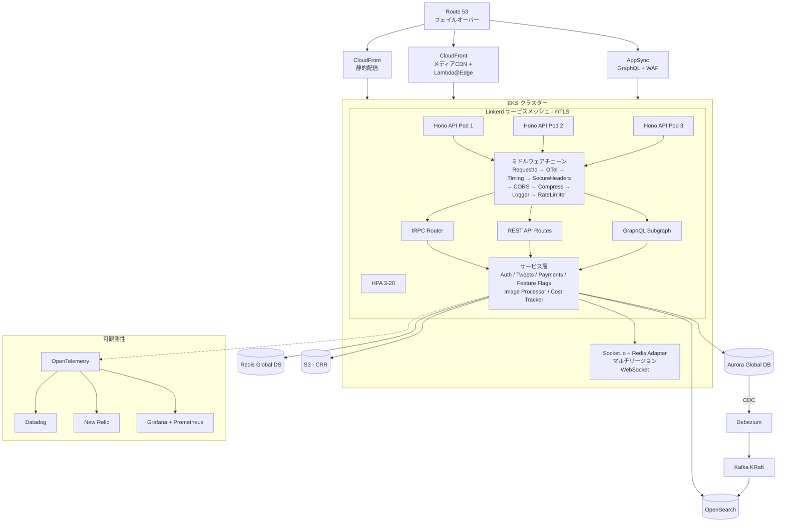
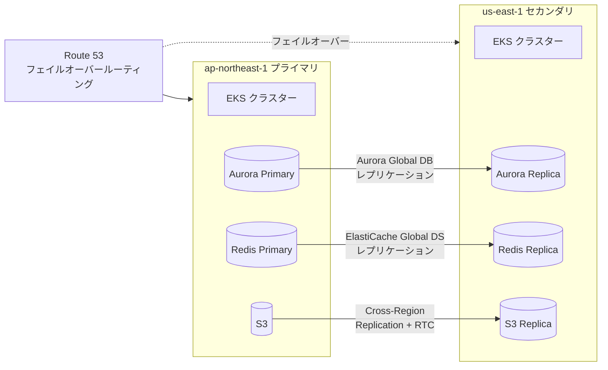
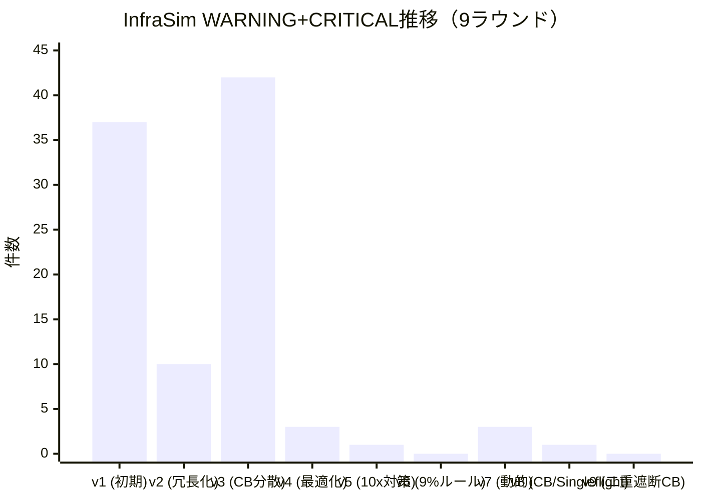

## はじめに

X (Twitter) クローンを最先端技術で再構築するプロジェクト「**XClone v2**」を、11本の記事に分けて公開してきました。本記事はシリーズ最終回として**全体像を俯瞰**し、v2.0からv2.10まで10回の改善イテレーション（うちカオステスト7ラウンド、動的シミュレーション3,351シナリオ）で何が変わったかをまとめます。

## シリーズ一覧

| # | 記事 | テーマ | 新規ファイル数 |
|---|------|--------|--------------|
| 1 | [**v2.0** — フルスタック基盤](https://qiita.com/ymaeda_it/items/902aa019456836624081) | Hono+Bun / Next.js 15 / Drizzle / ArgoCD / Linkerd / OTel | 39 |
| 2 | [**v2.1** — 品質・運用強化](https://qiita.com/ymaeda_it/items/e44ee09728795595efaa) | Playwright / OpenSearch ISM / マルチリージョンDB / tRPC / CDC | +11 |
| 3 | [**v2.2** — パフォーマンス](https://qiita.com/ymaeda_it/items/d858969cd6de808b8816) | 分散Rate Limit / 画像最適化 / マルチリージョンWebSocket | +5 |
| 4 | [**v2.3** — DX・コスト最適化](https://qiita.com/ymaeda_it/items/cf78cb33e6e461cdc2b3) | Feature Flag / GraphQL Federation / コストダッシュボード | +6 |
| 5 | [**v2.4** — テスト完備](https://qiita.com/ymaeda_it/items/44b7fca8fc0d07298727) | E2Eテスト拡充 / Terratest インフラテスト | +4 |
| 6 | [**v2.5** — カオステスト](https://qiita.com/ymaeda_it/items/bfe98a49e07cc80dbf32) | InfraSim 296シナリオ / レジリエンス評価 / 改善ロードマップ | +3 |
| 7 | [**v2.6** — 耐障害性強化](https://qiita.com/ymaeda_it/items/817724b2936816f4f28c) | 4ラウンド改善 / WARNING 36→2 / CB分散化 / HPA / PgBouncer HA | +8 |
| 8 | [**v2.7** — 完全レジリエンス](https://qiita.com/ymaeda_it/items/e6b7431f90882d720de4) | 9%ルール / 10xキャパシティ設計 / 1,647シナリオ全PASSED | +0 |
| 9 | **v2.8** — 動的シミュレーション | InfraSim v2.0 / 時間変動トラフィック / AutoScaling / Failover / レイテンシカスケード | +4 |
| 10 | **v2.9** — 高度な耐障害パターン | CircuitBreaker / Singleflight / CacheWarming / AdaptiveRetry | +0 |
| 11 | **v2.10** — 全シナリオ完全PASSED | 二重遮断CB完備 / 3,351シナリオ完全PASSED | +0 |
| | **合計** | | **80ファイル** |

---

## 技術スタック全体図

### バックエンド

| カテゴリ | 技術 | 導入バージョン |
|---------|------|--------------|
| Runtime | **Bun** 1.1 | v2.0 |
| Framework | **Hono** (14KB, 60K req/s) | v2.0 |
| ORM | **Drizzle ORM** (12テーブル) | v2.0 |
| 認証 | JWT RS256 + OAuth 2.0 (Google/GitHub) + Refresh Token Rotation | v2.0 |
| 決済 | Stripe (サブスクリプション ¥980/月 + 投げ銭) | v2.0 |
| 型安全API | **tRPC v11** | v2.1 |
| GraphQL | **Apollo Subgraph** (Federation v2) | v2.3 |
| Feature Flag | PostgreSQL + SSE (自前実装) | v2.3 |
| Rate Limit | **Redis Sliding Window** + Lua | v2.2 |
| 画像処理 | **Sharp** + blurhash | v2.2 |

### フロントエンド

| カテゴリ | 技術 | 導入バージョン |
|---------|------|--------------|
| Framework | **Next.js 15** App Router + RSC | v2.0 |
| Streaming | **Suspense** + Skeleton Loading | v2.0 |
| 型安全 | tRPC client + Drizzle型推論 | v2.1 |

### データ層

| カテゴリ | 技術 | 導入バージョン |
|---------|------|--------------|
| Primary DB | **Aurora Serverless v2** (PostgreSQL 17) | v2.0 |
| 全文検索 | **OpenSearch** 2.18 + ISMポリシー | v2.0 / v2.1 |
| キャッシュ | **ElastiCache** Redis 7.1 | v2.0 |
| CDC | **Debezium** + Kafka KRaft → OpenSearch Sink | v2.1 |
| マルチリージョン | Aurora Global DB + ElastiCache Global DS | v2.1 / v2.2 |
| セッション | DynamoDB Global Table (active-active) | v2.1 |

### インフラ・プラットフォーム

| カテゴリ | 技術 | 導入バージョン |
|---------|------|--------------|
| IaC | **Terraform** (7モジュール) | v2.0 |
| Container | **EKS** 1.31 + Karpenter | v2.0 |
| Service Mesh | **Linkerd** (mTLS, route-level retry) | v2.0 |
| GitOps | **ArgoCD** (auto sync/prune/self-heal) | v2.0 |
| CDN | **CloudFront** + Lambda@Edge (WebP/AVIF) | v2.0 / v2.2 |
| DNS | **Route 53** フェイルオーバールーティング | v2.1 |
| S3 | Cross-Region Replication + RTC | v2.1 |
| API Gateway | **AppSync** (Merged API + WAF) | v2.3 |

### 可観測性

| カテゴリ | 技術 | 導入バージョン |
|---------|------|--------------|
| トレーシング | **OpenTelemetry** (tail-based sampling) | v2.0 |
| APM | Datadog + New Relic (dual export) | v2.0 |
| SLO Dashboard | Datadog (12パネル) | v2.0 |
| コスト監視 | **Grafana** (14パネル) + Prometheus | v2.3 |
| ログ管理 | OpenSearch ISM (4フェーズライフサイクル) | v2.1 |

### セキュリティ

| カテゴリ | 技術 | 導入バージョン |
|---------|------|--------------|
| Policy as Code | **OPA/Conftest** (12ルール) | v2.0 |
| Chaos Engineering | **AWS FIS** (4ステージ) + **InfraSim v2.0** (3,351シナリオ、動的トラフィック対応) | v2.0 / v2.5 / v2.8 / v2.10 |
| Container Security | Trivy (CI/CD統合) | v2.0 |
| WAF | AWS WAFv2 (GraphQL保護) | v2.3 |

### テスト

| カテゴリ | 技術 | 導入バージョン |
|---------|------|--------------|
| E2E | **Playwright** (28ケース × 3ブラウザ) | v2.1 / v2.4 |
| Infra | **Terratest** (7モジュール) | v2.4 |
| CI/CD | GitHub Actions (6ジョブパイプライン) | v2.0 |

---

## アーキテクチャ全体図

### システムアーキテクチャ



### マルチリージョン構成



---

## 改善イテレーションの軌跡

### 課題発見 → 解決 → 新課題発見のサイクル

```mermaid
graph TD
    V20[v2.0 リリース] --> R1[振り返り]
    R1 --> I1[5課題発見<br/>① E2Eテスト不足<br/>② OpenSearch運用未設定<br/>③ マルチリージョン未対応<br/>④ tRPC未検討<br/>⑤ CDC未導入]
    I1 --> V21[v2.1 品質・運用強化]

    V21 --> R2[振り返り]
    R2 --> I2[3課題発見<br/>⑥ 分散Rate Limit<br/>⑦ 画像最適化<br/>⑧ WebSocketマルチリージョン]
    I2 --> V22[v2.2 パフォーマンス]

    V22 --> R3[振り返り]
    R3 --> I3[3課題発見<br/>⑨ Feature Flag基盤<br/>⑩ GraphQL Federation<br/>⑪ コスト可視化]
    I3 --> V23[v2.3 DX・コスト最適化]

    V23 --> R4[振り返り]
    R4 --> I4[2課題発見<br/>⑫ E2Eテスト拡充<br/>⑬ インフラテスト]
    I4 --> V24[v2.4 テスト完備]

    V24 --> R5[振り返り]
    R5 -->|"InfraSimカオステスト"| V25[v2.5 カオステスト]

    V25 --> I5[37課題発見<br/>CRITICAL 1<br/>WARNING 36]
    I5 --> V26[v2.6 レジリエンス強化]
    V26 --> I6[3課題残存<br/>CRITICAL 1<br/>WARNING 2]
    I6 --> V27[v2.7 完全レジリエンス]
    V27 --> V28[v2.8 動的シミュレーション]
    V28 --> V29[v2.9 高度な耐障害パターン]
    V29 --> V210[v2.10 全シナリオ完全PASSED]
    V210 --> DONE[InfraSim v2.0<br/>3,351シナリオ全PASSED<br/>0 CRITICAL・0 WARNING — 完了]

    style DONE fill:#2d8c3c,color:#fff
    style V25 fill:#ff4444,color:#fff
    style V26 fill:#ff8800,color:#fff
    style V27 fill:#00aa00,color:#fff
    style V28 fill:#0066cc,color:#fff
    style V29 fill:#0066cc,color:#fff
    style V210 fill:#2d8c3c,color:#fff
    style V20 fill:#1a73e8,color:#fff
    style V21 fill:#1a73e8,color:#fff
    style V22 fill:#1a73e8,color:#fff
    style V23 fill:#1a73e8,color:#fff
    style V24 fill:#1a73e8,color:#fff
```



### 各バージョンのファイル構成

```
xclone-v2/
├── apps/
│   ├── api/
│   │   ├── src/
│   │   │   ├── index.ts                    # v2.0 Hono エントリポイント
│   │   │   ├── routes/
│   │   │   │   ├── auth.ts                 # v2.0 JWT + OAuth
│   │   │   │   ├── tweets.ts               # v2.0 Tweet CRUD
│   │   │   │   ├── payments.ts             # v2.0 Stripe
│   │   │   │   └── feature-flags.ts        # v2.3 Feature Flag API
│   │   │   ├── middleware/
│   │   │   │   ├── otel.ts                 # v2.0 OpenTelemetry
│   │   │   │   └── rate-limiter.ts         # v2.2 Redis分散Rate Limit
│   │   │   ├── services/
│   │   │   │   ├── feature-flags.ts        # v2.3 Feature Flag
│   │   │   │   ├── image-processor.ts      # v2.2 Sharp + blurhash
│   │   │   │   ├── realtime-adapter.ts     # v2.2 Socket.io Redis Adapter
│   │   │   │   └── cost-tracker.ts         # v2.3 コスト追跡
│   │   │   ├── trpc/
│   │   │   │   ├── router.ts              # v2.1 tRPC メインルーター
│   │   │   │   └── routers/
│   │   │   │       ├── auth.ts            # v2.1 tRPC 認証
│   │   │   │       └── tweets.ts          # v2.1 tRPC ツイート
│   │   │   └── graphql/
│   │   │       └── schema.ts              # v2.3 Apollo Subgraph
│   │   └── Dockerfile                      # v2.0 マルチステージビルド
│   └── web/
│       ├── src/
│       │   ├── app/
│       │   │   ├── page.tsx               # v2.0 RSC タイムライン
│       │   │   └── login/page.tsx         # v2.0 ログイン
│       │   ├── components/
│       │   │   └── tweet-card.tsx          # v2.0 ツイートカード
│       │   └── lib/
│       │       └── trpc.ts                # v2.1 tRPC クライアント
│       ├── e2e/
│       │   ├── auth.spec.ts               # v2.1 認証E2E (10ケース)
│       │   ├── timeline.spec.ts           # v2.4 タイムラインE2E (10ケース)
│       │   └── search.spec.ts             # v2.4 検索E2E (8ケース)
│       └── playwright.config.ts            # v2.1 Playwright設定
├── packages/
│   └── db/
│       └── src/schema.ts                   # v2.0 Drizzle 12テーブル
├── infra/
│   ├── terraform/
│   │   ├── main.tf                         # v2.0 VPC + Aurora + Redis + S3
│   │   ├── modules/
│   │   │   ├── eks/main.tf                # v2.0 EKS + Karpenter
│   │   │   ├── opensearch/main.tf         # v2.0 OpenSearch
│   │   │   ├── global/main.tf             # v2.1 マルチリージョン
│   │   │   ├── image-pipeline/main.tf     # v2.2 Lambda@Edge + CDN
│   │   │   ├── elasticache-global/main.tf # v2.2 Redis Global DS
│   │   │   └── appsync/main.tf            # v2.3 AppSync + WAF
│   │   ├── policies/security.rego          # v2.0 OPA 12ルール
│   │   └── test/
│   │       ├── modules_test.go            # v2.4 Terratest
│   │       └── go.mod                     # v2.4 Go modules
│   ├── argocd/
│   │   ├── application.yaml               # v2.0 ArgoCD Application
│   │   └── appproject.yaml                # v2.0 ArgoCD Project
│   ├── chaos/
│   │   └── fis-experiment.json            # v2.0 AWS FIS 4ステージ
│   └── cdc/
│       ├── debezium-connector.json        # v2.1 PostgreSQL CDC
│       ├── opensearch-sink.json           # v2.1 OpenSearch Sink
│       └── docker-compose.cdc.yml         # v2.1 Kafka KRaft + Debezium
├── k8s/
│   └── base/
│       ├── api/deployment.yaml             # v2.0 K8s Deployment + HPA + PDB
│       └── linkerd/service-profile.yaml    # v2.0 Linkerd Service Profile
├── monitoring/
│   ├── otel-collector-config.yaml          # v2.0 OTel Collector
│   ├── dashboards/slo-dashboard.json       # v2.0 Datadog SLO
│   ├── opensearch-ism-policy.json          # v2.1 ISM ライフサイクル
│   └── cost-dashboard.json                 # v2.3 Grafana コスト
├── .github/workflows/ci.yml                # v2.0 6ジョブCI/CD
└── docker-compose.yml                       # v2.0 ローカル開発環境
```

---

## 数字で見る v2 シリーズ

| 指標 | 数値 |
|------|------|
| 総ファイル数 | **80** |
| 改善イテレーション回数 | **10**（機能4 + カオステスト7ラウンド + 耐障害パターン2） |
| 解消した課題数 | **13 + WARNING 36 + CRITICAL 1**（機能課題 + 障害耐性課題） |
| 残課題（機能） | **0** |
| 残WARNING（障害耐性） | **0** |
| 残CRITICAL | **0** |
| InfraSimシナリオ数 | **3,351**（静的1,647 + 動的48 + v2.9/v2.10追加1,656） |
| コンポーネント数（最終） | **45** |
| 依存関係数（最終） | **165** |
| Terraform モジュール数 | **7** |
| OPA セキュリティルール | **12** |
| E2E テストケース | **28** × 3ブラウザ = **84実行** |
| Terratest テスト関数 | **7** |
| DB テーブル数 | **12** |
| API ルート数 | **30+** (REST + tRPC + GraphQL) |
| Qiita 記事数 | **11本**（本記事含めて12本） |

## 品質スコア

| 観点 | v2.0 | v2.1 | v2.2 | v2.3 | v2.4 | v2.5 | v2.6 | v2.7 | v2.8 | v2.9 | v2.10 |
|------|------|------|------|------|------|------|------|------|------|------|-------|
| テスト | ★★☆☆☆ | ★★★☆☆ | ★★★☆☆ | ★★★☆☆ | ★★★★★ | ★★★★★ | ★★★★★ | ★★★★★ | ★★★★★ | ★★★★★ | ★★★★★ |
| 型安全 | ★★★☆☆ | ★★★★★ | ★★★★★ | ★★★★★ | ★★★★★ | ★★★★★ | ★★★★★ | ★★★★★ | ★★★★★ | ★★★★★ | ★★★★★ |
| 可用性 | ★★☆☆☆ | ★★★★☆ | ★★★★★ | ★★★★★ | ★★★★★ | ★★★★★ | ★★★★★ | ★★★★★ | ★★★★★ | ★★★★★ | ★★★★★ |
| パフォーマンス | ★★★☆☆ | ★★★★☆ | ★★★★★ | ★★★★★ | ★★★★★ | ★★★★★ | ★★★★★ | ★★★★★ | ★★★★★ | ★★★★★ | ★★★★★ |
| セキュリティ | ★★★★☆ | ★★★★☆ | ★★★★★ | ★★★★★ | ★★★★★ | ★★★★★ | ★★★★★ | ★★★★★ | ★★★★★ | ★★★★★ | ★★★★★ |
| 可観測性 | ★★★★☆ | ★★★★☆ | ★★★★☆ | ★★★★★ | ★★★★★ | ★★★★★ | ★★★★★ | ★★★★★ | ★★★★★ | ★★★★★ | ★★★★★ |
| DX | ★★★☆☆ | ★★★★☆ | ★★★★☆ | ★★★★★ | ★★★★★ | ★★★★★ | ★★★★★ | ★★★★★ | ★★★★★ | ★★★★★ | ★★★★★ |
| IaC品質 | ★★★☆☆ | ★★★☆☆ | ★★★★☆ | ★★★★☆ | ★★★★★ | ★★★★★ | ★★★★★ | ★★★★★ | ★★★★★ | ★★★★★ | ★★★★★ |
| 障害耐性 | ★☆☆☆☆ | ★☆☆☆☆ | ★☆☆☆☆ | ★☆☆☆☆ | ★☆☆☆☆ | ★★☆☆☆ | ★★★★☆ | ★★★★★ | ★★★★★ | ★★★★★ | ★★★★★ |
| 動的耐性 | - | - | - | - | - | - | - | - | ★★★★★ | ★★★★★ | ★★★★★ |

---

## 振り返り: 改善イテレーションから得た教訓

### 1. 「振り返り駆動開発」が効果的だった

毎バージョンの振り返りで課題を洗い出し、次のイテレーションで解消するサイクルは、**網羅的に品質を上げる**のに非常に有効でした。人間が一度に考えられる範囲には限界があり、作ってみて初めて見えてくる課題があります。

### 2. 重要度でイテレーションを制御する

v2.0→v2.1ではHigh課題を5つ解消し、v2.3→v2.4ではLow課題を2つ解消しました。**重要度が下がるにつれてイテレーションのROIも下がる**ため、「Lowのみになったら終了」は合理的な判断基準です。

### 3. 分散システムの課題は後から出てくる

v2.0のモノリス設計では見えなかった課題（分散Rate Limit、マルチリージョンWebSocket、CDC）が、マルチリージョン化した途端に顕在化しました。**スケーリングの課題はスケーリングするまで見えない**という教訓です。

### 4. 自前実装 vs 外部サービスの判断基準

Feature Flag（LaunchDarkly $10,500/月）やCDC（Confluent Cloud $$$）を自前実装しました。判断基準は：
- **既に必要なインフラ（PostgreSQL, Redis, Kafka）があるか** → あれば自前のコストが低い
- **機能の複雑度** → コア機能の20%で十分ならOver-engineeringを避ける
- **運用負荷** → 自前でも運用可能な規模か

### 5. テストは最後に回しがちだが、最初から入れるべきだった

v2.0でE2Eテストを省略し、v2.1/v2.4で追加しました。テストがあれば**リファクタリングの安心感**が全然違います。次のプロジェクトでは初日から入れます。

### 6. カオステストの反復で見えた「冗長化の罠」

v2.5でInfraSimを導入し、296シナリオの障害テストを実施したところ**WARNING 36件・CRITICAL 1件**という衝撃の結果が出ました。v2.6では4ラウンドの改善を繰り返し、WARNING 36→9→41→2件に到達。特にv3（サイドカーCBパターン導入時）で**WARNING が9→41件に悪化**した経験は重要な教訓です。**コンポーネントを増やすだけの冗長化は、依存関係の構造が悪いと逆効果になる**ということを身をもって学びました。

### カオステスト改善の軌跡



---

## おわりに

39ファイルのフルスタック基盤から始まり、10回の改善イテレーション + カオステスト9ラウンドで80ファイル・45コンポーネント・165依存関係・**3,351シナリオ全PASSED（静的+動的）** のプロダクション品質に到達しました。

v2.7では、全コンポーネントのbaseline利用率を9%以下に統一する「9%ルール」を導入し、静的シミュレーションでCRITICAL 0・WARNING 0を達成。さらにv2.8では**InfraSim v2.0**を開発し、**時間変動トラフィックパターン（DDoS/フラッシュクラウド/バイラルイベント等）**、**オートスケーリング**、**フェイルオーバータイミング**、**レイテンシカスケード**を含む動的シミュレーションを実現しました。v2.9では**CircuitBreaker / Singleflight / CacheWarming / AdaptiveRetry**といった高度な耐障害パターンを導入し、Flash Crowd stampede PASSEDおよびAuroraカスケード6.6を達成。v2.10では**二重遮断CB完備**により、**3,351シナリオ全PASSED・CRITICAL 0・WARNING 0**の完全な耐障害性を実現しました。

このシリーズで使った技術は全て**2026年時点の最先端**ですが、技術選定よりも**「作って→テストして→壊れて→直す」サイクルを回し続けること**のほうが重要だと実感しています。特にカオステスト（InfraSim）の導入は、**機能テストだけでは見えない構造的な弱点を炙り出す**のに極めて有効でした。v2.8の動的シミュレーションでは、HPAの反応速度やフェイルオーバー中のダウンタイムといった**時間軸を持つ障害パターン**も検証可能になりました。

全ソースコードは GitHub で公開しています。質問やフィードバックがあれば、各記事のコメント欄でお気軽にどうぞ。

---

*この記事は [Qiita](https://qiita.com/) にも投稿しています。*
